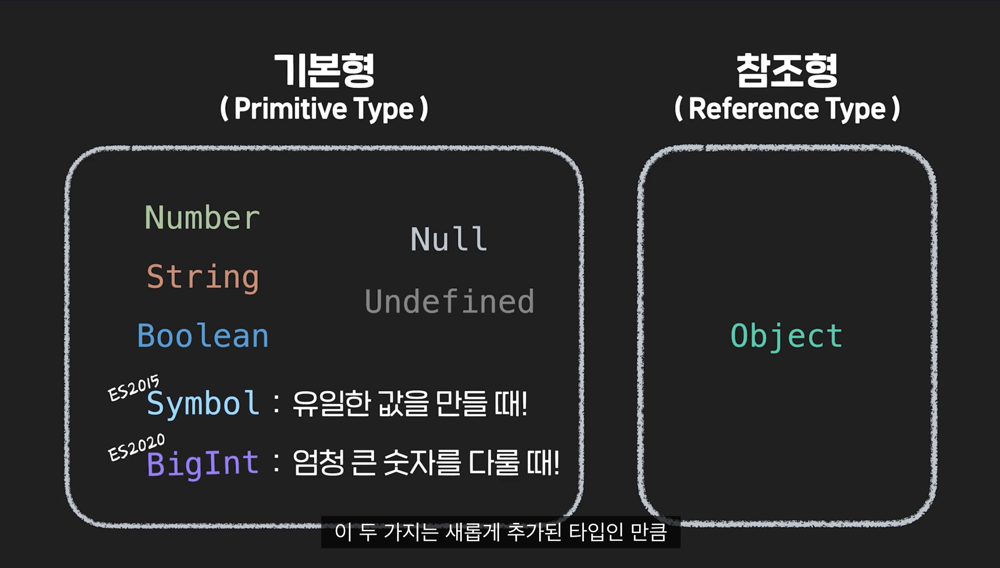
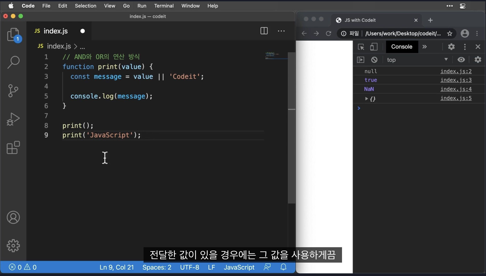
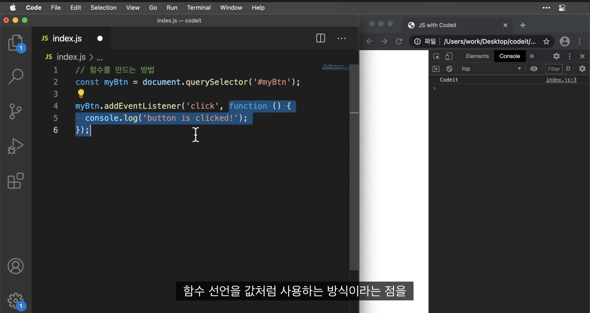
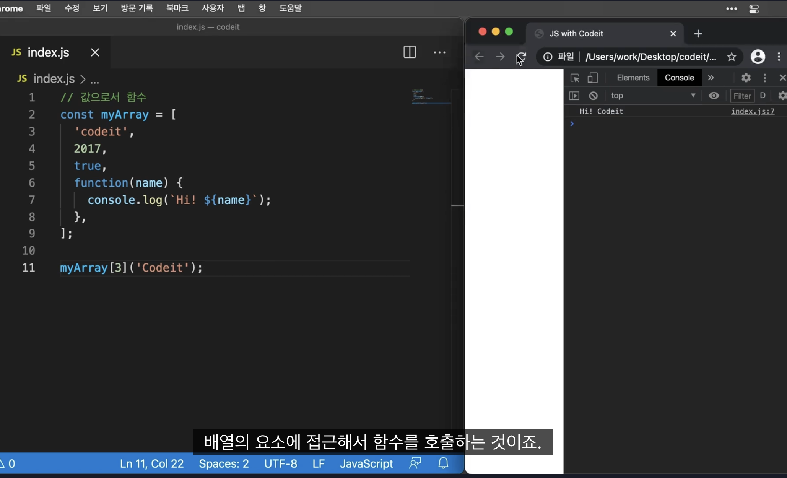
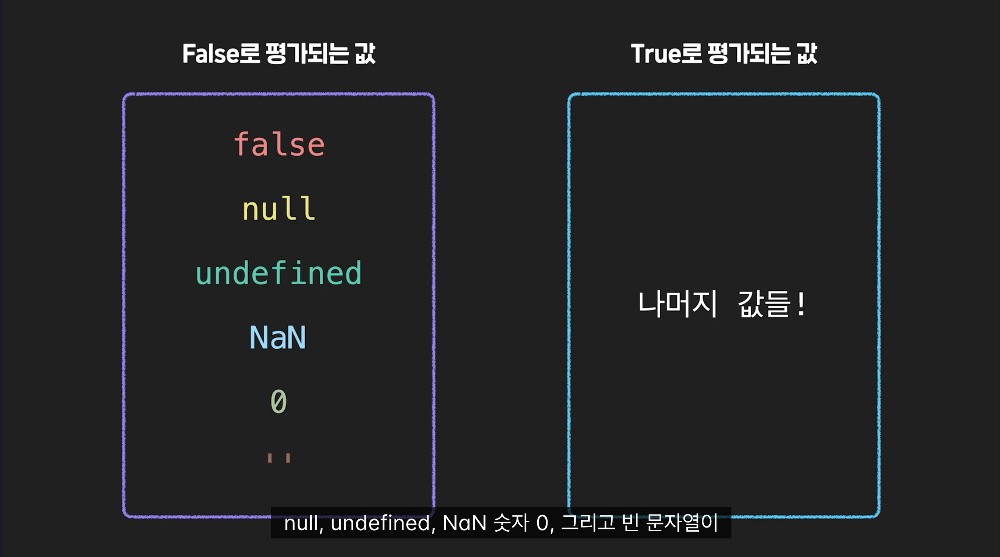

### 1. 학습목표
1. 자바스크립트의 역사와 특징에 대해 이해할 수 있습니다.
2. 자바스크립트의 기본 문법인 변수, 상수, 데이터 타입, 연산자, 함수 등을 이해하고 적용할 수 있습니다.
3. 변수 선언과 할당, 산술, 논리, 비교, 삼항 연산자 등 자바스크립트에서의 표현식을 작성할 수 있습니다.
4. 조건문과 반복문을 이해하고 적용할 수 있습니다.
5. 배열과 객체의 기본 개념을 이해하고 활용할 수 있습니다.

### 2. JS의 역사
1995년 탄생 브라우저 동작 스크립트 언어 
1999년 자바스크립트 표준화 완료 2005년 ajax등장
2008년 v8엔진 출시
2009년 node.js등장 (로얄드 달) 서버 개발에 자바스크립트가 들어가게 되고 하나의 언어로 풀스택 개발이 가능해짐

### 3. js언어의 특징
1. 객체 지향 프로그래밍 지원 

ℹ️  **객체지향 vs 절차지향**

절차지향 프로그래밍은 **순서대로 실행되는 일련의 과정**을 단계적으로 기술하여 프로그램을 만드는 것이고, 객체지향 프로그래밍은 데이터와 함수를 **객체라는 그룹으로** 묶어서 처리하는 방법입니다.

절차적은 순서대로 객체지향은 객체로 묶어서 그룹으로 처리(파이썬의 class처럼)

- js에서 객체를 만들때에는 {} 사용해 만들고 쉼표로 속성을 구분 
속성은 이름과 값을 가지고 이름은 문자열("")로 작성하고 값은 다양
객체 내부의 함수를 메소드라고 부르고 속성을 프로퍼티라고 부름
(이거 파이썬에서 상태를 프로퍼니 행동을 메소드)

2. 동적 타이핑
자바스크립트는 변수를 **선언시 타입을 지정하지 않고** 런타임(실행 시)사 변수에 할당한 값에 따라 **자동으로 타입이 결정**
파이썬 또한 동적 타이핑
정적 타이핑은 c, c++, java등이 있는데 먼저 형을 선언시 형을 지정해줘야 한다 
(int, string 등, 안하면 오류 남)

3. 함수형 프로그래밍 지원
함수를 일급 객체로 취급 하고 고차함수를 지원
-일급객체란 함수를 일반 값 처럼 **변수에 할당**하거나 **함수의 인자**로 전달하거나 **함수의 반환값**으로 사용 할 수 있는 객체를 의미
```javascript
// 함수를 변수에 할당 add
const add = function(a, b) {
  return a + b;
}

// 함수를 인자로 받는 함수 calculate
function calculate(func, a, b) {
  return func(a, b);
}

// 함수를 반환하는 함수 getAddFunction
function getAddFunction() {
  return add;
}

// 함수를 일급 객체로 다루어 코드의 재사용성을 높임
console.log(calculate(add, 2, 3)); // 5
console.log(getAddFunction()(2, 3)); // 5
```

- 고차함수란
함수를 인자로 받거나 함수를 반환하는 함수를 의미
```javascript
// 고차 함수 예시: 함수를 인자로 받는 함수 operate func는 일급객체
function operate(func, a, b) {
  return func(a, b);
}

function add(a, b) {
  return a + b;
}

function multiply(a, b) {
  return a * b;
}

console.log(operate(add, 2, 3)); // 5
console.log(operate(multiply, 2, 3)); // 6
```
- 비동기 처리
작업을 기다리지 않고 시작하고 return 값을 기다리지 않고 다음으로 넘어가는 것
ajax사용

### 4-1. 기본문법-변수와 상수 

- 변수 
모든 프로그래밍 언어는 값을 메모리에 저장하고 저장된 값을 읽어들여 재사용함
원래는 var(가변)형만 있었지만 es6에서 lat(가변) const(불변)이 도입
```javascript
// var로 변수 선언
var myVar = "Hello World";
console.log(myVar); // "Hello World"

// let으로 변수 선언
let myLet = "Hello World";
console.log(myLet); // "Hello World"

// const로 상수 선언
const myConst = "Hello World";
console.log(myConst); // "Hello World"
```

2. 데이터 타입과 형변환


자바스크립트의 데이터 타입은 내 생각에 파이썬이 더 알기 쉬운듯 이건 그냥 다 뭉뚱그렸어
1) 숫자(Number)
- 정수형(integer)
```javascript
let num1 = 10;
console.log(num1); // 10
console.log(typeof num1); // "number"
```
- 실수형(float)
```javascript
let num2 = 3.14;
console.log(num2); // 3.14
console.log(typeof num2); // "number"
```
- 지수형(Exponential)
```javascript
let num3 = 2.5e5; // 2.5 x 10^5
console.log(num3); // 250000
console.log(typeof num3); // "number"
```
- NaN(숫자가 아님)
- infinity(JavaScript에서 0으로 나눌 때만 Infinity가 발생)
```javascript
let num5 = 1 / 0;
console.log(num5); // Infinity
console.log(typeof num5); // "number"

let num6 = -1 / 0;
console.log(num6); // -Infinity
console.log(typeof num6); // "number"
```

2)문자열(string)
- 문자열의 길이
```javascript
let str = "Hello, world!";
console.log(str.length); // 13
```
- 문자열 결합
```javascript
let str1 = "Hello, ";
let str2 = "world!";
let result = str1.concat(str2);
console.log(result); // "Hello, world!"
```
- 문자열 검색
```javascript
let str = "Hello, world!";
console.log(str.search("world")); // 7 띄어쓰기 도 셈 인덱스 반환
```

- 문자열 자르기
```javascript
let str = "Hello, world!";
console.log(str.substr(7, 5)); // "world"
console.log(str.slice(7, 12)); // "world"

```
substr(start, length) 메서드는 문자열에서 특정 위치(start 인덱스)에서 시작하여 지정된 길이(length)만큼의 부분 문자열을 반환
즉, start에서 시작하여 length 개수만큼의 문자열을 반환

slice는  문자열에서 특정 범위(start에서 end 직전까지)의 부분 문자열을 반환
end 인자는 선택적이며, 생략할 경우 문자열의 끝까지 포함

**주의!**
substr는 현재 ECMAScript 표준에서는 일부 브라우저에서 비표준이 되었으며, 대신 substring이나 slice를 사용하는 것이 권장

substring은 슬라이스와 같은 형식으로 매개변수가 들어가나 차이점이 존재
- 음수가 들어오면 에러
- slice처럼 2번째 매개변수 end 삭제 불가능(에러 남)


- 문자열 대체(replace)
```javascript
let str = "Hello, world!";
let result = str.replace("world", "JavaScript");
console.log(result); // "Hello, JavaScript!"
```
- 문자열 분할
```javascript
let str = "apple, banana, kiwi";
let result = str.split(",");
console.log(result); // ["apple", " banana", " kiwi"]
```
이거는 배열이 아닌 객체를 배열로 만들어 저장

3. 불리언
참과 거짓을 나타내는 데이터타입
```javascript
let bool1 = true;
console.log(bool1); // true
console.log(typeof bool1); // "boolean"

let bool2 = false;
console.log(bool2); // false
console.log(typeof bool2); // "boolean"
```
이러한 불리언 데이터 타입은 조건문(if, else, swich등), 논리언산자(&&,||, !)와 함꼐 많이 사용 
ex)
참이면 이 조건 거짓이면 이 조건
and연산자(&&), or연산자(||)와 함께 사용해 참인지 거짓인지 

4. undefined : 값이 할당X
5. null: 값이 존재 하지 않음 위와 달리 의도적으로 null값을 집어넣은것
6. object: 속성과 메소드를 가지는 컨테이너(바구니)
```javascript
let person = { name: 'Alice', age: 20 };
person.name // 'Alice' 프로퍼티
person.age // 20     프로퍼티
```
7. array
파이썬의 리스트
여러개의 데이터를 순서대로 저장 서로 다른 데이터타입이라도 저장가능

### 4-2 형변환
- 암시적 형변환
자동으로 자바스크립트에서 형변환을 수행 일반적으로 연산자 사용 시 발생
ex)
문자열과 다른 자료형 더하고자 할시 다른 자료형이 문자형으로 변환됨
+연산자 제외  사용시 문자로 변환되지 않고 숫자로 변환
(파이썬은 *연산자 쓰면 .repeat()였지만 여기는 그런거 없다)
++두번 사용시 문자열이 아닌 숫자로 변환

0, 빈 문자열(""), null, undefined, NaN은 false로 변환

- 명시적 형 변환
개발자가 직접 자료형을 변환하는 것을의미
`String()`,  `Number()`

### 4-3 연산자
[연산자우선순위](https://developer.mozilla.org/ko/docs/Web/JavaScript/Reference/Operators/Operator_precedence)
- 산술연산자(+,-,*,/,%)

- 할당연산자(=,+=,-=,%=,*=,/=)

- 비교연산자
=== 데이터 타입까지 같다 , ==값이 같다, !== 불일치, <,>,<=,>=
크거나 같다 연산자는 숫자와 문자열을 함께 사용할 경우, 자동으로 숫자로 변환

- 논리연산자(&&,||,!)
자바스크립트에서 논리 연산자는 상황에 따라 양쪽값중 어느 한쪽을 선택하는 방식으로 동작
** &&연산자는 왼쪽값이 truthy하면 오른쪽값 return 왼쪽값이 falsy하면 왼쪽값 return**
** ||연산자는 정반대로 왼쪽값이 truthy하면 왼쪽값, 오른쪽값이 falsy하면 오른쪽값**

이렇게 사용할 수 있다 값이 없으면 undefined가 들어가고 false가 되니까 오른쪽값이 나오고 
값이 들어가면 trhthy가 되어서 왼쪽값이 나오게 된다

- 삼항연산자(?:)
조건문? true일때 값;false일때 값

- 타입연산자 (typeof연산자 값의 자료형 확인 가능)
자료형의 경우, 해당 자료형의 이름을, 객체나 함수의 경우, "object" 또는 "function"을 반환. 
typeof null의 경우 "object"를 반환하는 버그 존재.

-  옵셔녈 체이닝 연산자
?.
객체 속성에 접근하거나 메서드를 호출할 때, 해당 속성 또는 메서드가 존재여부확인
존재하면 값을 반환하고 없으면 undefined를 반환하는 연산자
연산자는 ES11(ES2020)부터 도입
```javascript
const user = {
  name: 'John',
  address: {
    city: 'New York',
    zipcode: '10001'
  }
};

// 일반적인 속성 접근
const cityName = user.address.city; // 'New York'

// 옵셔널 체이닝을 사용한 속성 접근
const zipCode = user.address?.zipcode; // '10001'

// 객체의 중첩된 속성에 대한 옵셔널 체이닝
const country = user.address?.country; // undefined

```

- 널병합연산자
??
왼쪽 피연산자가 null 또는 undefined일 때 오른쪽 피연산자를 반환
그렇지 않으면 왼쪽 피연산자를 반환하는 논리 연산자
```javascript
const value1 = null;
const value2 = 'Hello, world!';

// 널 병합 연산자 사용
const result = value1 ?? value2;

console.log(result); // 'Hello, world!'

```

### 4-4함수
함수를 정의하여 코드의 재사용성을 높일 수 있음(모듈화)
함수선언문
```javascript
function add(x, y) {
  return x + y;
}

console.log(add(2, 3));   // 5
```
함수표현식(익명의 함수를 생성하고 변수에 할당)
```javascript
let add = function(x, y) {
  return x + y;
}

console.log(add(2, 3));   // 5
```
함수표현식은 함수를 대입하는것이 중요한게 아니라 함수를 값처럼 사용한다는 것

이것도 함수 표현식
함수호출시 이름 뒤()


- 둘의 차이
함수선언문은 호이스팅이 되기 때문에 함수 선언전에 사용할 수 있었다
반면에 일반적으로 변수에 할당하는 함수 선언식은 변수의 특성상 호이스팅이 안됨

함수선언문은 변수의 var처럼 함수 스코프를 가짐
함수안에서 선언된 함수를 함수 바깥에서 호출 할 수는 없지만, 함수가 아닌 다른 코드블럭에서 함수선언을 하게 되면 전역적으로 호출이 가능해짐

함수표현식의 경우에는 할당된 변수에 따라 스코프가 결정됨


*코드잇*
이름이 있는 함수 표현식
1)Named Function Expression (기명 함수 표현식)
함수표현식으로 만들때 선언하는 함수에 이름을 붙여 줄 수 있음
이를 가명함수 표현식이라고 함
```javascript
const sayHi = function printHiInConsole() {
  console.log('Hi');
};

console.log(sayHi.name); // printHiInConsole

```
하지만 이 이름은 함수내부에서 함수자체를 가리킬때 사용할 수는 있지만 외부에서 호출할때 사용할 수는 없다  

2)즉시 실행 함수(IIFE)
함수를 선언하는 것과 함수를 실행하는것은 다르다
그래서 함수 선언문이든 함수 표현식이든 만들고 나중에 소괄호 붙여 실행함
하지만 함수 선언 부분을 소괄호로 감싼 뒤 함수 끝난 다음에 ()붙이면 바로 실행됨
어차피 이름 지어져도 외부에서는 못쓰기 때문에 이름을 안짓고 익명함수를 쓴다

- 활용
선언과 실행이 동시에 일어나기 때문에 초기화에 많이 활용한다 (init)
재사용이 필요없는 일회성 동작 구성할때 사용

- 함수는 객체로 표현된다
함수표현식으로 함수를 선언하고 호출할 수 있고 객체 안의 메소드로 사용할 수도 있다
흔하지는 않지만 필요에 따라서는 배열에 담아 호출 하는것도 가능하다

다른 함수의 파라미터로도 전달 할 수 있다
또한 미리 선언된 함수를 전달하면서 조건에 따라 그 함수가 나중에 호출되거나 

### 4-5 스코프(범위)
전역에서 선언시 어디에서든지 참조가 가능하지만 지역에서 선언시 그 지역 안에서만 참조 가능
(파이썬에서는 global 사용해 밖으로 뺐었는데 이건 잘 모르겠다)

### 4-6 arrow function
화살표 함수는 es6에서 도입
```javascript
let add = (x, y) => {
  return x + y;
}

console.log(add(2, 3));   // 5
```
변수선언=(매개변수)=> {
변수
}
한줄로 표현할 수 도 있는데 이때 내부의 return 문이 한줄로 작성될 경우 가능하다
`let add = (x, y) => x + y;`
매개변수가 하나일 경우 매개변수의 ()생략 가능
`let square = x => x * x;`

### 5. 문
if-else if -else문
```javascript
if(조건){
}
else if(조건){
}else {
}
```
중첩가능

switch문
```javascript
let fruit = "사과";

switch (fruit) {
  case "사과":
    console.log("사과는 빨간색입니다.");
    break;
  case "바나나":
    console.log("바나나는 노란색입니다.");
    break;
  case "오렌지":
    console.log("오렌지는 주황색입니다.");
    break;
  default:
    console.log("해당하는 과일이 없습니다.");
    break;
}
```
if문 처럼 변수의 값에 따라 여러개의 경우 중하나 선택하여 해당 코드 실행
switch문은 값을 break하지 않으면 해당 되는 값 아래가 전부 실행됨
또한 오직 일치하는지만 검사가능

조건부 실행
```javascript
let x = 10;

(x > 0) && console.log("x는 양수입니다.");
```
변수 x가 양수인경우만 실행(and여서)
``` javascript
let x = 10;

(x > 0) || console.log("x는 양수입니다.");
```
이경우 or연산자 이기 때문에 실행

삼항연산자와 단축평가
```javascript
let x;
let y = x || 10;

console.log(y);   // 10
```
단축평가란?
논리 연산에서 첫 번째 피연산자만으로 전체 표현식의 결과를 결정하는 동작을 의미
```javascript
const result = false && someFunction(); // someFunction은 실행되지 않음

const result = true || someFunction(); // someFunction은 실행되지 않음
```
첫번째에서 and인데 처음이 false여서 거기서 중단
두번째는 or이지만 처음이 true여서 이미 true로 판단해 중단

 falsy한 값과 truthy한 값
 

0, 빈 문자열, null, undefined, NaN, false는 falsy한 값
그외는  truthy한 값(빈배열과 빈객체도 truthy)
자바스크립트에서는 if, for, while의 조건부분에 불린이 아니여도 불린으로 생각
형변환됨

### 6. 반복문
- for문
```javascript
for (let i = 0; i < 10; i++) {
  console.log(i);
}
```
혹은 배열과 같이 사용해 배열의 값을 뺴내 올수 있다
```javascript
let numbers = [1, 2, 3, 4, 5];

for (let i = 0; i < numbers.length; i++) {
  console.log(numbers[i]);
}
```
- for in 문
```javascript
let person = { name: "John", age: 30, gender: "male" };

for (let key in person) {
  console.log(key + ": " + person[key]);
}
```
for...in문은 객체의 프로퍼티를 순서대로 접근
인덱스가 추출된다

- for each 문
```javascript
const numbers = [1, 2, 3, 4, 5];

// 배열의 각 요소에 대해 작업 수행
numbers.forEach(function(element) {
  console.log(element * 2);
});
```
forEach는 배열의 각 요소에 대해 주어진 함수를 실행하는 고차 함수
순서 보장,원본 배열 변경 안 함

* for in은 객체의 요소를 하나씩 순회할때 실행
  forEach은 배열을 순회할때 사용
  
- while문
언제까지 반복될지 모를때 사용
```javascript
let i = 0;

while (i < 10) {
  console.log(i);
  i++;
}
```
앞에 do 붙이면 반복문과 관계 없이 do 문 무조건 실행 후 조건 비교

### 7. break와 continue
break는 조건 달성시 종료 continue는 조건 달성시 제외하고 다음으로 넘어감(pass와 바슷)

### 8. 배열, 객체 기초
- 객체 
객체는 {}사용헤 만들고 속성값은,로 구분
함수로도 만들 수 있음
```javascript
function Person(name, age, gender) {
  this.name = name;
  this.age = age;
  this.gender = gender;
}

let person1 = new Person("홍길동", 30, "남자");
let person2 = new Person("홍길순", 25, "여자");
```
this는 자기자신을 나타냄
파이썬의 클래스를 만들고 인스턴스로 값 할당하는 것과 비슷

객체 속성 접근
객체이름.속성이름 이렇게 사용하면 객체의 속성에 접근하여 값 출력 가능

- 객체 메소드
1) object.keys(), Object.values()
사용시 각각의 key와 value값을 빼올 수 있음
```javascript
let person = {
  name: "홍길동",
  age: 30,
  gender: "남자"
};

let values = Object.values(person);

console.log(values);   // ["홍길동", 30, "남자"]

let person = {
  name: "홍길동",
  age: 30,
  gender: "남자"
};

let entries = Object.entries(person);

console.log(entries);
```
이 둘은 값 전부를 빼오기 때문에 하나만 빼올려면 이렇게 해야 한다
```javascript
let person = {
  name: "홍길동",
  age: 30,
  gender: "남자"
};

let nameEntry = ["name", person.name];

console.log(nameEntry);

```
Object.entries() 메소드
```javascript
let person = {
  name: "홍길동",
  age: 30,
  gender: "남자"
};

let entries = Object.entries(person);

console.log(entries);
```
이러면 객체의 속성 이름과 속성 값들을 2차원 배열로 반환

Object.assign() 
```javascript
let person = {
  name: "홍길동",
  age: 30,
  gender: "남자"
};

let newPerson = Object.assign({}, person, { age: 35 });

console.log(newPerson);   // { name: "홍길동", age: 35, gender: "남자" }
```
새로운 객체를 만듬
기존 객체를 복사하여 새로운 객체를 만듬
assign은 원래 기존의 객체를 복사하는데 첫 파라미터에 {}가 있어{}형태
첫번째 파라미터ㄹ호 전달된 대상 객체에 속성들을 복사하여 병합

객체 비교
두개의 객체를 만들어 비교 할 수 있음
체를 비교할 때는 일반적으로 === 연산자 X
대신 JSON.stringify() 함수를 사용하여 객체를 문자열로 변환 후 문자열 비교
```javascript
let person1 = {
  name: "홍길동",
  age: 30,
  gender: "남자"
};

let person2 = {
  name: "홍길동",
  age: 30,
  gender: "남자"
};

console.log(person1 === person2);   // false
console.log(JSON.stringify(person1) === JSON.stringify(person2));   // true
```
아마 이거 이름이 달라서 다른 객체이기 때문에 이렇게 나오는거 같음

객체병합시 전개연산자(...)사용
전개 연산자(...)는 배열이나 객체의 요소를 펼쳐서 복사하거나 합칠 때 사용되는 문법
rest parameter에서도 사용(...)사용
배열요소 합치기
```javascript
let person1 = {
  name: "홍길동",
  age: 30
};

let person2 = {
  gender: "남자"
};

let mergedPerson = {...person1, ...person2};

console.log(mergedPerson);   // { name: "홍길동", age: 30, gender: "남자" }

```

### 9. 배열
배열의 크기 지정
```javascript
let numbers = new Array(5); //크기만 지정한것 아무것도 없다
//이개로 출력하면 empty나옴
```
배열요소는 인덱스를 통해 접근이 가능하다
```javascript
let fruits = ["사과", "바나나", "오렌지"];

console.log(fruits[0]);   // "사과"
console.log(fruits[1]);   // "바나나"
console.log(fruits[2]);   // "오렌지"
```
- 배열 메소드
1) push()
`array.push()`
맨 뒤에 들어감
2) pop()
`array.pop()`
배열의 마지막 요소 삭제 그리고 해당요소 반환
(내가 이해할때는 죽기 전 마지막으로 뛰어오르고 사라짐 이라고 이해)
3) shift()
`array. shift()`
첫번째 요소 삭제
4) unshift()
`array.unshift()`
배열의 맨 앞에 추가 
5) splice()
`array.splice(start, deleteCount, item1, item2, ...);`
배열의 인덱스가 start인거 부터 deleteCount까지 뒤에 오는 item으로 변환
없으면 요소 삭제
문자열의 replace같은 느낌

6) slice()
`array.slice(start,deleteCount)`
slice조각내다 
배열의 인덱스가 start인거 부터 deleteCount까지 새로운 배열로 만듬
```javascript
let fruits = ["사과", "바나나", "오렌지"];

let slicedFruits = fruits.slice(1, 2);

console.log(slicedFruits);   // ["바나나"]
```
7) forEach()
```javascript
let numbers = [1, 2, 3, 4, 5];

numbers.forEach(function(number) {
  console.log(number);
});
```
배열의 각 요소에 대해 콜백 함수 실행 새 배열 반환x 반환할려면 map 사용

8)map()
map() 메소드는 배열의 각 요소에 대해 콜백 함수를 실행하고, 그 결과를 새로운 배열로 반환
```javascript
let numbers = [1, 2, 3, 4, 5];

let squaredNumbers = numbers.map(function(number) {
  return number * number;
});

console.log(squaredNumbers);   // [1, 4, 9, 16, 25]
```
여기에 map에 콜백함수로 
```javascript
function(number) {
  return number * number;
}
```
이게 들어가 실행됨

```javascript
let newArray = originalArray.map(function(currentValue, index, array) {
  // 콜백 함수에서 수행할 동작
  // 반환값은 새로운 배열의 해당 요소로 들어감
  	//currentValue: 현재 처리 중인 배열의 요소 값
	//index: 현재 처리 중인 요소의 인덱스(생략가능)
	//array: map을 호출한 배열 자체(생략가능)
});
```
9)filiter()
배열의 각 요소에 콜백함수를 실행하고 그 결과가 true인값만 반환
그러니까 배열을 하나씩 for문을 돌려 하는것보다 직관적으로 콜백함수를 등록해 가능
```javascript
let numbers = [1, 2, 3, 4, 5];

let evenNumbers = numbers.filter(function(number) {
  return number % 2 === 0;
});

console.log(evenNumbers);   // [2, 4]
```

10) reduce()
```javascript
array.reduce(callback, initialValue);
//callback: 각 요소에 대해 실행되는 함수로, 네 개의 매개변수를 받습니다.

//accumulator: 누적된 결과값 또는 중간 결과값입니다.
//currentValue: 현재 처리 중인 배열의 요소입니다.
//currentIndex: 현재 처리 중인 배열의 요소 인덱스입니다.
//array: reduce가 호출된 배열입니다.
//initialValue (선택적): 첫 번째 콜백 함수 호출 시 사용되는 초깃값입니다.
//만약 이 값이 제공되지 않으면 배열의 첫 번째 요소가 초기 accumulator로 사용됩니다.

```
```javascript
let numbers = [1, 2, 3, 4, 5];

let sum = numbers.reduce(function(accumulator, currentValue) {
  return accumulator + currentValue;
}, 0);

console.log(sum);
```

11) find()
```javascript
let numbers = [1, 2, 3, 4, 5];

let foundNumber = numbers.find(function(number) {
  return number > 3;
});

console.log(foundNumber);   // 4
```
 find() 메소드는 배열의 각 요소에 대해 콜백 함수를 실행하고, 그 결과가 true인 첫 번째 요소를 반환
 
 12)some()
 ```javascript
let numbers = [1, 2, 3, 4, 5];

let hasEvenNumber = numbers.some(function(number) {
  return number % 2 === 0;
});

console.log(hasEvenNumber);   // true
```
배열의 각 요소에 대해 콜백 함수를 실행하고, 그 결과가 true인 요소가 하나라도 있는지 확인
전에 filiter()는 true인것만 반환했지만 some은 true가 하나라도 있으면 true를 반환(||)

13)every() 
배열의 각 요소에 대해 콜백 함수를 실행하고, 그 결과가 true인 요소가 모든 요소인지 확인
전부 다 결과가 true여야 true를 반환
```javascript
let numbers = [2, 4, 6, 8, 10];

let isAllEvenNumbers = numbers.every(function(number) {
  return number % 2 === 0;
});

console.log(isAllEvenNumbers);   // true
```
14) sort()
```javascript
numbers.sort(function(a, b) {
  return a - b; //오름차순 반대로 하면 내림차순
});
```
sort는 주로 이렇게 약간 숙어처럼 많이 쓰이는거 같음

15) reverse()
배열을 뒤집음

16) map
배열의 각 요소에 대해 주어진 함수를 호출하고, 그 결과를 새로운 배열로 반환
```javascript
array.map(callback(currentValue[, index[, array]])[, thisArg])

```
array: map을 호출한 배열
callback: 각 요소에 대해 호출할 함수
currentValue: 배열 내 현재 처리 중인 요소
index (선택 사항): 배열 내 현재 요소의 인덱스
array (선택 사항): map을 호출한 배열
thisArg (선택 사항): 콜백 함수 내에서 this로 사용될 값


