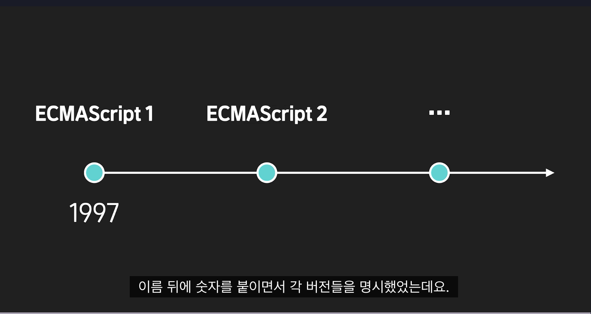
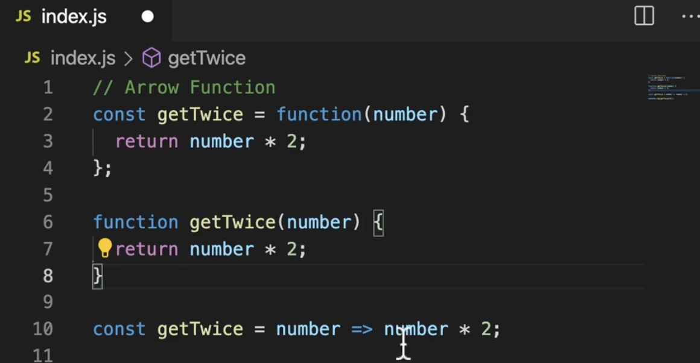
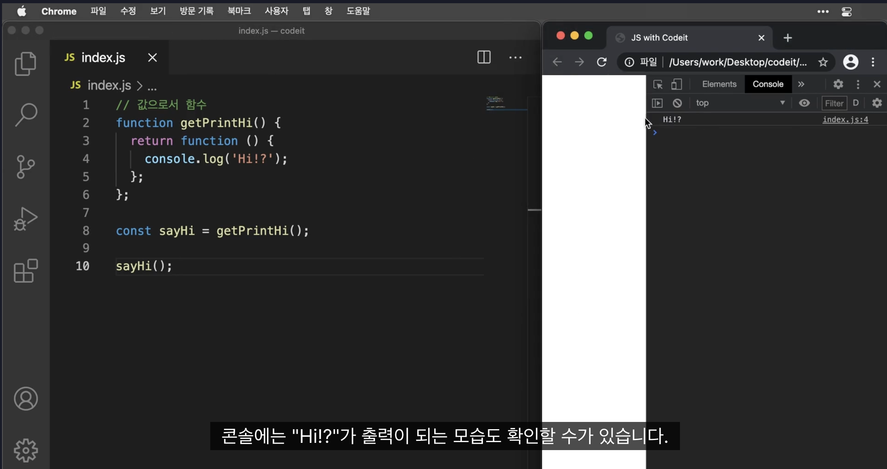

### 1. 학습목표

🚩 **[학습 목표]**

1. 자바스크립트 es6 문법에서 새로 추가된 문법에 대해 학습해요.
2. 일급객체로서의 함수가 어떤 의미인지, 왜 중요한지 알며 실습을 통해 활용능력을 갖출 수 있어요.
3. Map과 Set에 대한 개념에 대해 학습하고, 각각에 대한 활용능력을 갖출 수 있어요.

### 2.es6

에크마자바스크립트는 자바스크립트라는 언어의 표준이라고 생각
자바스크립트도 시간이 지남에 따라 기능이 추가되고 발전되고 삭제되고 있음 
이러한 발전의 결과물을 Ecma international이라는 국제표준화기구에서 관리
자바스크립트를 사용할때 지켜야 할 규칙이나 세부사항들을 Ecma 262-2라는 문서로 관리하게 되는데 그 안의 내용이 에크마 스크립트


년도가 지날때마다 숫자를 붙이면서 각 버전들을 명시
- es6는 자바스크립트가 기존에 가지고있던 문제점들을 보완하고 다른 프로그래밍 언어에 있던 기능들이 추가 됨

- let, const:var를 가변 불변에 따라 나눔(var는 호이스팅이 된다)
**팁**
**호이스팅**이란?
JavaScript에서 변수 및 함수 선언이 스코프의 상단으로 올려지는 동작
코드의 실행 전에 JavaScript 엔진에 의해 해당 스코프의 변수 및 함수 선언이 먼저 처리되는 것을 의미
어디에 있던지 먼저 찾아서 함술을 실행하는것
그래서 보면 한곳에 모아놓고 쓰는 경우가 많더라

var키워드는 변수가 만들기도 전에 호이스팅되어 실행된다는 문제점이 존재
let이나 const키워드는 애초에 변수 선언전에 접근 할 수가 없음
-> 예상치 못한 에러가 났을때 그 에러의 이유를 파악하기가 쉬움

** let은 재할당이 가능한거지 중복 선언은 불가능!**

- 화살표 함수
function이나 return 키워드 없이 함수를 만드는 방법
매개변수가 하나인 경우 괄호를 생략할 수 있고, 함수 본문이 한 줄인 경우 중괄호와 return 키워드도 생략 가능
화살표 함수는 자신만의 this를 생성하지 않고, 주변 스코프의 this를 그대로 사용
function은 호출을 할 때 this가 정해지지만, 화살표 함수는 선언할 때 this가 정해진다
``` javascript
// 일반 함수 표현식
let add = function(x, y) {
  return x + y;
};

// 화살표 함수
let add = (x, y) => x + y;
```
*코드잇*
기존의 함수 선언방식을 보다 간결하게 만들어주는 문법
이름이 없는 익명함수이기 때문에 일반적으로 이름을 가진 변수에 할당하거나 다른 함수의 아규먼트로 선언할때 주로 활용

 간결하게 표현할 수 있는 규칙
 1) 파리미터가 하나면 파라미터를 감싸는 소괄호 삭제 가능
 사실 몇몇 스타일 가이드에서는 가독성의 문제로 ()삭제하지 말자는 의견이 있음
 2) 내부의 동작 부분이 return문 하나로 되어있다면{}와 함께 return 문 생략 가능
 3) 하지만 return문 외 다른 표현이 필요하다면 한줄로 만들 수 없음
 4) return 값이 한 줄이지만 return 값이ㅣ 객체인경우 {}생략하면 오류
 -> 객체라고 작성했던 중괄호를 함수의 동작부분을 구분하는 중괄호로 해석하기 때문
 -> 이럴때는 {}바깥에 ()로 한번 감싸면 오류 해결
 **이 arrow function안에는 arguments객체가 없다** 
 그래서 이거 사용시 대체가 어렵다

- 삼항연산자
조건?참:거짓:

- 구조 분해 할당
배열[]이나 객체{}의 속성을 분해해서 그 값을 변수에 담을 수 있게 해주는 문법
```javascript
// 배열의 경우 기본 배열 해체
let [value1, value2] = [1, "new"]; 
console.log(value1); // 1을 할당
console.log(value2); // "new"을 할당

//기존 배열에서의 배열 해체
let arr = ["value1", "value2", "value3"]; //배열을 선언하고 초기화
let [a,b,c] = arr; // 배열 해체를 사용하여 각각의 값 할당
console.log(a,b,c) // value1 value2 value3
//첫 번째 줄은 배열 arr을 선언하고 초기화하는 부분이며, 두 번째 줄에서는 배열 디스트럭처링을 사용하여 배열의 값들을 변수 a, b, c에 할당하는 부분

// let [a,b,c] = arr; 은 아래와 동일!
// let a = arr[0];
// let b = arr[1];
// let c = arr[2];

let [a,b,c,d] = arr //배열의 길이보다 더 많은 변수를 선언하면 값은 X
console.log(d) // undefined 

let [a,b,c,d = 4] = arr
console.log(d) // d에 기본값을 할당해서 값이 할당됨
```
객체의 경우
```javascript
// 객체의 경우
let user = {name: "nbc", age: 30}; //배열선언
let {name, age} = user; //객체에서 값 추출 위한 해체 할당

// let name = user.name;
// let age = user.age;

console.log(name, age) // nbc 30

// 새로운 이름으로 할당
let {name: newName, age: newAge} = user;//{원래속성이름:새이름}
console.log(name, age) // ReferenceError: name is not defined
console.log(newName, newAge) //nbc 30 새이름으로 해야 함

let {name, age, birthDay} = user; //user에 값이 없어서 정의되지 않음
console.log(birthDay) // undefined

let {name, age, birthDay = "today"} = user; //기본값 설정
console.log(birthDay) // today
```

- 단축속성명
객체의 key와 value의 속성의 값이 같으면 생략이 가능하다

- 전개구문(spread)
배열이나 객체를 전개(... 전개연산자 사용) 구조 분해 할당과 함께 사용
 배열이나 객체를 개별 요소로 분리하거나 복사할 수 있는 문법
 기존의 배열을 변경하지 않고도 새로운 배열 생성이 가능해 기존의 배열이 필요하지만 간단한 요소를 추가해야 할때 많이 씀
 
 ```javascript
let arr = [1,2,3];

let newArr = [...arr, 4]; //원래 배열arr를 복사해 요소 추출 후 뒤에 4 넣음
console.log(newArr) // [1,2,3,4]

let user = {name: "nbc", age: 30};// 배열선언
let user2 = {...user} //전개연산자로 복사

user2.name = "nbc2"//name이라는 속성에 새로운 값 할당

console.log(user.name) // nbc //원래배열
console.log(user2.name) // nbc2 //전개연산자로 만든 배열
```

- rest parameter
```javascript
function func (a, b, ...args) {
	console.log(...args)
}
//a, b,를 제외한 다른 요소들을 배열로 모음

func(1, 2, 3) // 3
func(1, 2, 3, 4, 5, 6, 7) // 3 4 5 6 7
```
**...가 배열이나 객체에서 사용되면 전개연산자고 이렇게 함수안에 사용되면 rest**
arguments를 유연하게 사용할 수 있는 함수 내부의 argument객체보다 더 장점이 상대적으로 크기 때문에 일단 rest parameter사용하고 불가피한 상황에서 arguments사용

- named export vs default export 

1)named export
여러 개의 변수, 함수 또는 클래스를 모듈에서 내보내는 방식
내보낼 때 각각의 변수, 함수, 클래스 등에 이름을 지정
다른 파일에서 가져올 때에는 중괄호 {}를 사용하여 해당 이름으로 가져옴
다른 이름으로 바꿀려면 {원래이름 as 바꿀이름}
전부 가져올려먼 * 사용

2)default Export
하나의 모듈에서 하나만 가능하며, 모듈 전체를 내보낼 때 사용
아무 이름으로나 import가능
```javascript
// name.js
const Name = () => {
}

export default Name //이렇게 내보냄

// other file 
// 아무 이름으로 import 가능
import newName from "name.js"
import NameFromOtherModule from "name.js"

// 하나의 파일에서 여러 변수/클래스 등을 export 하는 것이 가능

export const Name1 = () => {
}

export const Name2 = () => {
}
//두개 내보냄
// other file
import {Name1, Name2} from "name.js" //중괄호로 가져옴
import {newName} from "name.js" // x 이름이 달라서

// 다른 이름으로 바꾸려면 as 사용
import {Name1 as newName, Name2} from "name.js"

// default export 처럼 가져오려면 * 사용
import * as NameModule from "name.js" //전부 가져올려면 

console.log(NameModule.Name1)

```

### 3. 일급객체로서의 함수
자바스크립트에서 함수는 객체로 취급된다
다른 객체들에 일반적으로 적용 가능한 연산을 모두 지원하는 객체를 일급객체(first-class object)
자바스크립트에서는 함수 말고도 boolean, 배열등 다양한 데이터 유형들이 일급 객체로 취급 
함수를 다른 데이터처럼 사용가능

- 일급 객체의 특성

1) 변수에 할당할 수 있다
그동안 변수에 숫자, 객체등 값을 할당 한것처럼 함수또한 숫자, 객체처럼 일급 객체 이기 때문에 변수에 값으로 할당할수 있다
함수는 할당 후 사용 시 ()적기
ex) 화살표 함수 생각

2) 다른 함수에 인수로 전달할 수 있다
함수를 다른 데이터타입들처럼 인수로 전달 할 수 있다 함수가 값으로 취급 되기 때문
이것은 콜백(callback)이나 고차 함수(higher-order function)를 작성하는 데 사용
```javascript
function callFunction(func) {
  func(); //매개변수로 온 함수르 실행하겠다
}

const sayHello = function() {
  console.log('Hello!');
};

callFunction(sayHello); // "Hello!" 출력 고차 함수
```

3) 다른 함수에서 반환할 수 있다
함수는 값으로 취급되기 때문에 함수는 다른 함수에서 반환
함수 팩토리(factory)나 클로저(closure)를 작성하는 데 사용

**함수 팩토리란?**
함수를 생성하는 함수, 함수를 만들고 반환하여 코드를 재사용

**함수 클로져란**
함수가 생성될 때 주변의 환경을 "기억"하고, 이 환경의 변수에 접근할 수 있는 함수

```javascript
function createAdder(num) {
  return function(x) {
    return x + num;
  }
}

const addFive = createAdder(5);
console.log(addFive(10)); // 15 출력
```

createAdder(5)를 호출하면서 num에 5를 전달하여 내부 함수를 생성하고, 그것을 addFive라는 변수에 할당
클로져인 내부함수 
```javascript
 return function(x) {
    return x + num;
  };
```
가 반환되면서 클로져를 형성하고 외부 함수인 num을 기억(여기서는 5)
그후 10이 들어오게 되면서 기억하고 있던 내부 함수 5을 사용해 15로 값을 반환

4)객체의 프로퍼티를 함수로 할당
함수를 객체의 프로퍼티로 할당 할 수 있음 객체의 메소드로 함수 호출 가능
```javascript
const person = {
  name: 'John',
  sayHello: function() {
    console.log(`Hello, my name is ${this.name}`);
  }
};

person.sayHello(); // "Hello, my name is John" 출력
```

5)배열의 요소로 함수 할당
함수를  배열의 요소로 할당될 수 있음 
```javascript
// 함수를 배열의 요소로 할당
const arrayWithFunctions = [
  function() {
    console.log("Function 1");
  },
  function() {
    console.log("Function 2");
  },
  function(name) {
    console.log(`Hello, ${name}`);
  }
];

// 배열의 각 함수를 순회하며 호출
arrayWithFunctions[0]();  // 출력: Function 1
arrayWithFunctions[1]();  // 출력: Function 2
arrayWithFunctions[2]("Alice");  // 출력: Hello, Alice
```

함수를 일급 객체로 다룰 수 있다는 것은, 함수를 다양하게 조합할 수 있다는 것을 의미

```javascript
function multiplyBy(num) {
  return function(x) {
    return x * num;
  }
} //팩토리함수

function add(x, y) {
  return x + y;
} //팩토리함수

const multiplyByTwo = multiplyBy(2); //선언하면서 num에 2 전달
const multiplyByThree = multiplyBy(3);

const result = add(multiplyByTwo(5), multiplyByThree(10)); // 40 
//내부 함수가 클로져가 되어 num을 기억 그리고 x에 2전달
```
 클로저는 내부 함수로서 num에 2가 기억
 multiplyByTwo(5)를 호출하면 내부 함수에서 x가 5가 되어, 5 * 2를 계산하여 최종적으로 10을 반환
 
 

 
### 4. map & set
- map
키-값 쌍을 저장하는 객체와 비슷 객체와 다른점은 키로 사용할 수 있는 모든 유형을 사용
map은 순서가 보장됨
map 메서드는 주로 배열에서 사용되며, 배열의 각 요소에 대해 주어진 함수를 호출하고 그 결과를 새로운 배열로 반환

- `new Map()` – 맵을 만듭니다.
- `map.set(key, value)` – `key`를 이용해 `value`를 저장합니다.(값추가)
- `map.get(key)` – `key`에 해당하는 값을 반환합니다. `key`가 존재하지 않으면 `undefined`를 반환합니다. (값검색)
- `map.has(key)` – `key`가 존재하면 `true`, 존재하지 않으면 `false`를 반환합니다. (있는지 확인)
- `map.delete(key)` – `key`에 해당하는 값을 삭제합니다.
- `map.clear()` – 맵 안의 모든 요소를 제거합니다.
- `map.size` – 요소의 개수를 반환합니다.

map의 반복
keys(), values(), entries() 메소드를 사용하여 키, 값 및 키-값 쌍을 반복

1) for ...of 반복문
사용하기 위해서는 객체가 iterator해야함  myMap.key()가 반환하는 값이 iterator
```javascript
const myMap = new Map();
myMap.set('one', 1);
myMap.set('two', 2);
myMap.set('three', 3);
 //map생성
for (const key of myMap.keys()) {
  console.log(key);
} // myMap.keys를 임시변수인 key에 담음 py의 for i in 처럼

for (const value of myMap.values()) {
  console.log(value); //값만
}

for (const entry of myMap.entries()) {
  console.log(`${entry[0]}: ${entry[1]}`);
} //전체를 가져오는데 0번째가key 1번째가 value
```
2) 크기확인
다른 배열은 .length을 쓰지만 map에서 크기를 확인할ㄹ려면 size속성 사용

- Set
Set은 고유 한값만 저장가능 중복불가(파이썬과 같음)
또한 map은 키와 값을 전부 저장하지만 set은 값만 저장
새로운 Set 생성 시 Set()생성자 이용 후 값을 추가하려면 .add('추가할 값')
값을 검색할려면 has 사용

1) 반복
set은 오로지 값만 가지고 있기때문에 .value만 사용
2) 크기
map과 마찬가지로 size로 확인

