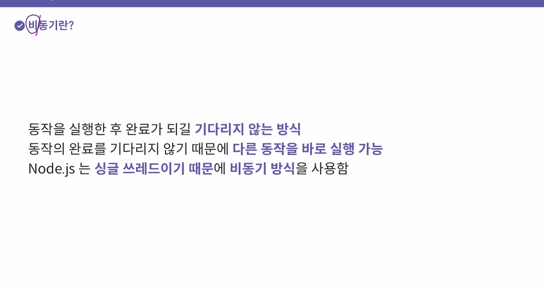
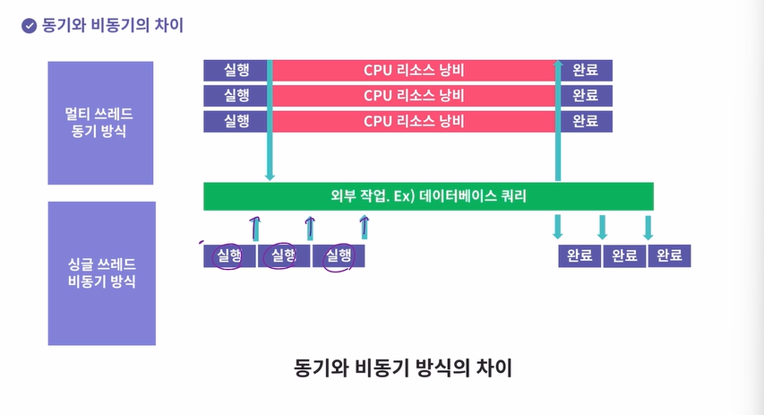
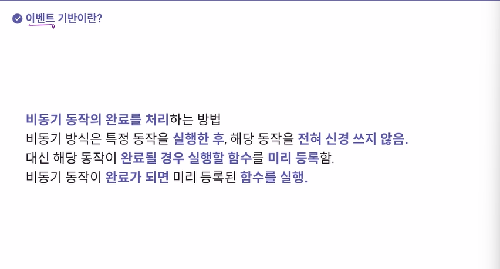
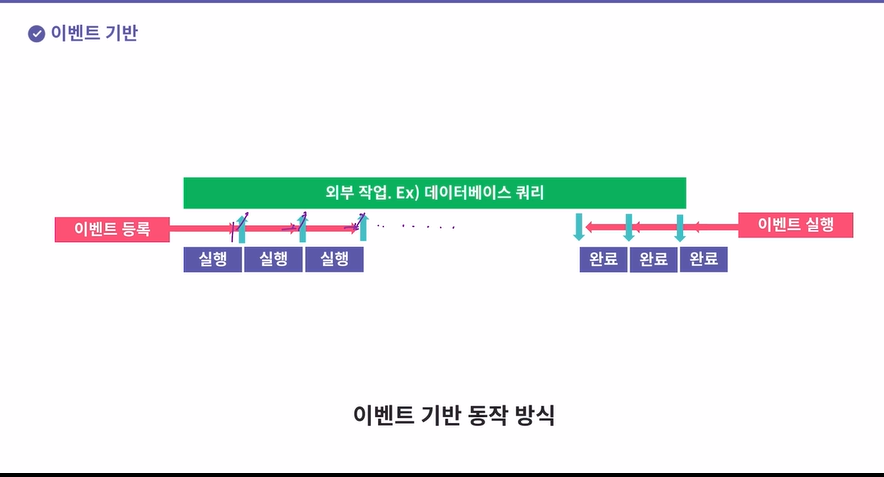
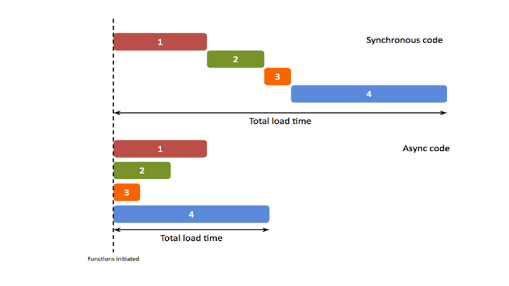

코어자바스크립트 04.콜백함수
항해 인척하는 코어 자바스크립트 챕터 4 콜백함수
비동기 내가 분명 어디에 챗봇 하면서 정리를 해놔서 멘토님한테 애기를 들은적이 있는데 왜 어디에 있는지 못찾겠지

### 콜백 함수
1. 콜백이란
부르다 호출하다 하는 뜻의 call과 뒤돌아오다 되돌아오다 라는 뜻의 back의 합성어
되돌아 호출해달라
콜백함수란 다른 코드의 인자로 넘겨주는 함수 
콜백함수를 넘겨받은 코드는 이 콜백함수를 필요에 따라 적절한 시점에 실행할 것
어떤 함수x를 호출하면서 **특정조건**일때 함수 y를 실행해서 나한테 알려달라
함수x가 해당 조건이 갖혀졌는지 여부를 스스로 판단하고 y를 호출
-> 다른 함수 또는 메서드에게 인자로 넘겨줌으로써 그 제어권을 위임
위임 받은 코드는 자체적인 내부 로직에 의해 판단해 y를 직접 호출

- 예시
a와 b는 모두 내일 아침 6시에 일어나야 함 
a는 늦지 않기 위해 계속 잠을 살치면서 확인
그러나 b는 알람시게를 세팅해 그 시간에 일어남

a는 수시로 시간을 구하는 함수를 호출한것이고 b는 시계의 알람을 설정하는 함수를 호출해 당시는 아무것도 하지 않다가
시간이 되니 알람이 울리는 결과를 반환함
**a의 경우 시계함수의 제어권은 a한테 있고 시계는 그저 요청받는 내용을 이행
그러나 b는 시계함수에게 요청을 하면서 알람을 울리는 명령의 제어권을 시계에게 줌**

### 제어권

1. 호출시점
```javascript
var count = 0;

// timer : 콜백 내부에서 사용할 수 있는 '어떤 게 돌고있는지'
// 알려주는 id값
var timer = setInterval(function() {
	console.log(count);
	if(++count > 4) clearInterval(timer);
}, 300);
```
count를 선언하고 0을 할당 
그 후 timer 변수를 선언했는데 여기에 setInterval을 실행한 결과를 할당
* setInterval이란?
JavaScript에서 사용되는 타이머 함수 중 하나
이 함수를 사용하면 일정한 시간 간격으로 함수를 반복해서 실행
이 함수는 두가지 인자를 받음 첫번째는 익명 함수이고 두번째는 숫자
```javascript
var intervalID = scope.setInterval(func,delay[,param1,param2,...]);
```
우선 scope에 window 객체 또는 인스턴스가 들어옴 매개변수로는 func, delay가 들어가야 함
func에  전달된 함수는 매 delay(ms)마다 실행되며 그 결과 어떤 값도 리턴하지 않음
setInterval를 특정할 수 있는 고유한 ID값이 반환됨(변수에 담은 이유는 반복 실행 중간에 종료할 수 있게 하기 위해(clearinterval)

지금 보면 첫번째 익명함수가 카운트를 출력하고 만약 ++count가 4보다 크다면 타이머를 해제한다(고유한 아이디 값을 사용해 종료하기 위해)
그후 ms로 300이 들어간다
쉽게 바꾸면 
```javascript
var count = 0;
var cbFunc = function () {
	console.log(count);
	if (++count > 4) clearInterval(timer);
};
var timer = setInterval(cbFunc, 300);

// 실행 결과
// 0 (0.3sec)
// 1 (0.6sec)
// 2 (0.9sec)
// 3 (1.2sec)
// 4 (1.5sec)
```
timer 변수에는 setInterval의 아이디 값이 담긴다 
그리고 첫번째 인자인 cbFunc가 들어가고 이 함수가 콜백 함수가 된다 
두번째 인자로 들어간 300으로 인해 0.3초 마다 자동으로 실행될것이다

|code | 호출주제 | 제어권 |
| :---- | :------ | :---------- | 
| cdFunc() | 사용자 | 사용자 | 
| setInterval(cdFunc,300); | setInterval | setInterval | 

cbFunc()를 수행한다면 그 호출주체와 제어권은 모두 사용자
setInterval로 넘겨주게 되면 그 호출주체와 제어권은 모두 setInterval
**콜백함수의 제어권을 넘겨받은 코드는 콜백함수 호출 시점에 대한 제어권을 가진다**

2. 인자
```javascript
// map 함수에 의해 새로운 배열을 생성해서 newArr에 담고 있네요!
var newArr = [10, 20, 30].map(function (currentValue, index) {
	console.log(currentValue, index);
	return currentValue + 5;
});
console.log(newArr);

// -- 실행 결과 --
// 10 0
// 20 1
// 30 2
// [ 15, 25, 35 ]
```
[10,20,30]을 가지고 msp 메서드를 호출한다 이때 첫번째 매개변수로 익명함수가 들어간다 
map 메서드는 첫번째 인자로 콜백함수를 받고 생략가능한 두번째 인자로 콜백함수 내부에서 this로 인식할 대상을 특정
생략 할 경우 일반함수와 마찬가지로 전역객체가 바인딩된다
map 메서드는 메서드의 대상이 되는 배열의 모든 요소를 처음부터 끝까지 하나씩 꺼내어 콜백함수 반복호출
콜백함수의 실행결과를 모아 새로운 배열을 만듬

콜백함수의 첫번째 인자: 배열의 요소중 현재값
콜백함수의 두번째 인자: 현재값의 인덱스
콜백함수의 세번째 인자: map 메서드의 대상이 되는 베얄 객체 자체가 담김

제이쿼리의 메서드들은 기본적으로 첫번째 매개변수에 인덱스 , 두번째 매개변수에 currentvalue가 담김 
이런 제이쿼리 방식으로 순서를 바꿔 사용하면 어떻게 될까??
```javascript
// map 함수에 의해 새로운 배열을 생성해서 newArr에 담고 있네요!
var newArr2 = [10, 20, 30].map(function (index, currentValue) {
	console.log(index, currentValue);
	return currentValue + 5;
});
console.log(newArr2);

// -- 실행 결과 --
// 10 0
// 20 1
// 30 2
// [ 5, 6, 7 ]
```
단어로 접근하는것이 아니라 순서로 접근하는것이여서 값이 같다
map 메서드에 정의된 규칙에는 콜백함수의 인자로 넘어올 값들 및 그 순서 가 포함되어 있음 
콜백함수의 주체는  **map메서드** 그래서 어떤 인자에 어떤 값을 넘길지는 전적으로 map메서드에 달림
제어권이 넘어갈 map 함수의 규칙에 맞게 ‘나는’ 호출해야함

3. this
콜백함수도 함수이기 때문에 기본적으로 this가 전역객체를 참조하지만 제어권을 넘겨받을 코드에서 콜백함수에 별도로 
this를 지정한 경우 그 대상을 참조하게 된다
```javascript
// Array.prototype.map을 직접 구현해봤어요!
Array.prototype.mapaaa = function (callback, thisArg) {
  var mappedArr = [];

  for (var i = 0; i < this.length; i++) {
    // call의 첫 번째 인자는 thisArg가 존재하는 경우는 그 객체, 없으면 전역객체
    // call의 두 번째 인자는 this가 배열일 것(호출의 주체가 배열)이므로,
		// i번째 요소를 넣어서 인자로 전달
    var mappedValue = callback.call(thisArg || global, this[i]);
    mappedArr[i] = mappedValue;
  }
  return mappedArr;
};

const a = [1, 2, 3].mapaaa((item) => {
  return item * 2;
});

console.log(a);
```
메서드 구현의 핵심의 call/aply 메서드에 있다 this에 thisArg가 있을 경우에는 그값을 없을 경우는 전역객체 지정
첫번째 인자에는 메서드의 this가 배열을 가르키므로 인덱스 두번째는 값

제어권을 넘겨받을 코드에서 call/apply 메서드의 첫 번째 인자에서 콜백 함수 내부에서 사용될 this를
명시적으로 binding 하기 때문에 this에 다른 값이 담길 수 있음

이제 이 코드를 더 이해할 수 있다 
```javascript
//이젠 이 코드를 좀 더 잘 이해할 수 있어요!!

// setTimeout은 내부에서 콜백 함수를 호출할 때, call 메서드의 첫 번째 인자에
// 전역객체를 넘겨요
// 따라서 콜백 함수 내부에서의 this가 전역객체를 가리켜요
setTimeout(function() { console.log(this); }, 300); // Window { ... }

// forEach도 마찬가지로, 콜백 뒷 부분에 this를 명시해주지 않으면 전역객체를 넘겨요!
// 만약 명시한다면 해당 객체를 넘기긴 해요!
[1, 2, 3, 4, 5].forEach(function (x) {
	console.log(this); // Window { ... }
});

//addEventListener는 내부에서 콜백 함수를 호출할 때, call 메서드의 첫 번째
//인자에 addEventListener메서드의 this를 그대로 넘겨주도록 정의돼 있어요(상속)
document.body.innerHTML += '<button id="a">클릭</button';
document.body.querySelector('#a').addEventListener('click', function(e) {
	console.log(this, e);
});
```
3번째 값으로 명시해주지 않아서 전역객체를 넘긴다

addEventListener는 내부에서 콜백함수를 호출할때 addEventListener메서드의 this를 그대로 넘겨주도록 정의되어 있어 
this가 호출한 주체인 HTML 엘리먼트 가르키게 됨

### 콜백함수는 함수다
콜백함수는 어떤 객체의 메서드를 전달하더라도 그 메서드는 메서드가 아닌 함수로서 호출된다 
```javascript
var obj = {
	vals: [1, 2, 3],
	logValues: function(v, i) {
		console.log(this, v, i);
	}
};

//method로써 호출
obj.logValues(1, 2);

//callback => obj를 this로 하는 메서드를 그대로 전달한게 아니에요
//단지, obj.logValues가 가리키는 함수만 전달한거에요(obj 객체와는 연관이 없습니다)
[4, 5, 6].forEach(obj.logValues);
```

obj객체의 logValues는 메서드로 정의 되어 있고 .으로 호출하고 있으니 메서드로써 호출한것이다 
this는 obj를 가르키고 인자로 넘어온 1,2가 출력되서 obj,1,2가 결과로 나온다

두번째는 forEach이라는 함수의 콜백함수에 전달했다 
이때 obj를 this로 하는 메서드 그자체를 전달한 것이 아니라 가르키는 함수만 전달된다 
메서드로써 호출할 때가 아닌 한 obj와 직접적인연관이 사라진다 obj의 메서드로서의 컨텍스트가 사라지고, 단순히 독립적인 함수로 취급
그래도 별도의 this를 지정해주지 않으면 전역객체를 바라보게 된다 

### 콜백함수 내부의 this에 다른 값 바인딩 하기
콜백함수 내부에 별도의 인자로 this를 받는 경우 넘겨주면 되지만 그렇지 않은 경우 this의 제어권도 넘겨주게 되므로 사용자가 임의로 값을 넘길 수 없음
그래서 전통적으로는 this를 다른 변수에 담아 콜백함수로 활용할 함수에서는 this 대신 그 변수를 사용하게 되고 
이를 클로져로 만듬

```javascript
var obj1 = {
	name: 'obj1',
	func: function() {
		var self = this; //이 부분!
		return function () {
			console.log(self.name);
		};
	}
};

// 단순히 함수만 전달한 것이기 때문에, obj1 객체와는 상관이 없어요.
// 메서드가 아닌 함수로서 호출한 것과 동일하죠.
var callback = obj1.func();
setTimeout(callback, 1000);
```
이렇게 this를 self라는 메서드에 담고 익명함수를 선언과 동시에 반환한다
그후 obj1.func();를 선언하고 이를 callback 함수에 담은다 그 후 setTimeout에 인자로 전달한다
하지만 이렇게 딴거에서 넣어서 할거면 굳이 this를 안써도 된다
```javascript
var obj1 = {
	name: 'obj1',
	func: function () {
		console.log(obj1.name);
	}
};
setTimeout(obj1.func, 1000);
```

훨씬 간결하고 직관적이지만 이제는 작성한 함수인 this를 이용해 다양한 상황에 재활용하지 못하게 됨

```javascript
var obj2 = {
	name: 'obj2',
	func: obj1.func
};

var callback2 = obj2.func();
setTimeout(callback2, 1500);

var obj3 = {name:'obj3'};
var callback3 = obj1.func.call(obj3);
setTimeout(callback3, 2000);
```
callback2에는 obj의 Func를 실행한 결과를 담아 이를 콜백으로 사용
callback3의 경우에는 obj1의 func를 실행하면서의 this가 obj3이 되도록 하고 지정해 이를 콜백으로 사용
이렇게 하면 번거롭긴 하지만 this를 우회적으로 사용함으로써 다양한 상황에서 원하는 객첼를 바라보는 콜백함수를 만들 수 있음

이는 **bind 메서드를 활용하는 방법**으로 쉽게 해결가능
```javascript
var obj1 = {
	name: 'obj1',
	func: function () {
		console.log(this.name);
	}
};
//함수 자체를 obj1에 바인딩
//obj1.func를 실행할 때 무조건 this는 obj1로 고정해줘!
setTimeout(obj1.func.bind(obj1), 1000);

var obj2 = { name: 'obj2' };
//함수 자체를 obj2에 바인딩
//obj1.func를 실행할 때 무조건 this는 obj2로 고정해줘!
setTimeout(obj1.func.bind(obj2), 1500);
```

### 콜백지옥과 비동기제어
- 콜백지옥이란?
콜백함수를 익명함수로 전달하는 과정이 반복되어 코드의 들여쓰기 수준이 감당하기 힘들 정도로 깊어지는 현상
주로 이벤트 처리 및 서버 통신과 같은 비동기적 작업을 수행할 때 발생
자바스크립트에서 흔히 발생하는 문제
가독성이 떨어지고 수정하기도 어렵다


비동기는 동작의 완료를 기다리지 않고 다른사람에게 시킨다 

외부작업은 노드 외부에서 이뤄짐

작업을 실행을 시작했으면 완료 안기다림 그냥 다음으로 넘어감
아마 외부에서 실행됐을 그 작업이 완료될 경우 실행할 함수를 미리 등록해 완료 되면 그 함수 실행


비동기는 동기의 반대로 동기적인 코드는 현재 실행 중인 코드가 완료된 후에 다음코드를 실행하즌 방식이고 
반대로 비동기는 **현재 실행중인 코드의 완료여부와 무관하게 바로 다음 코드로 넘어감**
cpu의 계산에 의해 즉시 처리가 가능한 대부분의 코드는 동기적인 코드
반면 비동기 코드란
1. 사용자의 요청에 의해 특정시간이 경과되기 전까지 어떤 함수의 실행을 보류
2. 사용자의 직접적인 개입이 있을때 비로소 어떤 함수를 실행하도록 대기
3. 웹브라우저 자체가 아닌 별도의 대상에 무언가를 요청하고 그에 대한 응답이 왔을때 비로소 어떤 함수를 실행하도록 대기

**하지만 현대의 자바스크립트는 웹의 복잡도가 높아진 만큼 비동기 적인 코드이 비중이 훨씬 높아짐**

간단한 콜백지옥의 예시
``` javascript
setTimeout(
  function (name) {
    var coffeeList = name;
    console.log(coffeeList);

    setTimeout(
      function (name) {
        coffeeList += ", " + name;
        console.log(coffeeList);

        setTimeout(
          function (name) {
            coffeeList += ", " + name;
            console.log(coffeeList);

            setTimeout(
              function (name) {
                coffeeList += ", " + name;
                console.log(coffeeList);
              },
              500,
              "카페라떼"
            );
          },
          500,
          "카페모카"
        );
      },
      500,
      "아메리카노"
    );
  },
  500,
  "에스프레소"
);
```
setTimeout은 첫번째 인자로 들어간 콜백함수가 두번째 인자로 들어간 수만큼의 ms가 지나야 실행이 된다 
지금 보면 각 콜백은 커피 이름을 전달하고 목록에 이름을 추가한다 
값은 아래에서 위로 전달 된다
0.5초 주기마다 커피 목록을 수집하고 출력한다 
하지만 가독성이 낮고 값 전달이 아래에서 위라 어색하게 느껴진다 

- 해결방법
### 비동기 작업의 동기적 표현-2. 콜백함수를 기명함수로 
```javascript
var coffeeList = '';

var addEspresso = function (name) {
	coffeeList = name;
	console.log(coffeeList);
	setTimeout(addAmericano, 500, '아메리카노');
};

var addAmericano = function (name) {
	coffeeList += ', ' + name;
	console.log(coffeeList);
	setTimeout(addMocha, 500, '카페모카');
};

var addMocha = function (name) {
	coffeeList += ', ' + name;
	console.log(coffeeList);
	setTimeout(addLatte, 500, '카페라떼');
};

var addLatte = function (name) {
	coffeeList += ', ' + name;
	console.log(coffeeList);
};

setTimeout(addEspresso, 500, '에스프레소');
```
이 방식은 코드의 가독성을 높일뿐만이 아니라 함수선언과 함수호출을 구분할 수 있다면 위에서부터 아래로 순서대로 읽어내려가는데 어려움이 없음
하지만 한번만 쓰고 말텐데 이렇게 이름을 다 적는것은 비효율적이다

### 비동기 작업의 동기적 표현-2. promise

promise는 비동기 처리에 대해 처리가 끝나면 알려달라는 일종의 **약속**
new 연산자와 함께 호출한 프로미스의 인자로 넘겨주는 콜백함수는 호출시 바로 실행
내부의 resolve(또는 reject) 함수를 호출하는 구문이 있을 경우 resolve(또는 reject) 둘 중 하나가 실행되기 전까지는 다음(then), 오류(catch)로 넘어가지 않음
```javascript
new Promise(function (resolve) {
	setTimeout(function () {
		var name = '에스프레소';
		console.log(name);
		resolve(name);
	}, 500);
}).then(function (prevName) {
	return new Promise(function (resolve) {
		setTimeout(function () {
			var name = prevName + ', 아메리카노';
			console.log(name);
			resolve(name);
		}, 500);
	});
}).then(function (prevName) {
	return new Promise(function (resolve) {
		setTimeout(function () {
			var name = prevName + ', 카페모카';
			console.log(name);
			resolve(name);
		}, 500);
	});
}).then(function (prevName) {
	return new Promise(function (resolve) {
		setTimeout(function () {
			var name = prevName + ', 카페라떼';
			console.log(name);
			resolve(name);
		}, 500);
	});
});
```
이렇게 new를 사용해 함꼐 호출하고 이 안의 resolve 또는 reject와 함께 호출된 함수가 있을 경우 실행되기 전까지 다음(then) 또는 오류 구문으로 넘어가지 않음
- 정리
1. 비동기 작업이 성공하면 resolve()를 호출하여 성공적인 결과를 전달 실패하면 reject()를 호출하여 실패 원인을 전달

2. .then() 메서드를 사용하여 성공적인 결과를 처리

3. .catch() 메서드를 사용하여 실패한 경우를 처리
4.  Promise는 성공적으로 작업이 완료되면 
 .then() 메서드로 이동하고, 작업이 실패하면 .catch() 메서드로 이동
5.  .then() 메서드는 Promise가 성공적으로 완료된 경우에 실행되며, 해당 Promise의 resolve 함수에 전달된 값이 .then() 블록의 콜백 함수의 인수로 전달
(그래서 prevName에 resolve(name)이 들어감)
 
promise 체인에서 .then() 메서드에서 반환된 Promise가 실패하면 바로 이전 .then() 메서드에서 반환된 Promise가 실패한 것으로 간주, 이에 따라 이전 .then() 메서드에서 반환된 Promise가 .catch()로 이동
```javascript
Promise.resolve('첫 번째 작업 성공')
  .then(result => {
    console.log(result);
    return Promise.reject('두 번째 작업 실패');
  })
  .then(result => {
    // 이 코드는 실행되지 않습니다.
    console.log(result);
  })
  .catch(error => {
    console.error('에러 발생:', error);
  });

```
지금 보면     return Promise.reject('두 번째 작업 실패');
  })라고 되어 있어서 reject니까 catch로 감


이걸 좀더 반복적인 내용을 함수화해 짧게 표현하면 다음과 같다
```javascript
var addCoffee = function (name) {
	return function (prevName) {
		return new Promise(function (resolve) {
			setTimeout(function () {
				var newName = prevName ? (prevName + ', ' + name) : name;
				console.log(newName);
				resolve(newName);
			}, 500);
		});
	};
};

addCoffee('에스프레소')()
	.then(addCoffee('아메리카노'))
	.then(addCoffee('카페모카'))
	.then(addCoffee('카페라떼'));
```
1. 맨처음 addcoffe함수에 에스프레소를 맨 처음에 넣는다 근데 애는 매개변수가 필요한데 아직 없기 때문에 ()를 사용한다

2. 에스프레소가 들어가게 되고 prevname에 ()가 들어간다
3. 그후 new Promise(function (resolve)를 통해 프로미스 객체를 생성한다
4. 성공시 resolve에 담긴 값이 전달된다 
5. 프로미스 안의 함수는 셋타임아웃-> 콜백함수
6. 500ms있다가 이 함수를 실행한다
7. prevname이 있으면 prevName + ', ' + name이고 없으면 name을 newname에 넣는다 
8. 그리고 console.log로 출력한다 
9. resolve에 newname이라는 값을 넣어준다 
10. 그리고 then에 오는 새로운 함수의 매개변수로 들어가게 된다 
11. 그 뒤부터는 resolve가 매개변수 역할을 하기 때문에 ()가 없어도 된다 
12. resolve에 담긴 값이 addCoffee = function (name)의 name으로 들어가게 된다 
13. 그 후 function (prevName)의 prevName에 들어가게 된다

### 비동기 작업의 동기적 표현-3 Generator
제너레이터 문법을 이용
*가 붙은 함수가 제너레이터 함수 
- 제너레이터 문법이란??
일반 함수처럼 보이지만 함수 실행 중에 중지된 상태에서 값을 반환
이후에 중단된 곳에서 다시 실행을 이어나갈 수 있음
제너레이터는 함수 실행을 일시 중단하고, 필요할 때 재개할 수 있는 방법을 제공하여 복잡한 제어 흐름을 다루기 쉽게 만듬

제너레이터함수를 사용하면 , Iterator 객체가 반환
Iterator객체는 next라는 메서드를 가지고 있다 
이 next라는 메서드를 호출하면 제너레이터 함수 내부에서 가장 먼저 등장하는 yield의 함수의 실행을 멈춤
이후 다시 next메서드를 호출하면 멈췄던 부분부터 다시 시작 후 그 다음 yield에서 함수의 실행을 멈춤

-> 비동기 작업이 완료되는 시점마다 next 메서드를 호출해주면 내부의 소스가 위에서 부터 아래로 순차적으로 진행

```javascript
var addCoffee = function (prevName, name) {
	setTimeout(function () {
		coffeeMaker.next(prevName ? prevName + ', ' + name : name);
	}, 500);
};
var coffeeGenerator = function* () {
	var espresso = yield addCoffee('', '에스프레소');
	console.log(espresso);
	var americano = yield addCoffee(espresso, '아메리카노');
	console.log(americano);
	var mocha = yield addCoffee(americano, '카페모카');
	console.log(mocha);
	var latte = yield addCoffee(mocha, '카페라떼');
	console.log(latte);
};
var coffeeMaker = coffeeGenerator();
coffeeMaker.next();
```

### 비동기 작업의 동기적 표현-4 async/await
ES2017에서 새롭게 추가된 async/await 문을 이용
비동기 작업을 수행코자 하는 함수 앞에 async 함수 내부에서 실질적인 비동기 작업이 필요한 위치마다 await를 붙이기

그럼 비동기작업이 필요한 함수에 async를 적고 멈출 부분에 await을 적는다 
이러면 await를 표기하는 것만으로도 뒤의 내용을 promise로 자동 전환 해당 내용이 resolve된 이후에 다음으로 진행
-> promise의 then과 흡사한 효과를 얻을 수 있음
```javascript
var addCoffee = function (name) {
	return new Promise(function (resolve) {
		setTimeout(function(){
			resolve(name);
		}, 500);
	});
};
var coffeeMaker = async function () {
	var coffeeList = '';
	var _addCoffee = async function (name) {
		coffeeList += (coffeeList ? ', ' : '') + await addCoffee(name);
	};
	await _addCoffee('에스프레소');
	console.log(coffeeList);
	await _addCoffee('아메리카노');
	console.log(coffeeList);
	await _addCoffee('카페모카');
	console.log(coffeeList);
	await _addCoffee('카페라떼');
	console.log(coffeeList);
};
coffeeMaker();
```
await은 성공했다 치고 하는거  최근에는 asynv await을 많이 씀
코드가 깔끔해짐(이거fast api에 있던거)
async와 await은 promise와 본질적으로 같다
하지만 promise는 resolve와 reject때의 할일을 상세히 정할 수 있고 async await는 성공했다 치고 하는것
