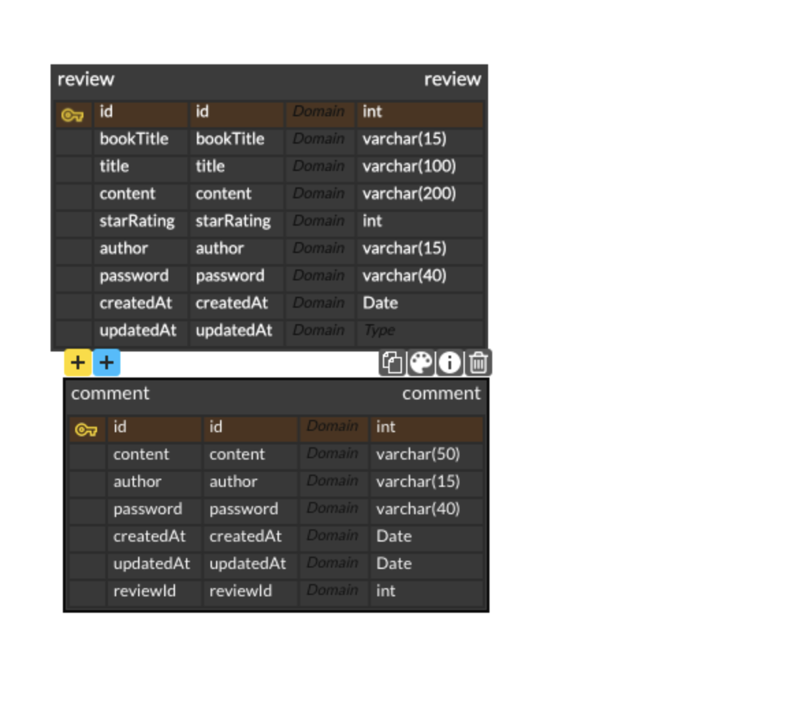

### 과제 요구사항
 1. 내 프로젝트의 ERD 작성하기
 

할거 다하고 식간이 남아서 만들어놨던 erd
외래키를 안쓴다고 해서 코멘트 테이블에 리뷰아이디를 넣어줬다
나는 다크버전을 너무 싫어해서 무조건 밝게 쓴다 

2.  prisma.schema 파일에서 각 모델을 작성하기
prsima init으로 파일 만든 후 테이블을 만든다

```javascript
// review 모델
model Reviews {
  id        Int      @id @default(autoincrement()) @map("review_id")
  bookTitle String   @map("bookTitle") 
  title     String   @map("title")
  content   String   @map("content")
  starRating Int     @map("starRating")
  author    String   @map("author")
  password  String   @map("password")
  createdAt DateTime @default(now()) @map("createdAt")
  updatedAt DateTime @updatedAt @map("updateAt")

  @@map("Reviews")
}

// comment model
model Comments {
  id        Int      @id @default(autoincrement()) @map("comment_id")
  review_id  Int      @map("review_id")
  content   String   @map("content")
  author    String   @map("author")
  password  String   @map("password")
  createdAt DateTime @default(now()) @map("createdAt")
  updatedAt DateTime @updatedAt @map("updatedAt")

  @@map("Comments")
}
```
모델은 각각 자기 부분을 만들었고 나는 리뷰부분을 만들었다 
만들면서 항상 이상하다고 생각하는 건데 createAt은 그냥 기본값이 now인데 왜 updateAt은 기본값이 왜 updateAt일까?
이걸 npx prisma db push를 사용해 데이터베이스에 연결해 만들어준다 
이게 넘어간 후 util 폴더를 만들어 거기서 new PrismaClient를 만든다 
여기가 몽구스로 따지면 모델 만드는것

```javascript
import { PrismaClient } from "@prisma/client";

export const prisma = new PrismaClient({
  // Prisma를 이용해 데이터베이스를 접근할 때, SQL을 출력해줍니다.
  log: ["query", "info", "warn", "error"],

  // 에러 메시지를 평문이 아닌, 개발자가 읽기 쉬운 형태로 출력해줍니다.
  errorFormat: "pretty",
}); // PrismaClient 인스턴스를 생성합니다.

```
그럼 이제 라우테에서 모델 가져와 쓰듯이 `import { prisma } from '../utils/prisma/index.js';`을 쓰고 거기 안에 있는 테이블을 사용하면 된다 

3.과제 요구 사항: API 구현하기
1. 리뷰 작성 API
    - 책 제목, 리뷰 제목, 리뷰 내용, 별점, 작성자명, 비밀번호를 **request**에서 전달받기
    - 리뷰 별점은 최소 1점 ~ 최대 10점까지 등록 가능합니다.
    
2. 리뷰 목록 조회 API
    - 책 제목, 리뷰 제목, 별점, 작성자명, 작성 날짜를 조회하기
    - 리뷰 목록은 작성 날짜를 기준으로 **내림차순(최신순)** 정렬하기
    
3. 리뷰 상세 조회 API
    - 책 제목, 리뷰 제목, 리뷰 내용, 별점, 작성자명, 작성 날짜를 조회하기
    
4. 리뷰 수정 API
    - 책 제목, 리뷰 제목, 리뷰 내용, 별점을 **request**에서 전달받기
    - 비밀번호 일치 여부를 확인한 후, 동일할 때만 리뷰가 **수정**되게 하기
    - 선택한 리뷰가 존재하지 않을 경우, “존재하지 않는 리뷰입니다." 메시지 반환하기
    
5. 리뷰 삭제 API
    - 비밀번호 일치 여부를 확인한 후, 동일할 때만 리뷰가 **삭제**되게 하기
    - 선택한 리뷰가 존재하지 않을 경우, “존재하지 않는 리뷰입니다." 메시지 반환하기
    
 리뷰부분만 맡아서 내가 한부분을 정리!
 
 ### api 구현
 - import
 일단 express를 import하고 프리즈마 모델을 사용하기 위해 prisma을 가져온다 
 
```javascript
import express from 'express';
import { prisma } from '../utils/prisma/index.js';
```

이걸 가져오는 이유는 프리즈마 클라이언트만 가져오면 
`import { PrismaClient } from '@prisma/client';`
프리즈마를 이용해 인스턴스를 만들어줘야 하는데 이게 라우터 마다 이 인스턴스를 만들어서 연결해줘야 하기 때문에 미들웨어 처럼 다른곳에서 만들어서 그 **인스턴스의 이름만**을 가져오기만 하면 된다 

일단 유틸 파일을 만들고 거기에서 인스턴스를 만든다 
```javascript
import { PrismaClient } from "@prisma/client";
export const prisma = new PrismaClient({
  // Prisma를 이용해 데이터베이스를 접근할 때, SQL을 출력해줍니다.
  log: ["query", "info", "warn", "error"],

  // 에러 메시지를 평문이 아닌, 개발자가 읽기 쉬운 형태로 출력해줍니다.
  errorFormat: "pretty",
}); // PrismaClient 인스턴스를 생성합니다.
```
사실여기안의 로그와 에러포멧은 원하면 사용하고 원하지 않으면 없어도 되는거
처음에 있는거로 사용하고 테스트 완료하면 지워도 될거 같다 요청이 올때마다 터미널이 너무 복잡해진다
export로 내보냈기 때문에 라우터 파일에서는 그냥 이 prisma만 가지고 사용하면 된다 
`import { prisma } from '../utils/prisma/index.js';`

그리고 이 라우터가 라우터라고 선언하기 위해 `const router = express.Router();`를 쓴다

1. 리뷰 전체 조회
```javascript
//전체 조회
router.get('/', async (req, res, next) => {
  try {
    let reviewlist = await prisma.Reviews.findMany({
      select: {
        id: true,
        bookTitle: true,
        title: true,
        author: true,
        starRating: true,
        createdAt: true,
        updatedAt: true,
      },
      orderBy: {
        createdAt: 'desc',
      },
    });
    res.status(200).json({ data: reviewlist });
  } catch (error) {
    next(error);
  }
});
```
try-catch문 사용해 받는다 
전부 찾는거이기 때문에 프리즈마.모델.findMany를 사용해 원하는 것을 ㄴselect 해 가져온다 
(이 뒤의 select가 삭제 가능한지는 모르겠다)
가져온 정보를 최근에 생성한 순서로 가져오기 위해 order by에 createdAt을 desc로 사용한다 
그후 받아온 값을 200상태코드와 함께 제이슨에 데이터로 전송한다
만약 에러가 생기면 에러 미들웨어로 전송한다

2. 리뷰등록

```javascript
router.post('/', async (req, res, next) => {
  try {
    const { bookTitle, title, content, starRating, author, password } =
      req.body;
    if (
      !bookTitle ||
      !title ||
      !content ||
      !starRating ||
      !author ||
      !password
    ) {
      return res
        .status(400)
        .json({ errorMessage: '데이터 형식이 올바르지 않습니다.' });
    }
    if (!(starRating >= 1 && starRating <= 10)) {
      return res
        .status(400)
        .json({ message: '별점은 1점에서 10점까지만 입력할 수 있습니다' });
    }
    const reviews = await prisma.Reviews.create({
      data: {
        bookTitle,
        title,
        content,
        starRating,
        author,
        password,
      },
    });
    return res.status(200).json({ message: '첵 리뷰를 등록하였습니다' });
  } catch (error) {
    return res.status(500).json({ error: error.message });
  }
});
```
포스트로 들어온 값을 확인해 없으면 데이터형식이 올바르지 않습니다를 반환한다
만약 들어온 별점이 1이상 10이하가 아니라면 (! 사용)-> 별점은 1점에서 10점까지만 입력할 수 있습니다를 반환한다
이걸 다 넘어오면 들어온 값을 사용해 만든다 (프리즈마.테이블.create 사용
그후 리턴값을 상태코드200을 가지고 와 제이슨으로 메세지를 보낸다 

만약 문제가 있다면 에러메세지를 보낸다 

3) 리뷰아이디 받아 수정
```javascript
//리뷰 아이디 받아 수정
router.put('/:id', async (req, res, next) => {
  try {
    let { id } = req.params;
    const { bookTitle, title, content, starRating, password } = req.body;
    if (!id || !bookTitle || !title || !content || !starRating || !password) {
      return res
        .status(400)
        .json({ errorMessage: '데이터 형식이 올바르지 않습니다.' });
    }

    if (!(starRating >= 1 && starRating <= 10)) {
      return res
        .status(400)
        .json({ message: '별점은 1점에서 10점까지만 입력할 수 있습니다' });
    }
    const review = await prisma.Reviews.findUnique({
      where: { id: +id },
    });
    if (!review)
      return res.status(404).json({ message: '존재하지 않는 리뷰입니다' });
    else if (review.password != password) {
      return res.status(404).json({ message: ' 비밀번호가 틀립니다' });
    }

    await prisma.Reviews.update({
      data: { bookTitle, title, content, starRating },
      where: {
        id: +id,
        password,
      },
    });
    return res.status(200).json({ message: '책 리뷰를 수정하였습니다' });
  } catch (error) {
    next(error);
  }
});
```
try-catch를 사용하고 가져온 파람과 바디가 있는지를 확인하고 값이 있는지를 찾아 없으면 400을 리턴한다
또한 들어온 별점을 1점부터 10점까지만을 사용하게 한다 
들어온 값을 업데이트의 데이터에 넣고 where문을 사용해 뭐를 바꿀지 찾는다 
만약 문제가 있다면 에러 미들웨어로 넘어간다

4) 리뷰 아이디 삭제 
```javascript
//리뷰삭제
router.delete('/:id', async (req, res, next) => {
  try {
    let { id } = req.params;
    const { password } = req.body;
    if (!id || !password) {
      return res
        .status(400)
        .json({ errorMessage: '데이터 형식이 올바르지 않습니다.' });
    }
    const review = await prisma.Reviews.findUnique({
      where: { id: +id },
    });
    if (!review)
      return res.status(404).json({ message: '존재하지 않는 리뷰입니다' });
    else if (review.password != password) {
      return res.status(404).json({ message: ' 비밀번호가 틀립니다' });
    }
    await prisma.Reviews.delete({ where: { id: +id } });
    return res.status(200).json({ message: '책 리뷰를 삭제하였습니다.' });
  } catch (error) {
    next(error);
  }
});

export default router;
```
우선 아이디와 바디의 내용들을 검사하고 파람이 있는지를 검사해 없다면 리뷰가 없다고 리턴
있다면 그 값을 delete where문을 사용해 삭제할 값을 찾고 제 후 제이슨 메세지를 리턴
그 후 에러가 들어오면 에러미들웨어로 보낸다 