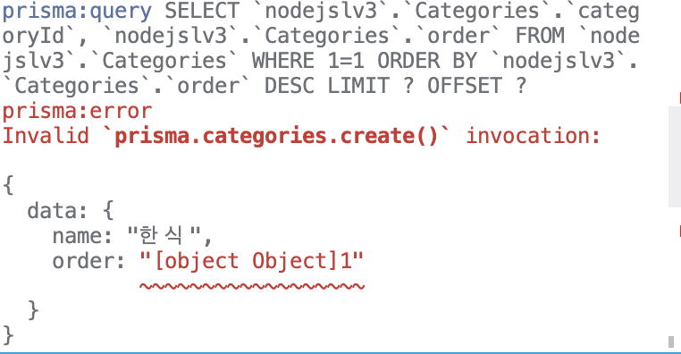
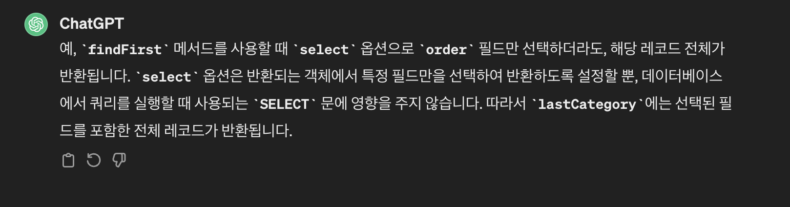
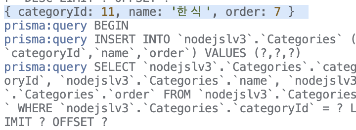

### 프로젝트의 ERD
erd 작성은 내가 한게 아니라 안올림

### 프로젝트 요구사항
prisma.schema 파일에서 각 모델을 작성하기
테이블간의 외래키(foreign key) 제약 조건을 사용하여 모델을 정의
이번에는 외래키를 사용한다

전의 과제와 마찬가지로 프리즈마 프리즈마 클라이언트를 다운받고 prisma init을 한다
그 안에 모델을 작성한다 
나는 카테고리 부분을 맡아 작성했다 
``` javascript
model Categories {
  categoryId Int    @id @default(autoincrement()) @map("categoryId")
  name       String @map("name")
  order      Int    @map("order")   

  menus      Menus[]

  @@map("Categories") 
}
```
외래키를 사용하기 때문에 일대 다 관계라고 Menus[]라고 해놨다 이거는 자식 테이블에 가서 @relation(field:자식테이블값, references:참고할 칼럼  onDelete: Cascade)
onDelete은 부모테이블의 레코드가 삭제될때 해당 테이블의 레코드에 어떤 작업 을 수행할지 지정
CASCADE: 부모 테이블의 레코드가 삭제될 때, 해당 부모 테이블과 관련된 모든 자식 테이블의 레코드도 함께 삭제
SET NULL: 삭제시 남아있지만 null로 바꿈
RESTRICT: 부모테이블의 레코드 삭제되는것을 제한

만든후 npx prisma db push로 적용한다 
그 후 유틸 폴더를 만들어 거기서 클라이언트를 사용해 모델을 만들고 export한다 

라우터에서 가져와 사용한다
유효성 검사를 joi를 사용해 구현한다
### api 구현하기
1. 카테고리 등록 API
    - 카테고리 이름을 **request**에서 전달받기
    - 새롭게 등록된 카테고리는 **가장 마지막 순서**로 설정됩니다.
2. 카테고리 조회 API
    - 등록된 모든 카테고리의 카테고리 이름, 순서를 조회하기
    - 조회된 카테고리는 지정된 순서대로 정렬됩니다.
3. 카테고리 수정 API
    - 카테고리 이름, 순서를 **request**에서 전달받기
    - 선택한 카테고리가 존재하지 않을 경우, “존재하지 않는 카테고리입니다." 메시지 반환하기
4. 카테고리 삭제 API
    - 선택한 카테고리 삭제하기
    - 카테고리 삭제 시, 해당 카테고리에 **연관된 모든 메뉴도 함께 삭제**됩니다.
    - 선택한 카테고리가 존재하지 않을 경우, “존재하지 않는 카테고리입니다." 메시지 반환하기
    
### 구현
1) 카테고리 등록

이름을 request에서 받는다 
이 이름이 없으면 에러메시지를 반환한다
그 후 가져온 이름을 조이의 validate를 한다 
그 후 에러가 나지 않았다면 그대로 진행한다 
새롭게 등록된 카테고리는 저장시 마지막 순서로 저장을 하기 위해 카테고리의 오더를 찾아 만약 오더의 칼럼은 있는데 값이 없다면 오더라는 값에 1을 넣고 오더라는 값이 존재한다면 가장 마지막값을 찾고 거기에 +1을 한다
처음에 오더값 맨 마지막 오더값만 가져올려고 하다가 그러면 desc에서 가져오면 좋겠다라는 생각을 했다
그래서 처음에 짰던 코드는 이거였다 
```javascript
 const lastCategory = await prisma.Categories.findFirst({
      select:{order:true},
      orderBy: { order: 'desc' },
    });
     const order = lastCategory ? lastCategory+1 : 1;
```
근데 이렇게 하면 나는 order값만이 라스크카테고리에 들어갈지 알았는데 여기서 lastCategory.order+1을 해야 한다 
아니면 이 오류난다

근데 어차피 아래서 오더를 가져올꺼면 앞에서 굳이 select를 안해도 된다고 생각했다 

라네요 그냥 눈에 보여주는것만 true인것만 하고 그냥 다 나온다네요
그러면 굳이 select를 할 필요가 없다고 느껴서 그냥 select부분을 빼고 전부 가져와서 그 값중 오더를 빼와서 +1을 해줬다 
콘솔로그 해주니까 이렇게 뜬다 

인줄 알았으나...객체로 준다 그래서 객체중 키값 이렇게 있으니까 그중 value를 가지고 오기 위해 키값을 사용하는거였다 


등록이니 포스트를 사용해 받고 조이를 사용하고 
```javascript
router.post('/', async(req, res,next)=> {

    try{//없으면 
    let { name } = req.body;

    if(!name){
        return res.status(400),json({errorMessage:"데이터 형식이 올바르지 않습니다"})
    }
    
    const validationResult = schemas.validate({ name });
    if (validationResult.error) {
      return res
        .status(404)
        .json({ message: '데이터 형식이 올바르지 않습니다.' });
    }
    const lastCategory = await prisma.Categories.findFirst({
      orderBy: { order: 'desc' },
    });//맨 마지막 오더를 가져오고 
     const order = lastCategory ? lastCategory.order + 1 : 1;
    let category = await prisma.Categories.create({
      data: {
        name,
        order,
      },
    });
    return res.status(200).json({message:"카테고리를 등록하였습니다"})
    }catch(error){
        next(error)
    }
})
```
그리고 조이를 썼기 때문에 이제 파람이나 바디 검사하는 값은 다 빼도 된다 

2)  카테고리 조회 API
카테고리 조회는 get을 사용한다 테이블을 전체 검색한다 
그리고 보여주고 싶은걸 select를 한다 (이거 보여줄때는 왜 이거만 보이는지는 모르겠다)
```javascript
//카테고리 전체 조회
router.get('/', async (req, res, next) => {
    try{
  let category = await prisma.Categories.findMany({
    select: {
      categoryId: true,
      name: true,
      order: true,
    },
    orderBy: {
      order: 'asc',
    },
  });
return res.status(200).json({data:category})
    }catch(error){
      next(error)
    }
});
```
3. 카테고리 수정 API
수정은 put사용 
```javascript
router.put('/:categoryId', async (req, res, next) => {
try{
  let { categoryId } = req.params;
  const { name, order } = req.body;

  if (!categoryId || !name ||!order) {

    return res
      .status(400)
      .json({ message: '데이터 형식이 올바르지 않습니다.' });
  }
const validationResult = schema.validate({ name, order });
if (validationResult.error){
  return res
      .status(404)
      .json({ message: '데이터 형식이 올바르지 않습니다.' });
}
  let categoryfind = await prisma.Categories.findFirst({
    where: { categoryId: +categoryId },
  });
  if (!categoryfind) {
    return res.status(404).json({ message: '존재하지 않는 카테고리입니다' });
  }
  let updateOne =  await prisma.Categories.update({
    data: { name, order },
    where: {
      categoryId: +categoryId,
    },
  });
    return res.status(200).json({ message: '카테고리 정보를 수정하였습니다' });
}catch(error){
    next(error)
}
});
```
우선 검사부분은 없어도 됨
그리고 수정시 사용하는 이름과 오더를 유효성 검사를 돌리고 에러처리한다
```javascript
const schema = Joi.object({
  name: Joi.string().required(), 
  order: Joi.number().integer().required(), 
});
```
그 후 카테고리 아이디를 찾는다 -> 만약 없으면 존재하지 않는 카테고리임을 반환하고 있으면 그것을 where로 사용해 업데이트를 한다 

4. 카테고리 삭제 API
이건 그냥 받아오는게 파람밖에 없어 굳이 조이를 사용하지 않아도 된다 
그냥 파람을 findunique를 해 찾고 없으면 400을 리턴 있으면 delete에 where에 넣어 삭제 한다 
```javascript
router.delete('/:categoryId', async (req, res,next) => {
    try{
  let { categoryId } = req.params;
  if (!categoryId) {
    return res
      .status(400)
      .json({ message: '데이터 형식이 올바르지 않습니다.' });
  }
  let deleteOne = await prisma.Categories.delete({
    where: { categoryId: +categoryId },
  });
  if (!deleteOne) {
    return res.status(404).json({ message: '존재하지 않는 카테고리입니다' });
  }

  return res.status(200).json({ message: '카테고리 정보를 삭제하였습니다.' });
}catch(error){
    next(error)
}
});
```
