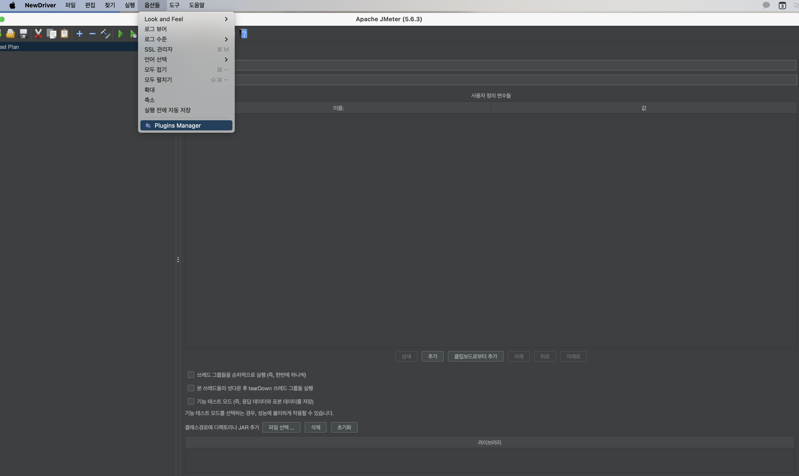

### Jmeter란
Apache JMeter는 웹 애플리케이션의 성능을 측정하고 부하 테스트를 수행하기 위한 도구로 서버나 개체등에 대한 과부하를 시뮬레이션 하여 서버를 테스트 하거나 다양한 부하에서 성능을 검사하는 도구이다

특징으로는 gul와 cli를 지원하며 시나리오 기반 테스트가 가능하고 다양한 외부 플러그인을 사용해 기능확장이 가능하다
### 설치 
* mac m1 기준
1. 일단 자바이기때문에 자바를 설치한다

[자바설치](https://www.oracle.com/kr/java/technologies/downloads/)

2. brew를 사용해 cmd에서 brew install Jmeter입력한다

3. open /opt/homebrew/bin/jmeter 입력하면 자동으로 켜진다 

### 기초설정
1. 플러그인 설치 
실행중인 Jmeter의  option에서 플러그인 매니저를 클릭한다

플러그인 매니저에서 jpgc-graphs-basic 검색후 3 Basic Graplhs 나오면 체크 

체크 후 아래 Aplly Changes and Restart JMeter 클릭

한글로 메뉴를 쓰고 싶으면 옵션에 가서 Choose Language에서 korean을 선택한다 

### Jmeter 주요 개념 및 용어 
테스트 하는 서버와 어플리케이션을 돌리는 서버는 서로 달라야 한다 
1. Test Plan: 실행할 테스트의 전체 구성 
2. Thread Group:가상의 사용자 그룹
3. sampler: 서버에 보낼 요청이 생성
4. Listener: 응답을 받았을때 어떤 동작을 취하는지 
5. Configuration: 샘플러나 리스너가 사용할 설정값(쿠키등)
6. Assertion: 응답결과의 성공여부를 판단하는 조건 
7. Logic Controllers: 테스트의 흐름을 제어 
8. Assertions: 테스트 실행 결과 기대하는 조건을 만족하는지 검증
9. Variables: 테스트중 실행에 사용할 수 있는 변수를 정의 

### 간단한 테스트 
- test plan에서 우클릭 add-> Config Element-> User Defined Variables

- 테스트할 정보를 입력
아래의 add버튼을 누르면 입력할 수 있는 창이 나온다

address: 테스트할 서버의 주소 (localhost)

port: 테스트 서버 포트 

userCnt: 테스트할 사용자 수 

timeSec: 실행시간 (초) 

loopCnt: 반복횟수 

enCoding: 인코딩 utf-8

입력완료 후 test plan 우클릭-> add-> Listener-> jp@gc-Transections per Second 클릭

test plan 아래에 jp@gc - Transction per Second 생기고 다시 add -> thread-> thread Group을 클릭

쓰레드 그룹 안에서 Thread Propeties에 입력
number of Thread: 테스트 사용자수 
,Ramp-up preiod: 실행기간(초)

아래 생긴 스레드 그룹 우클릭 -> add-> sampler-> http request
여기서 요청의 정보를 입력한다 

프로토콜: http인지 https인지 입력 

server name: 테스트 할려는 서버 주소 

port: 테스트 하려는 서버의 포트 

path: 테스트할 서버의 path

인코딩은 utf-8

스레드 그룹에서 http request-> advance->  Implementation에서 HttpClient4

스레드 리퀘스트를 우클릭=> add->listener->  Summary Report클릭

Summary Report 우클릭 ▶ Add ▶ Listener ▶ View Result Tree 

위 헤더의 초록색실행버튼 클릭

### http cookie Manager
 http cookie Managers는 상호작용 중에 쿠키를 관리 하는데 사용

 - 수동으로 관리
 HTTP Request → Add → Config Element → HTTP Cookie Manager 
 add를 눌러 쿠키를 생성한다 
 
 - 자동으로 관리 

 Add -> Config Element -> HTTP Cookie Manager
 기본적으로 쿠키를 자동으로 관리하도록 되어 있다 
 
 ### 로직예시
 1. 새로운 유저를 만들기 위해 정보 만들기 

 정보를 http Request에 테스트 플랜으로 가 요청 정보를 설정한다 
 
 method: http method가 뭔지 설정
 
 path: 뒤에 붙을 경로 
 
 parameter: 쿼리스트링 사용
 
 Body Data: 바디로 보낼값
 
 보낼값이 json타입이기 때문에 헤더에 application/json으로 설정 ( HTTP Header Manager를 사용)
 
 - 회원가입
 회원가입시 서로 다른 정보를 사용해 요청을 자동화 해야 한다 

 Jmetet의 CSV Data Set Config를 사용해 csv 파일의 데이터를 사용해 테스트를 진행한다 

 thread-> add-> Config Element -> CSV Data Set Config

 데이터가 있는 엑셀 데이터를 선탟 후 각 데이터가 의미하는 변수명을 입력

 filename:csv파일의 경로를 선택
 
 Variable Names: 구분자를 입력 csv파일의 맨 위에 있는것
 
 http request의 요청 파라미터에 바디 데이터에 값을 적는 부분에 $(변수명)으로 사용
 