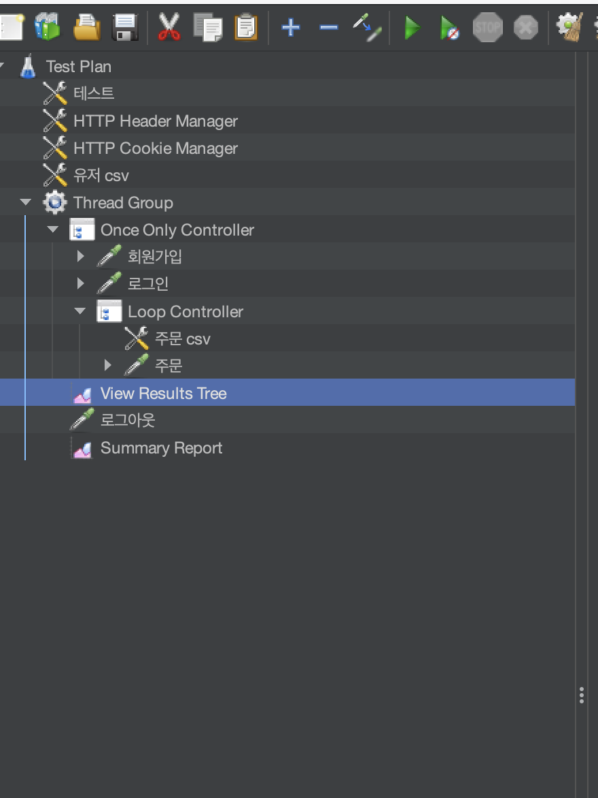

### 기초 설정
ec2 생성 및 pem파일 저장(ec2 총 3개 생성하는게 그냥 pem 다 맞추는게 편함)
jmeter파일중 save하면 나오는 jmx파일 저장하기 
jmx 파일 위치와 pem 키 위치 ec2의 사용자 이름, ec2 ip주소

1. ec2 서버에 메인과 node expoter동시 설치 
깃액션 사용해 ec2에 메인과 node expoter를 설치한다 
- node expoter 도커 파일
```Dockerfile
#부모 이미지 지정
FROM node:alpine
#도커 내부의 디렉토리를 생성
WORKDIR /app

# 외부 패키지 설치를 위해 package.json과 yarn.lock 파일 복사
COPY ./docker-compose.yml .
COPY main/package.json .
COPY main/yarn.lock .

# 패키지 설치
RUN  yarn install

# 메인 폴더의 내용을 전부 복사 
COPY main .
# 현재 디렉터리에 있는 파일들을 이미지 내부 /app 디렉터리에 추가함

ADD     . /app
#로컬 빌드이기때문에 안의 .env파일이 있어 arg와 env로 사용할 필요 없음
# ARG로 빌드 시점 변수를 선언
ARG DATABASE_URL
ARG PORT
ARG DATABASE_HOST
ARG DATABASE_PORT
ARG DATABASE_NAME
ARG DATABASE_USERNAME
ARG DATABASE_PASSWORD
ARG JWT_SECRET
ARG PASS
ARG USER
ARG GOOGLE_ID
ARG GOOGLE_SECRET
ARG NAVER_ID
ARG BACKEND_URL
ARG FRONTEND_URL
ARG NAVER_SECRET
ARG KAKAO_ID

ENV DATABASE_URL=$DATABASE_URL 
ENV PORT=$PORT 
ENV DATABASE_HOST=$DATABASE_HOST 
ENV DATABASE_PORT=$DATABASE_PORT 
ENV DATABASE_NAME=$DATABASE_NAME 
ENV DATABASE_USERNAME=$DATABASE_USERNAME 
ENV DATABASE_PASSWORD=$DATABASE_PASSWORD 
ENV PASS=$PASS 
ENV USER=$USER 
ENV NAVER_ID=$NAVER_ID
ENV BACKEND_URL=$BACKEND_URL
ENV FRONTEND_URL=$FRONTEND_URL
ENV NAVER_SECRET=$NAVER_SECRET
ENV KAKAO_ID=$KAKAO_ID
ENV GOOGLE_ID=$GOOGLE_ID 
ENV GOOGLE_SECRET=$GOOGLE_SECRET 
ENV JWT_SECRET=$JWT_SECRET
RUN yarn prisma generate

CMD [ "node","src/app.js" ]
```
- 도커파일2
```Dockerfile
FROM prom/node-exporter:latest
```

```yml
#메인 서버를 만들자 (메안과 node expoter를 사용하자)
version: "3.8"
services:
  stocking:
    build:
      context: .
      args:
        PORT: $PORT
        DATABASE_URL: $DATABASE_URL
        DATABASE_HOST: $DATABASE_HOST
        DATABASE_PORT: $DATABASE_PORT
        DATABASE_NAME: $DATABASE_NAME
        DATABASE_USERNAME: $DATABASE_USERNAME
        DATABASE_PASSWORD: $DATABASE_PASSWORD
        JWT_SECRET: $JWT_SECRET
        GOOGLE_ID: $GOOGLE_ID
        GOOGLE_SECRET: $GOOGLE_SECRET
        USER: $USER
        PASS: $PASS
        AWS_ACCESS_KEY_ID: $AWS_ACCESS_KEY_ID
        AWS_SECRET_ACCESS_KEY: $AWS_SECRET_ACCESS_KEY
        AWS_REGION: $AWS_REGION
        REMOTE_PRIVATE_KEY: $REMOTE_PRIVATE_KEY
        EC2_HOST: $EC2_HOST
        NAVER_ID: $NAVER_ID
        NAVER_SECRET: $NAVER_SECRET
        KAKAO_ID: $KAKAO_ID
        BACKEND_URL: $BACKEND_URL
        FRONTEND_URL: $FRONTEND_URL
    image: ${ECR_REGISTRY}/stocking:latest
    environment:
      PORT: $PORT
      DATABASE_URL: $DATABASE_URL
      DATABASE_HOST: $DATABASE_HOST
      DATABASE_PORT: $DATABASE_PORT
      DATABASE_NAME: $DATABASE_NAME
      DATABASE_USERNAME: $DATABASE_USERNAME
      DATABASE_PASSWORD: $DATABASE_PASSWORD
      JWT_SECRET: $JWT_SECRET
      NAVER_ID: $NAVER_ID
      NAVER_SECRET: $NAVER_SECRET
      KAKAO_ID: $KAKAO_ID
      BACKEND_URL: $BACKEND_URL
      FRONTEND_URL: $FRONTEND_URL
      GOOGLE_ID: $GOOGLE_ID
      GOOGLE_SECRET: $GOOGLE_SECRET
      USER: $USER
      PASS: $PASS
      AWS_ACCESS_KEY_ID: $AWS_ACCESS_KEY_ID
      AWS_SECRET_ACCESS_KEY: $AWS_SECRET_ACCESS_KEY
      AWS_REGION: $AWS_REGION
      REMOTE_PRIVATE_KEY: $REMOTE_PRIVATE_KEY
      EC2_HOST: $EC2_HOST
  node-exporter:
    build:
      context: .
      dockerfile: Dockerfile.node-exporter
    image: ${ECR_REGISTRY}/node-exporter:latest
    container_name: node-exporter
    ports:
      - "9100:9100"

```
왜 굳이 도커 파일을 빌드하는걸까? 
도커 파일을 빌드하지 않으면 이미지를 쓴다고 아예 push가 안됨 
이제 깃허브 액션을 사용해 ECR에 push하고 다시 ec2에 pull을 받는걸 수행한다 
그전에 ec2에 도커를 설치하고 기본 설정을 해줘야 한다 
전의 벨로그글을 보고 설정을 해줘야 한다 
```yml
name: Deploy to EC2 with ECR
#ECR
on:
  push:
    branches:
      - main_test
jobs:
  deploy:
    runs-on: ubuntu-latest
    steps:
      - name: Checkout repository
        uses: actions/checkout@v2

      # AWS에 로그인
      - name: Configure AWS credentials
        uses: aws-actions/configure-aws-credentials@v2
        with:
          aws-access-key-id: ${{ secrets.AWS_ACCESS_KEY_ID }}
          aws-secret-access-key: ${{ secrets.AWS_SECRET_ACCESS_KEY }}
          aws-region: ${{ secrets.AWS_REGION }}

      # ECR에 로그인
      - name: Login to Amazon ECR
        id: login-ecr
        uses: aws-actions/amazon-ecr-login@v1
        with:
          mask-password: "true"

      # Docker 이미지 빌드 및 푸시
      - name: Build, tag, and push image to Amazon ECR
        env:
          ECR_REGISTRY: ${{ steps.login-ecr.outputs.registry }}
          ECR_REPOSITORY: stocking
          IMAGE_TAG: latest
          PORT: 3000
          DATABASE_URL: ${{ secrets.DATABASE_URL}}
          DATABASE_HOST: ${{ secrets.DATABASE_HOST}}
          DATABASE_PORT: ${{ secrets.DATABASE_PORT}}
          DATABASE_NAME: ${{ secrets.DATABASE_NAME}}
          DATABASE_USERNAME: ${{ secrets.DATABASE_USERNAME}}
          DATABASE_PASSWORD: ${{ secrets.DATABASE_PASSWORD}}
          JWT_SECRET: ${{ secrets.JWT_SECRET}}
          GOOGLE_ID: ${{ secrets.GOOGLE_ID}}
          GOOGLE_SECRET: ${{ secrets.GOOGLE_SECRET}}
          USER: ${{ secrets.USER}}
          PASS: ${{ secrets.PASS}}
          FRONTEND_URL: ${{secrets.FRONTEND_URL}}
          BACKEND_URL: ${{secrets.BACKEND_URL}}
          NAVER_ID: ${{secrets.NAVER_ID}}
          NAVER_SECRET: ${{secrets.NAVER_SECRET}}
          KAKAO_ID: ${{secrets.KAKAO_ID}}
          AWS_ACCESS_KEY_ID: ${{ secrets.AWS_ACCESS_KEY_ID}}
          AWS_SECRET_ACCESS_KEY: ${{ secrets.AWS_SECRET_ACCESS_KEY}}
          AWS_REGION: ${{ secrets.AWS_REGION}}
          REMOTE_PRIVATE_KEY: ${{ secrets.REMOTE_PRIVATE_KEY}}
          EC2_HOST: ${{ secrets.EC2_HOST}}
          EC2_USERNAME: ${{ secrets.EC2_USERNAME}}
        run: |
          docker-compose build
          docker-compose push

      # SSH로 EC2 인스턴스에 접속하여 Docker 컨테이너 재시작!~
      - name: SSH into EC2 instance and restart Docker container
        uses: appleboy/ssh-action@master
        with:
          key: ${{ secrets.REMOTE_PRIVATE_KEY }}
          host: ${{ secrets.EC2_HOST_TEST }}
          username: ${{ secrets.EC2_USERNAME }}
          port: 22
          script: |
            docker login -u AWS -p $(aws ecr get-login-password --region ${{ secrets.AWS_REGION }}) ${{ steps.login-ecr.outputs.registry }}
            docker pull ${{ steps.login-ecr.outputs.registry }}/stocking:latest
            docker pull ${{ steps.login-ecr.outputs.registry }}/node-exporter:latest
            sudo docker ps -a
            sudo docker stop $(docker ps -a -q)
            sudo docker ps -a
            sudo docker rm $(docker ps -aq)
            sudo docker ps -a
            sudo docker run -d -p 3000:3000 ${{ steps.login-ecr.outputs.registry }}/stocking:latest
            sudo docker run -d -p 9100:9100 --name node-exporter ${{ steps.login-ecr.outputs.registry }}/node-exporter:latest
            sudo docker ps -a
            sudo docker system prune -a -f
 ```
 EC2_HOST_TEST를 메인서버 ip주소 넣기
 
### jmx파일 만들기 
gul로 된 jmeter프로그램에 들어가 설정하기 ip주소와 어떻게 테스트 할껀지 설정하기
```bash
/opt/homebrew/Cellar/jmeter/5.6.3/bin/jmeter ; exit;

```
이 명령어로 GUL로 Jmeter를 사용한다

User Defined Variables를 사용해 adress, port, encoding, userCnt, timeSec, loopCnt 설정 
이거는 그냥 이렇게 설정할꺼다라고 하는거 같음
헤더 매니저에 Content-Type를 application/json 설정
그아래 유저의 csv파일을 설정한다 
test plan과 testgroup의 ip주소를 모두 바꾸고 csv Config파일의 경로또한 ec2파일의 위치로 바꿔야 한다 
루프 컨테이너안에 주문용 csv를 넣어야 하나씩 제대로 들어간다
http request를 메인서버의 ip를 넣어야 한다

### ec2에 jmeter파일 보내기 
먼저 Jmeter용 ec2를 하나 만들어준다 
프리티어로 하면 테스트할 용량이 부족하다고 하니까 아예 미디움으로 만들자 
지금 이 jmeter파일을 ec2에 파일을 보낸다 scp을 사용해 보낸다 
scp -i/path/pem파일위치 /보낼파일위치/ ubuntu@ip주소:ec2경로
jmeter파일과 users.csv파일(회원정보가 들어있는 csv), orders.csv(주문정보가 들어있는 csv)파일또한 같이 보내야 한다 
만약 ec2안의 위치를 .로 하면 ec2내의 위치가 /home/ubuntu/안에 들어가게 된다 위치 다 이렇게 바꾸기
 
 ### 제대로 들어갔는지 확인하기
테스트용 서버에 들어가 ls를 해 csv파일과 jmx파일을 확인한다 

### Jmeter 설치 
```bash
sudo apt update
sudo apt install openjdk-11-jdk -y
wget https://downloads.apache.org/jmeter/binaries/apache-jmeter-5.6.3.tgz
 ./bin/jmeter -n -t ../test01.jmx -l ../results.jtl
 ```
 
 ### Jmeter를 사용해 테스트를 한다 
 
Jmeter 사용할때 플러그인 안쓰고 있는지 확인
그냥 플러그인 전부를 없애자 
```bash
./bin/jmeter -n -t ../jmx파일이름.jmx -l ./results.jtl
```
이렇게 하면 result.jtl에 로그가 남게 된다 
그리고 실행하면 결과가 나오게 된다 

### 그라파나와 프로메테우스를 다른 ec2에 설치하자 
도커 컴포즈와 도커 파일을 사용해 다른 ec2에 프로메테우스와 그라파나를 설치한다 
```Dockerfile
FROM prom/prometheus:latest
COPY prometheus.yml /etc/prometheus/prometheus.yml
```
```Dockerfile
FROM grafana/grafana:latest
COPY grafana.ini /etc/grafana/grafana.ini
```
도커 컴포즈 파일또한 같이 빌드해줘야 한다 
```yml
version: "3.8"
services:
  node-exporter:
    build:
      context: .
      dockerfile: Dockerfile.node-exporter
    image: ${ECR_REGISTRY}/node-exporter:latest
    container_name: node-exporter
    ports:
      - "9100:9100"
  prometheus:
    build:
      context: .
      dockerfile: Dockerfile.prometheus
    image: ${ECR_REGISTRY}/prometheus:latest
    ports:
      - "9091:9090"
    volumes:
      - ./prometheus.yml:/etc/prometheus/prometheus.yml
    depends_on:
      - node-exporter
  grafana:
    build:
      context: .
      dockerfile: Dockerfile.grafana
    image: ${ECR_REGISTRY}/grafana:latest
    ports:
      - "3001:3001"
    volumes:
      - ./grafana.ini:/etc/grafana/grafana.ini

```
이걸 굳이 빌드하는 이유는 안의 설정파일이 필요하기 때문이다 그라파나는 3000포트를 3001포트로 바꾸기 위해 사용했는데 이걸 굳이 안써도 된다 
근데 프로메테우스는 타켓으로 자기가 메트릭을 모을 ip를 지정해줘야 한다 
```yml
lobal:
  scrape_interval: 15s

scrape_configs:
  - job_name: "node-exporter"
    static_configs:
      - targets: ["x.xx.xxx.xxx:9100"] #
 ```
이렇게 타켓안에 넣어줘야 한다 
브런치를 바꿔 모니터링 브런치를 만들고 깃액션을 사용해 프로메테우스와 그라파나를 설치한다 
물론 이 브런치에도 전의 벨로그글을 보며 설정을 해줘야 한다 
```yml
name: Deploy to EC2 with ECR
#ECR
on:
  push:
    branches:
      - monitoring
jobs:
  deploy:
    runs-on: ubuntu-latest
    steps:
      - name: Checkout repository
        uses: actions/checkout@v2

      # AWS에 로그인
      - name: Configure AWS credentials
        uses: aws-actions/configure-aws-credentials@v2
        with:
          aws-access-key-id: ${{ secrets.AWS_ACCESS_KEY_ID }}
          aws-secret-access-key: ${{ secrets.AWS_SECRET_ACCESS_KEY }}
          aws-region: ${{ secrets.AWS_REGION }}

      # ECR에 로그인!
      - name: Login to Amazon ECR
        id: login-ecr
        uses: aws-actions/amazon-ecr-login@v1
        with:
          mask-password: "true"

      # Docker 이미지 빌드 및 푸시
      - name: Build, tag, and push image to Amazon ECR
        env:
          ECR_REGISTRY: ${{ steps.login-ecr.outputs.registry }}
        run: |
          docker-compose build
          docker-compose push

      # SSH로 EC2 인스턴스에 접속하여 Docker 컨테이너 재시작!~
      - name: SSH into EC2 instance and restart Docker container
        uses: appleboy/ssh-action@master
        with:
          key: ${{ secrets.REMOTE_PRIVATE_KEY }}
          host: ${{ secrets.EC2_HOST_MONITORING }}
          username: ${{ secrets.EC2_USERNAME }}
          port: 22
          script: |
            docker login -u AWS -p $(aws ecr get-login-password --region ${{ secrets.AWS_REGION }}) ${{ steps.login-ecr.outputs.registry }}
            docker pull ${{ steps.login-ecr.outputs.registry }}/prometheus:latest
            docker pull ${{ steps.login-ecr.outputs.registry }}/grafana:latest
            docker pull ${{ steps.login-ecr.outputs.registry }}/node-exporter:latest
            sudo docker ps -a
            sudo docker stop $(docker ps -a -q)
            sudo docker ps -a
            sudo docker rm $(docker ps -aq)
            sudo docker ps -a
            sudo docker run -d -p 9100:9100 --name node-exporter ${{ steps.login-ecr.outputs.registry }}/node-exporter:latest
            sudo docker run -d -p 9091:9090 ${{ steps.login-ecr.outputs.registry }}/prometheus:latest
            sudo docker run -d -p 3001:3001 ${{ steps.login-ecr.outputs.registry }}/grafana:latest
            sudo docker ps -a
            sudo docker system prune -a -f
```
EC2_HOST_MONITORING에 모니터링 ip주소로 설정한다
프로메테우스와 그라파나를 설치하고 실행이 된지 확인한다 
확인이 되면 그라파나 주소로 접속한후 데이터 소스에 들어가 프로메테우스를 사용한다 
ip주소는 메인서버와 같이 설치한 node expoter의 주소를 적는다 
save&test를 누르면 포록생으로 나오면서 연결된다 
그 후 대시보드쪽으로 가 new dashboard-> import dashboard-> 하면 나오는 load부분에 1860(node expoter full의 code)를 입력하고 load를 누른다 
그후 데이터 소스를 미리 연결해놓은 프로메테우스를 사용한다 
연결을 확인한다 

### 연결 후 테스트 
다시 테스트용 ec2에 들어가 Jmeter를 실행시키고 나오는 tps와 그라파나 그래프를 살펴본다 
다른 시나리오로 테스트를 할꺼면 원래 있던 파일을 rm을 사용해 삭제한 후  jmx파일을 다시 만들고 scp를 사용해 파일을 전송한다 
혹시 컴퍼니 아이디가 바뀌면 오더도 다시 전송한다 

메인서버에서 제대로 처리하고 있는지 살펴보기 위해 메인서버의 ec2에 접속해 docker logs 컨테이너ID를 사용한다 

### 정리 
사용하는 ec2 3개
Jmeter용 하나 , 모니터링툴용하나, 메인용 하나 
Jmeter파일을 만들어 계속 Jmeter에 넣어준다 
모니터링툴은 메인서버의 node expoter의 ip를 설정파일에 넣어주고 빌드를 한다 그리고 프로메테우스의 depends_on으로 node expoter를 사용해서 같이 설치해줘야 한다 
테스트시 유저랑 세션 잘 지웠는지 확인한다 
push나 generate했으면 바뀌니까 잘 확인
그리고 push  후 바로 하는게 아니라 로컬에서 nodemon이나 node로 실행시키고 다시 하기 
Jmeter csv파일 위치 중요 onceonly는 아에 컨트롤러에 안들어가게, loop는 그 안에서 하나씩 가지고 와야 하니까 안에 넣어주기 
