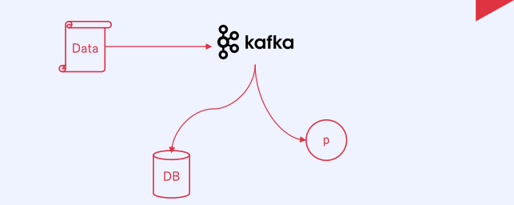
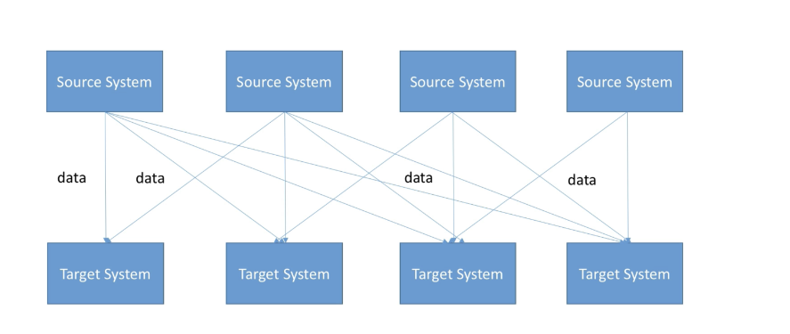
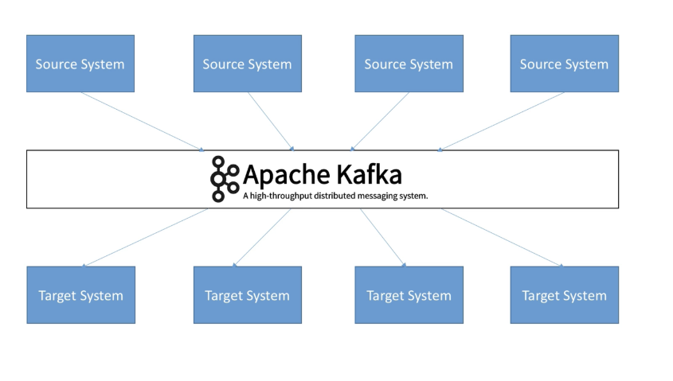

### 도입배경
카프카와 데이터베이스 간의 통신이 다른점

- 비동기 vs 동기
카프카는 비동기 메세지 큐로 작동 이는 생산자가 메세지를 보내고 소비자가 메세지를 읽을때까지 기다리지 않고 다른 작업을 수행할 수 있다 

-> 데이터베이스는 동기통신을 사용해 요청을 보내고 응답을 보낸다 

카프카는 메세지 큐로 동작하기 때문에 생산자가 메세지로 보낸 후 메세지 즉시 반환

소비자가 메세지를 받을때 메세지를 처리 할 수 있다 

- 데이터 저장과 처리 
카프카는 데이터를 영구적으로 저장하지 않음 일정 기간동안 데이터를 보장하고 검색할 수 있게 함

빠르게 검색 할 수 있도록 인메모리 디스크 사용

저장속도와 검색속도는 카프카가 더 빠르다 

- 확장성
카프카는 수평적으로 확장이 가능한 분산 시스템으로 설계 되어 있다 브로커를 추가하여 클러스터를 확장하거나 파티션을 추가하여 처리능력을 증가 할 수도 있음

### 카프카란? 

목적:event/message 전송을 위해 사용된다 

장점: 고강용성 빠른처리 

단점: 순서보장이 어려움, 아주 작게 사용이 어렵다 


시스템이 복잡해짐에 따라 이를 운영하고 개발은 매우 복잡해짐

서로 각각 시스템 끼리의 연결이 엉켜있음


이런 문제를 해결하기 위해 kafka가 만들어졌다 

모든 시스템은 카프카를 타켓으로 대이터를 송신하는 구조 


카프카를 도입함으로써 모든 이벤트 데이터의 흐름을 중앙에서 관리 할 수 있게 됨

대용량의 실시간 로그처리에 특화된 구조 
### 카프카란
카프카는 분산형 스트리밍 플랫폼으로, Pub-Sub 모델의 메시지 큐 형태로 동작합니다. 

메시지 큐란 메시지 지향 미들웨어를 구현한 시스템으로, 프로그램 간의 데이터 교환에 사용되는 기술입니다. 

카프카는 메시지 큐의 개념을 적용하여 메시지를 중앙 큐에 저장하고, 프로듀서와 컨슈머 간의 중재 역할을 수행합니다. 

이를 통해 높은 처리량과 낮은 시간, 높은 확장성, 리플리케이션을 통한 고가용성, 내구성 등의 특징을 가지고 있습니다.

- Pub-Sub 모델
Pub-Sub 모델은 이벤트를 발행하는 퍼블리셔와 해당 이벤트를 구독하는 서브스크라이버로 구성됩니다. 
퍼블리셔는 특정 토픽에 이벤트를 전송하고, 구독자는 해당 토픽을 구독하여 이벤트를 받습니다.

카프카에서는 프로듀서가 토픽에 이벤트를 보내고, 해당 이벤트는 토픽의 파티션에 분산되어 저장됩니다. 이후 구독자인 컨슈머 그룹 내의 컨슈머가 파티션으로부터 이벤트를 가져옵니다.

카프카 이외에도 래빗엠큐, 아파치 펄사 등의 메시지 큐가 있으며 ,Kafka는 높은 처리량, 내구성, 확장성이 특징이며, 메시지를 효율적으로 전송하기 위해 메시지 브로커 시스템을 사용합니다.

카프카는 여러 클러스터에서 여러 브로커를 통해 작동하며 이를 여러 서버에 분산시켜 동시에 처리가 가능해 병목현상을 줄이고 처리량을 크게 향상 시킬 수 있습니다

또한 비동기 통신을 사용해 응답을 기라지지 않고 다른 작업을 계속 진행 할 수 있습니다
### 카프카의 구성요소 
- 토픽
토픽은 카프카에서 데이터가 발행되고 저장되는 논리적인 카테고리 

메세지들의 집합이며 데이터의 특정유형 또는 주제에 따라 구별

- 파티션 
파티션은 토픽의 물리적인 저장 단위 
각 파티션은 메세지를 순차적으로 저장, 파티션 내에서는 메세지들은 순서가 보장됨

하위폴더, Topic의 하위개념으로 분산을 위해 나누어 처리되는 단위

- 생산자
생산자는 데이터를 특정 토픽에 발행

데이터를 생성하고 카프카 클러스터에 메세지를 보냄

사바기 생산자가 될 수 있음

- 소비자
소비자는 특정 토픽에서 데이터를 소비하는 역할을 한다 읽고 처리 하여 필요한 작업을 수행

- 브로커 
브로커는 카프카 클러스터의 각 노드를 나타냄 

데이터의 저장 복제 분산 검색등을 담당

클러스터 내 데이터의 분산을 관리하고 파티션의 리더를 선택

- 주키퍼
주키퍼는 카프카 클러스터의 메타 데이터와 리더 선출을 관리하는데 사용

브로커의 동적관리 구성관리와 클러스터 상태 모니터링 담당

- 컨슈머 그룹
여러 소비자들의 논리적인 그룹을 형성

걱 콘슈머 그룹은 특정 토픽의 파티션에서 데이터를 소비하는 역할

컨슈머 그룹 내의 소비자들은 토픽의 파티션을 분산

- Replica
Leader 의 장애를 대응하기 위해 만들어놓는 복사본

### 카프카와 래빗엠큐의 차이 
RabbitMQ : Erlang(network설비를 위한 언어로 개발) 으로 AMQP를 구현한 Message Broker System 

Kafka : Producer → Broker → Partition → Consumer

RabbitMQ : Producer → Exchange → Binding Rules → Queue → Consumer

카프카는 제각기 조건에 맞춰서 가져감 

래빗엠큐: 프로듀서가 전달할 시기를 통제 나머지는 메세지를 신속히 전달하는것에 초첨

### 서버에서 카프카를 사용하는 방법
서버에서 카프카를 사용하는 방법은 주로 백엔드 서버에서 카프카를 사용해 데이터를 처리하고 저장

순서 
1. 백엔드 서비스에서 데이터 생성 및 카프카 전송

프론트에서 백으로 데이터를 넘어오는 데이터를 카프카 클러스터가 있는 ec2로 전송한다 

2. 카프카 클러스터에서 데이터 저장 및 처리 

카프카 클러스터는 받은 데이터를 토픽에 저장 -> 데이터를 처리함

3. 다시 백엔드 서버에서 카프카로부터 데이터 받기 

백엔드 서버에서 카프카 컨슈머를 사용하여 카프카에서 데이터 소비 

4. 그 후 다른 서버에 전달

### ec2에 카프카 설치 
카프카 클러스터를 만들기 위해 3개의 카프카브로커를 만든다 

그렇게 하기 위해서 ec2를 3개를 만든다 보안 그룹애 2181과 9092를 추가한다 

2181은 주기퍼 9092는 카프카가 사용한다 

인바운드 규칙에서 소스를 0.0.0.0이 아닌 보안그룹으로 지정할 수있다 보안그룹으로 지정하게 되면 그 보안그룹을 쓰는 인스턴스에서 오는 요청만 통신을 시켜준다고 한다 

이번에는 아니기 떄문에 0.0.0.0으로 열어준다 

터미널에서 ssh를 사용해 ec2에 들어간다 
```bash
sudo apt-get update
sudo apt-get install default-jre
JAVA_HOME="/usr/lib/jvm/java-11-openjdk-amd64"
mkdir kafka
 curl "https://archive.apache.org/dist/kafka/2.7.2/kafka_2.12-2.7.2.tgz" -o /home/ubuntu/kafka/kafka.tgz
 tar -xvzf kafka.tgz --strip 1
```
일단 업데이트한뒤 자바를 install하고 자바홈을 설정해준다 

그 후 카프카 폴더를 만들어 카프카를 다운 받는다 

curl 다음이 경로 -o 다음은 이 이름으로 받겠다 

strip1은 하나 벗겨낸다라는 의미 애를 풀면 카프카 2.7.2를 벗겨내서 여기에 풀겠다는 의미

strip 1"은 최상위 디렉토리를 생략하고 그 아래의 모든 파일과 디렉토리를 현재 작업 디렉토리에 압축 해제하는 것을 의미

압축 파일의 첫 번째 디렉토리가 제거되고 그 아래의 파일들이 현재 디렉토리에 직접 압축 해제
파일정리 안되어있고 그냥 풀리게 된다 

카프카는 카프카를 실행할때 bin폴더 안의 kafka-server-start.sh* 로 시작이 되고 kafka-server-stop.sh* 로 끝난다 

주키퍼또한 zookeeper-server-start.sh* 에서 시작이 되고 zookeeper-server-stop.sh* 로 끝난다 

카프카를 돌리는 스크립트에서 힙 부분을 바꿔줘야 한다 
```bash
vi kafka-server-start.sh
#들어간 후  i 눌러 입력모드 export KAFKA_HEAP_OPTS=Xmx1G - Xms1G부분을 바꾼다 
 export KAFKA_HEAP_OPTS="-Xms400m -Xmx400m"
 #입력후 esc누른 후 :qa로 나가기 
 ```
 카프카가 활동하는 메모리를 지정하는 부분인데 원래는 1기가인데 프리티어는 전체용량이 1기가이기 때문에 카프카가 활동을 못한다 

 그래서 400m으로 다운했다 

 일단은 다운해서 사용해보고 너무 속도가 느린거 같으면 프리티어가 아닌 미디움이나 라지로 다시 만들어놓고 이 부분은 진행하지 않는걸로 하자 
 ```
 export KAFKA_HEAP_OPTS="-Xms400m -Xmx400m"
 echo $KAFKA_HEAP_OPTS
```
echo하면 Xms400m -Xmx400m가 잘나와야 한다 

사실 이렇게만 해도 되는데 안전하게 하기 위해 위의 과정을 진행한것

자바 홈 설정
```bash
export JAVA_HOME="/user/lib/jvm/java-11-openjdk-amd64"
echo $JAVA_HOME
#이렇게 해도 되지만 실제로 입력하는것이 좋음
cd /home/ubuntu/
ll
vi .bashrc
#들어간 후 맨 마지막확인
export KAFKA_HEAP_OPTS="-Xms400m -Xmx400m"
export JAVA_HOME="/usr/lib/jvm/java-11-openjdk-amd64"
export PATH=$PATH:$JAVA_HOME/bin
#이미 이렇게 되어있으면 괜찮지만 아니면 이렇게 만들기 그 후 esc누르고 :qa로 나오기
#세션이 종료되면 터미널에 적어놓은거는 사라진다고 함
```
이렇게 하면 카프카를 구동하기 위해 java관련 내용 설정이 끝남

카프카 폴더의 config폴더로 이동하면 카프카 구동과 실행에 사용되는 configuration파일이 있다

이중에서 서버가 실행될때는 server property라는 파일을 사용하게 된다 
```bash
cd kafka/config
vi server.properties
#들어가면 왠만한건 전부 #으로 주석처리 되어있다
#Socket Server Settings 부분
listeners=PLAINTEXT://:9092 #여기 앞에 # 빼기 
advertised.listeners=PLAINTEXT://your.host.name:9092 #여기 호스트 부분 외부에서 들어올 ip로 바꾸기 
#나중에는 메인서버의 ip로 바꾸겟지만 지금은 아직 테스트 용이니까 내 인스턴스 ip사용
#Log Basics 부분
log.dirs=/home/ubuntu/kafka/logs
#:wq로 나오기
```
```bash
 sudo vi /etc/systemd/system/zookeeper.service
 #들어간 후 입력모드로 전환
 [Unit]
Requires=network.target remote-fs.target
After=network.target remote-fs.target
[Service]
Type=simple
User=ubuntu
ExecStart=/home/ubuntu/kafka/bin/zookeeper-server-start.sh /home/ubuntu/kafka/config/zookeeper.properties
ExecStop=/home/ubuntu/kafka/bin/zookeeper-server-stop.sh
Restart=on-abnormal
[Install]
WantedBy=multi-user.target
```
require는 이 서비스가 시작되기 전에 되어있어야 하는것 의미

after는 이 서비스가 끝났을때 

type은 심플 유저는 우분투 

아래가 스타트하는 스크립트의 위치 이 위치가 틀리면 안됨 만약 다른 곳에 만들었다면 그곳 path로 해야한다 

그 뒤 띄어쓰기로 나눠진 부분은 애를 실행하는 옵션 파일의 위치이다 

혹시 이거하고 나서 :qa로 나올려고 했는데 에러뜨고 안나가진다면 먼저 :w로 저장하고 :q로 나간다 

```
sudo vi /etc/systemd/system/kafka.service
#들어간 후 입력모드로 전환
[Unit]
Requires=zookeeper.service
After=zookeeper.service
[Service]
Type=simple
User=ubuntu
ExecStart=/bin/sh -c '/home/ubuntu/kafka/bin/kafka-server-start.sh /home/ubuntu/kafka/config/server.properties > /home/ubuntu/kafka/kafka.log 2>&1'
ExecStop=/home/ubuntu/kafka/bin/kafka-server-stop.sh
Restart=on-abnormal
[Install]
WantedBy=multi-user.targe
```
먼저 카프카는 주키퍼가 실행이 되어 있어야지 실행이 된다 그래서 require에 먼저 넣어줬다 

스탑과 스타트 뒤의 옵선 그 다음은 로그를 이 위치로 넣겠다는 의미 

sudo systemctl start kafka

zookeeper으로 따로 주키퍼를 킬 필요가 없는게 카프카의 required의 항목에 주키퍼가 있기 때문에 알아서 시작이 된다 

**만약 실행에 실패했다면 설정파일 다시 보기**

Failed to start kafka.service: Unit kafka.service has a bad unit file setting.

See system logs and 'systemctl status kafka.service' for details.

이렇게 나오면 위의 설정파일에서 잘못된것 다시 한번 확인해보자 

설정이 잘되어 있다면 sudo systemctl start kafka 하면 아무것도 안나와야 한다 

그 후 sudo systemctl status kafka 하면 어떻게 실행되고 있는지가 나온다 

sudo systemctl status zookeeper 하면 주키퍼도 러닝 상태로 잘있다 

이제 애네들을 사용되도 좋다라고 인식하게 하기 위해서 sudo systemctl enable zookeeper

sudo systemctl enable zookeeper" 명령어는 systemd에서 서비스를 부팅시 자동으로 시작하도록 설정

명령이 성공적으로 실행되면 시스템에 "/etc/systemd/system/multi-user.target.wants/" 디렉토리에 "zookeeper.service"에 대한 심볼릭 링크가 생성

sudo systemctl enable kafka

"sudo systemctl enable kafka" 명령을 실행하면 systemd에게 Kafka 서비스를 부팅시 자동으로 시작하도록 구성하도록 지시

명령을 실행하면 systemd가 서비스를 부팅시 자동으로 시작하도록 설정하고 관련된 심볼릭 링크를 생성