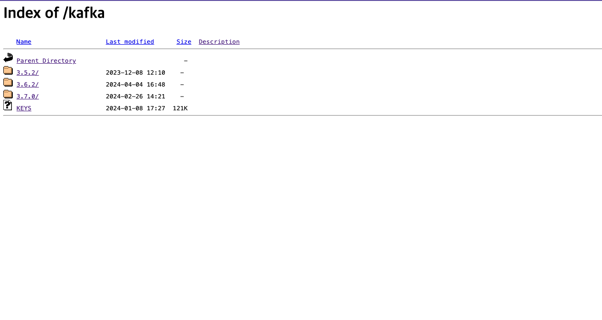

그동안 카프카 클러스터 생성이 실패했던 이유는 인터넷과 강의에 존재 하는 것들을 따라서 했었는데 버전이 맞지 않고 버전을 하나를 따라해도 주키퍼와 버전이 맞지 않거나 자바와의 버전이 맞지 않았다 

이주일 정도를 실패한 다음에 이번에는 버전을 맞춰서 하기로 결정하고 다른 블로그 글을 참고해 카프카 클러스터 생성에 성공하였다 

### 사전 설정
ec2 인스턴스를 3개를 생성해 준비한다 
나중에도 사용하고 싶으면 탄력적 아이피를 생성해 할당한다 
인스턴스는 우분투가 아니라 Amazon linux2 AMI를 사용한다 

### 카프카 설치 
아파치 카프카 공식 사이트에 들어가서 현재 최신 버전을 설치한다 

나는 가장 아래 있는 3.7.0을 선택해 설치했다 
```shell
wget https://downloads.apache.org/kafka/3.7.0/kafka_2.13-3.7.0.tgz
tar xvf kafka_2.13-3.7.0.tgz
```
wegt는 웹서버에서 파일을 다운로드 하기 위해 커맨드 라인에서 사용하는 도구 

이걸 사용해 웹에서 카프카를 다운 받는다 

그후 tar 명령어를 사용해 압축을 해제 한다 

x: 압축을 해제함

v: 자세한 출력으로 설정해 처리중인 파일 목록 표시 

f: 이 다음 파일 지정을 나타냄

### JDK설치
카프카는 자바로 구성되어 있기 때문에 자바를 설치 해야 한다 
```shell
sudo amazon-linux-extras install java-openjdk11
```
이게 아마존 리눅스 라서 앞에 amazon-linux-extras가 붙었지 이거 그냥 우분투면 install만 하면 될거 같아 

### 주키퍼 설정
그동안은 카프카와 따로 주키퍼를 설정했지만 카프카에서 주키퍼에 대한 의존성을 줄이기 위해 카프카안에 설치가 되어있다 

그래서 카프카의 설정파일을 담아놓은 폴더인 config안에 주키퍼 설정파일, 카프카 설정 파일이 둘다 있다 

이 파일들을 수정해 카프카와 주키퍼 설정을 해준다 

- 주키퍼 설정
vi ~/kafka/config/zookeeper.properties
```shell
#그 후 안에 입력한다
initLimit=5
syncLimit=2
server.1=0.0.0.0:2888:3888
server.2=x.x.x.x:2888:3888
server.3=x.x.x.201:2888:3888
#여기 ip를 자기의 1,2,3 퍼블릭 ip를 넣어준다 이걸 3개 다해줘야하니까 복붙하기 
이게 서버 1에 넣는거라 서버 1이 0.0.0.0 
서버2였으면 서버2가 0.0.0.0
```
안의 dataDir가 나중에 주키퍼 아이디를 넣어줘야 하는곳

설정되어 있는곳에 나중에 넣던지 그냥 여기에서 임의로 지정하고 거기에 넣던지 

initTime: 팔로워가 리더와 초기에 연결하는 시간에 대한 타임아웃

syncLimit: 팔로워가 리더와 동기화하는 시간에 대한 타임아웃

### 주키퍼 아이디 설정 
위에 dataDir로 설정되어있는 폴더에 echo명령어로 myid를 만들어줘야 한다 
```shell
cd ~/kafka
echo 1> ~/kafka/zookeeper/myid
#만약이게 없다고 나오면 아래처럼 만들어주기 
mkdir ~/kafka/zookeeper
#만든 후 다시 echo하기 echo 뒤의 숫자는 1,2,3으로 달라짐
```
### 주키퍼 서버 구동
카프카를 설정하기 보다 먼저 주키퍼를 구동해야 한다 

```shell
cd kafka
bin/zookeeper-server-start.sh -daemon ./config/zookeeper.properties
```
이 후 제대로 됐는지 확인하기 위해서는 이 명령어를 입력한다 

```shell
bin/zookeeper-shell.sh x.x.x.x:2181
```
welcome to zooKeeper가 나오면 제대로 설정된거 

### 카프카 서버 설정
```shell
cd kafka/config
vi server.properties
#들어가면 왠만한건 전부 #으로 주석처리 되어있다
#Socket Server Settings 부분
listeners=PLAINTEXT://:9092 #여기 앞에 # 빼기 
advertised.listeners=PLAINTEXT://your.host.name:9092 #여기 호스트 부분 외부에서 들어올 ip로 바꾸기 
#나중에는 메인서버의 ip로 바꾸겟지만 지금은 아직 테스트 용이니까 내 인스턴스 ip사용
zookeeper.connect=x.x.x.x:9092, x.x.x.x:9092, x.x.x.x:9092
#Log Basics 부분
log.dirs=/home/ubuntu/kafka/logs
#:wq로 나오기
```
브로커 아이디가 각 브로커마다 달라야 하기 때문에 브로커 아이디를 0,1,2로 하기 

### 카프카 서버 구동
```shell
bin/kafka-server-start.sh -daemon ./config/server.properties
```

### 토픽 생성


### express와 연동

kafkajs 설치: kafka와의 연동을 위해 설치 
```bash
yarn add kafkajs
```
Kafka 클라이언트를 설정하고 Kafka 브로커에 연결 후 Kafka 브로커의 호스트 및 포트 정보를 설정

값을 보내는것이 **프로듀서** 값을 구독하고 받는것이 **컨슈머**

```javascript
import kafka from 'kafka-node'
// Kafka 클라이언트를 생성합니다.
const kafka = new Kafka({
  clientId: "my-producer",
  brokers: ["52.79.201.23:9092", "43.200.179.176:9092", "13.124.81.159:9092"],
});

```
카프카1, 카프카2 이 부분이 카프카를 설치한 Ec2의 ip로 바꾸기

1. 프로듀서 
프로듀서는 데이터(메시지 또는 레코드)를 Kafka 토픽으로 전송하는 역할
일반적으로 프로듀서는 실시간 이벤트, 로그, 메트릭 등 다양한 종류의 데이터를 생성하고 Kafka에 전달

``` javascript
import { Kafka } from "kafkajs"; // kafkajs 패키지에서 Kafka를 import합니다
import express from "express";
import bodyParser from "body-parser";
const app = express();
const port = 9999;
// Kafka 클라이언트를 생성합니다.
const kafka = new Kafka({
  clientId: "my-producer",
  brokers: ["52.79.201.23:9092", "43.200.179.176:9092", "13.124.81.159:9092"], //임시 아이피, 각 브로커의 아이피 적어야 함
});
app.use(bodyParser.json());
// Producer 인스턴스를 생성합니다.
const producer = kafka.producer();

const initKafka = async () => {
  await producer.connect();
};
app.post("/events", async (req, res) => {
  //console.log(req.body);
  await producer.send({
    topic: "matchingQueue",
    messages: [{ value: JSON.stringify(req.body) }],
  });
  res.send("successfully stored event : " + req.body + "\n");
});
app.get("/", async (req, res) => {
  res.send("sss");
});

app.post("/result", async (req, res) => {
  console.log("여기로 넘어온값은", req.body);
  res.send(req.body);
});
app.listen(port, async () => {
  console.log(`kafka app listening on port ${port}`);
});

initKafka();
```
먼저 req.body로 들어오는 값을 제대로 받기 위해 body-parser을 설치한다 

app.use로 설정을하고 카프카 연결을 설정한다 

그 후 event로 포스트 요청이 올때 프로듀서인스턴스로 req.body를 json타입으로 보낸다 

result로 오는 값을 콘솔을 찍어본다 

- 컨슈머
컨슈머는 Kafka 토픽에서 데이터를 소비하고 처리하는 역할

주로 컨슈머는 프로듀서가 전송한 데이터를 읽어들여 비즈니스 로직에 따라 처리하거나 저장

컨슈머는 특정 토픽에 대한 구독을 생성하고, 해당 토픽의 파티션으로부터 메시지를 가져와서 처리

```javascript
import { Kafka } from "kafkajs"; // kafkajs 패키지에서 Kafka를 import합니다
import axios from "axios";

// Kafka 클라이언트를 생성합니다.
const kafka = new Kafka({
  clientId: "my-producer",
  brokers: ["52.79.201.23:9092", "43.200.179.176:9092", "13.124.81.159:9092"],
});
const consumer = kafka.consumer({ groupId: "test-group" });

const initKafka = async () => {
  console.log("start subscribe");
  await consumer.connect();
  await consumer.subscribe({ topic: "matchingQueue", fromBeginning: false });
  await consumer.run({
    eachMessage: async ({ topic, partition, message }) => {
      console.log({
        value: message.value.toString(),
      });
      await axios.post("http://localhost:9999/result", {
        message: message.value.toString(),
      });
      console.log("Message forwarded successfully.");
    },
  });
};

initKafka();
```
여기도 카프카 연결울 설정한다 

연결이 된후 토픽을 먼저 설정해놓은 matchingQueue로 입력하고 fromBeginning을 false로 선언한다 

fromBeginning은 Kafka 컨슈머가 특정 토픽을 구독할 때 처음부터 모든 메시지를 읽을지 여부를 지정하는 옵션

true로 설정하면 컨슈머가 토픽의 처음부터 모든 메시지를 읽고 false면 가장 최근꺼만 읽는다 

그후 컨슈머를 만들고 컨슈머가 카프카 토픽을 구독한다 

consumer.run는 컨슈머가 메세지를 처리하는 메서드이고  eachMessage는 카프카 컨슈머가 메시지를 소비할때 호출하는 함수이다 

여기서 들어오는 메세지를 콘솔로 찍고 post 로 다른 라우터로 값을 보낸다 

실제로 위에서 만든 result로값이 들어와 console.log에 찍힌다 

