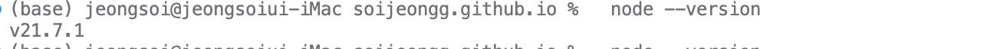
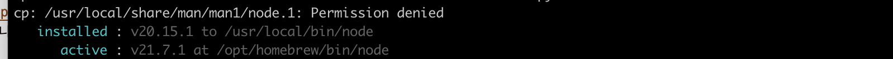
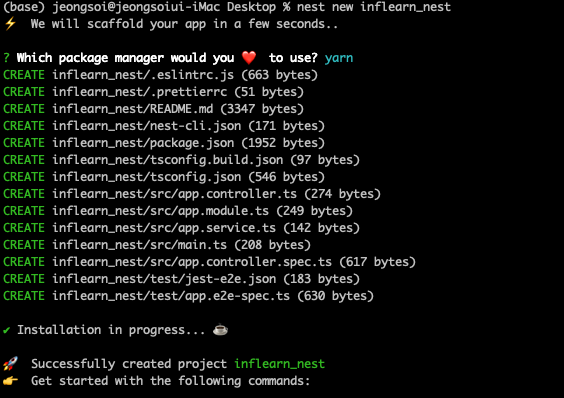

nest를 시작할려고 nest new project를 할려고 했는데 계속 이에러가 났다 
ailed to execute command: yarn install --silent
✖ Installation in progress... ☕
🙀  Packages installation failed! 에러가 계속 나와서 

사진을 안찍어서 인터넷에서 가져온거긴 한데 이게 계속 떴었다 
그래서 찾아보니 캐시 문제라고 해서 캐시 전체 삭제하는 명령어를 썼었다 
npm cache clean --force
그래도 계속 나와서 다음에 찾아보니 nest가 root 사용자로 실행되고 있으면 그런다고 해서 사용자 권한을 줬었다 
sudo chown -R $USER:$GROUP ~/.npm
sudo chown -R $USER:$GROUP ~/.config
그래도 계속 나와서 마지막 으로 찾아보니까 node버전이 다르면 이렇게 된다고 해서 노드 버전을 바꾸기로 했다 

이렇게 있는 버전이 찾아보니까 lts도 아니고 최신도 아니더라 뭐지..? 
암튼 lts를 깔기로 했다 
```shell
sudo npm install -g n
n stable //안정버전
```

지금보면 버전이 두개여서 인스톨된거랑 실제 activated된거랑은 달라서 이걸 두개를 연결해야한다 
ln -sf 인스톨버전 원래버전
참고 블로그: <https://velog.io/@jjhstoday/Node.js-Node.js%EC%99%80-NPM-%EC%B5%9C%EC%8B%A0%EB%B2%84%EC%A0%84%EC%9C%BC%EB%A1%9C-%EC%97%85%EA%B7%B8%EB%A0%88%EC%9D%B4%EB%93%9C-%ED%95%98%EA%B8%B0>

### 성공
