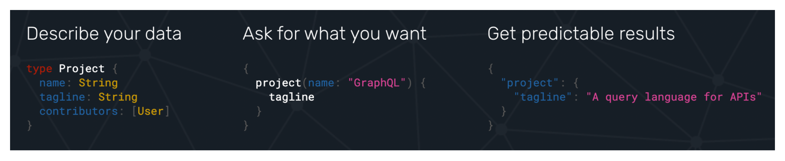

### GraphQL
GraphQL은 api용 쿼리 언어로 이해하기 쉬운 설명을 제공하고 클라이언트가 필요한것을 정확히 요청할 수 있는 능력을 제공한다 
2012년 페이스북에 의해 개발되었다

데이터를 모사하고  클라이언트에 데이터를 요청하고 서버에서 예측한 데이터를 받아온다 



### restapi가 있는데 왜 graphql이 나왔나 
Graphql은 rest에서 부족한점을 보완하기위해 탄생

- rest api와 달리 프론트엔드 개발자는 개발을 마칠때 까지 기다리지 않아도 됨

rest api개발을 마치고 프론트엔드개발자가 api에서 받아온 데이터를 이용해 화면에 보여주는 것이 그동안의 방법

이렇게 하기 위해서는 프론트엔드 개발자가 rest api개발이 끝날때 까지 기다려야 한다 

하지만 GraphQL을 사용하면 프론트엔드 개발자와 백엔드 개발자가 프로세스를 병렬로 개발할 수 있다 

graphQL의 스키마를 정의하고 그 스키마에 따라 프론트엔드 개발자는 어떤 데이터를 요청할지 미리 알 수 있다 
백엔드 개발자는 이 스키마에 맞춰 리졸버를 구현한다 리졸버란 실제로 데이터를 가져오고 클라이언트의 요청을 처리하는 로직
Overfetching과 Underfetching을 막아준다 

- Overfetching
필요이상의 데이터를 요청하는 상황을 말한다 
쓸모없는 데이터를 보내 통신을 무겁게 할 수도 있다 

예를 들어 사용자 프로필페이지를 만드는데 필요한 데이터는 사용자의 이름과 이메일뿐이다 
하지만 restapi는 모든 정보를 반환한다  -> 이름과 이메일이 아닌 다른 불필요한 데이터가 전송된다 

- Underfetching
필요한 데이터를 충분히 요청하지 못하는 상황을 말한다 
REST API에서 하나의 엔드포인트가 특정 데이터만 반환하고, 다른 관련 데이터를 가져오려면 추가 요청이 필요한 경우, 여러 번의 요청을 해야 한다

예를 들어 사용자와 사용자가 쓴 포스트를 둘다 함께 가져와야 할떄 rest api는 여러번의 네트워크를 요청해야 하고 여러번의 요청에 의해 전체 응답시간이 길어질 수 있다 

### 사용해보기
https://swapi.dev/ 는 스타워즈의 정보를 rest api 형식으로 반환한다 

https://graphql.org/swapi-graphql 이 사이트를 통해 똑같은 스타워즈 정보를 GraphQL을 사용해볼 수 있다 
보통 rest api는 url뒤에 파람을 붙여 전달한다 -> graphQL은 스키마를 정의한다 

{}을 사용해 열고 가져올 파람을 적는다

그 후 ()안에 안에 이 파람에서 가져올것이 있으면 적는다

가져오고 싶은 데이터만을 적는다 

```graphql
{
  starship(starshipID: 9) {
    name
    model
    crew
  }
}
```
또한 한번의 요청으로 여러 요청을 한꺼번에 보내고 반환받을 수 있다 
```graphql
{
  starship(starshipID: 9) {
    name
    model
    crew
  }
  planet(planetID:1) {
    name
    diameter
  }
}
```

### graphql의 단점
1. 개발자가 graphql를 쓰는 법을 따로 배워야 한다
2. 백엔드가 스키마 및 타입을 정해줘야 한다 
3. restaou 보다 캐싱이 까다롭다 
