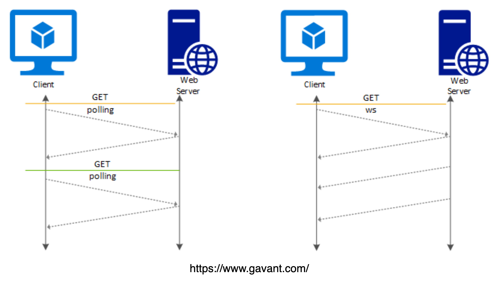

### rest api 와 socket

- rest api는 유저가 요청을 보낼때만 서버가 응답하는 단방향 통신으로 새로운 값이 들어오면 
새로고침을 해야만 새 값이 보여진다 

한방향으로 소니님이 서버에 지속적으로 요청을 보내야만 값을 받아올 수 있다 

- socket은 서버가 요청을 받지 않아도 양방향으로 통신이 가능하다 

### 풀링이란
클라이언트가 일정한 간격으로 서버에 요청을 보내 결과를 전달받는 형식

구현이 쉽다는 장점이 있지만 서버의 상태가 변하지 않았음에도 계속 요청을 보내 받아와야 하기 떄문에 필요하지 않는 요청이 많아지며 요청 간격을 정하기도 어렵다 (주기가 짧으면 서버의 성능에 부담이고 주기가 길면 실시간성이 좋지 않다 

