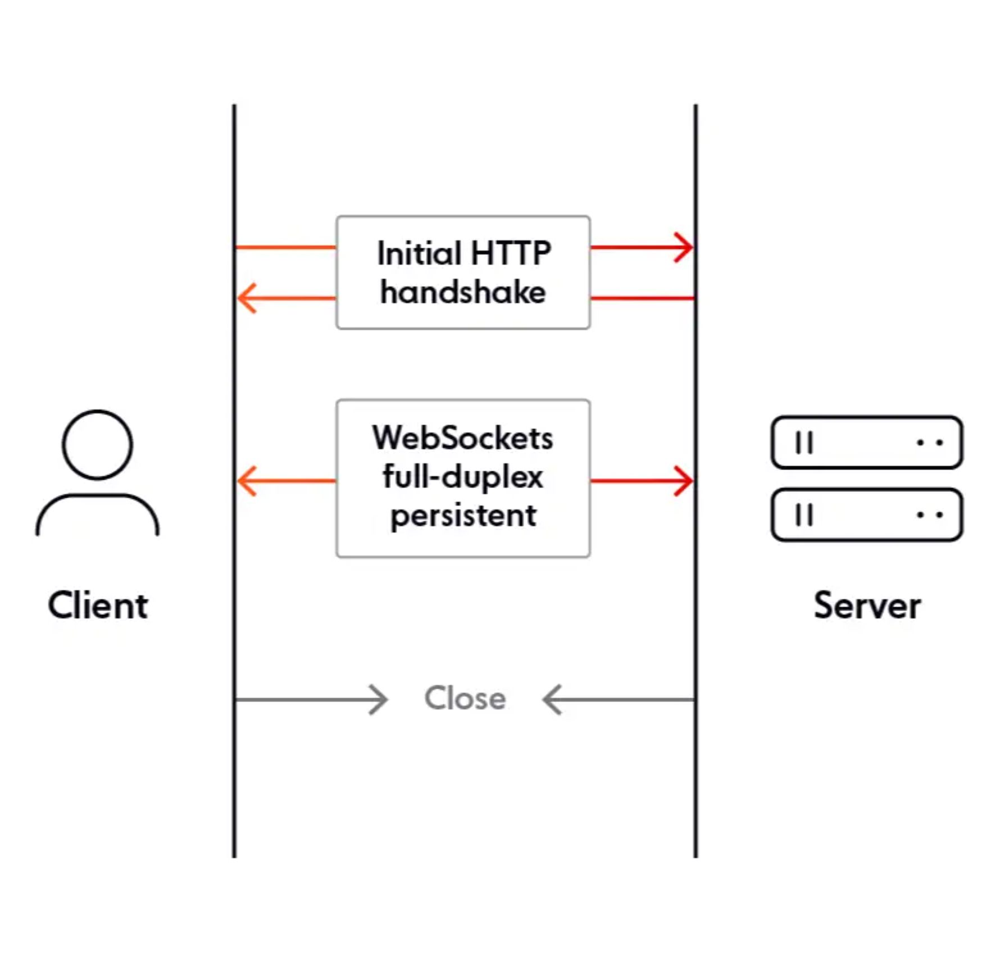
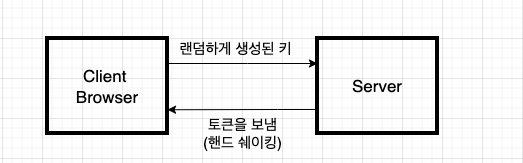

### rest api 와 socket

- rest api는 유저가 요청을 보낼때만 서버가 응답하는 단방향 통신으로 새로운 값이 들어오면 
새로고침을 해야만 새 값이 보여진다 

한방향으로 소니님이 서버에 지속적으로 요청을 보내야만 값을 받아올 수 있다 

- socket은 서버가 요청을 받지 않아도 양방향으로 통신이 가능하다 

### 풀링이란
클라이언트가 일정한 간격으로 서버에 요청을 보내 결과를 전달받는 형식


구현이 쉽다는 장점이 있지만 서버의 상태가 변하지 않았음에도 계속 요청을 보내 받아와야 하기 떄문에 필요하지 않는 요청이 많아지며 요청 간격을 정하기도 어렵다 (주기가 짧으면 서버의 성능에 부담이고 주기가 길면 실시간성이 좋지 않다 

### LONG POLLING
폴링의 단점을 보완하기 위해 새롭게 고안해 낸것이 롱 폴링이다 

롱폴링로 폴링처럼 계속 요청을 보내지만 폴링과 요청을 보내면 서버가 대기하다가 이벤트가 발생했고나 타이아웃이 발생할때까지 기다린 후 응답을 보내게 된다 

이는 서버의 상태변화가 많이 없다면 서버의 부담이 줄어들게 된다 

### 웹소켓
웹소켓을 이용하려면 클라이언트와 서버간에 http 통신으로 핸드세이크가 일어나야 한다 


- 패키지 ws
node.js에서 웹소켓을 구현하는 가장 기본적인 패키지로 클라이언트와 서버가 연결되면 웹소켓 프로토콜을 이용해 실시간으로 이중통신 통해 메지 스트리밍을 합니다 

웹소켓의 암호화 소켓은 wss고 new websocket() 생성자로 웹서버와 연결하고 생성된 웹소켓 인스턴스 객체를 이용해 연결, 수신 및 송신, 종료를 처리한다 

연결할떼 랜덤하게 생성된 키를 서버에 보내고 서버는 이키를 바탕으로 토큰을 생성한 후 브라우저에 돌려보낸다 


```javascript
import WebSocket from 'ws'

const wss = new WebSocket.Server({port:8080}); // wss생성자로 웹서버와 연결

wss.on('connection', (ws) =>{
    console.log("연결되었습니다")
 //연결되었을때 이벤트 처리

ws.on('message', (message) => {
    console.log('수신된 메시지: %s', message);
    // 클라이언트에게 메시지 전송
    ws.send(`서버로부터 응답: ${message}`);
});

// 연결 종료 이벤트 처리
ws.on('close', () => {
    console.log('클라이언트 연결 종료');
});

// 에러 이벤트 처리
ws.on('error', (error) => {
    console.log('에러 발생: ', error);
})
});
```

- socket.io
노드에서 웹소켓을 사용할떄 훨씬 더 편하게 사용할 수 있게 만들어주는 모듈이다 

- socket.io의 특징
1. socket.io는 웹소켓의 연결을 설정할 수 없는 경우 연결은 http 긴폴링으로 대체된다 
처음 웹소켓에 대한 지원이 아직 초기 단계였을때 이 기능이 사람들이 사용한 이유였고 현재는 대부분이 지원하지만 일부 지원이 안되거나 잘못 구성된 프록시 때문에 웹소켓 연결이 안되는 사용자도 쓸 수 있다 

2. 서버와 연결이 끊어질 시 서버가 과부하가 걸리지 않도록 자동으로 다시 연결된다 

3. 네임스페이스를 통해 단일 공유연결을 통해 애플리케이션의 논리를 분할 할 수 있다
네임스페이스란 멀티플렉싱을 통해 애플리케이션의 논리를 분할할 수 있는 통신채널이다

```javascript
const app = express();
const server = http.createServer(app); //express의 소켓 연동
const io = socketIo(server);

// 클라이언트 연결 이벤트 처리
io.on('connection', (socket) => {
    console.log('클라이언트 연결됨');

    // 클라이언트로부터의 메시지 수신
    socket.on('message', (message) => {
        console.log('수신된 메시지: ', message);
        // 클라이언트에게 메시지 전송
        socket.emit('message', `서버로부터 응답: ${message}`);
    });

    // 클라이언트 연결 종료 이벤트 처리
    socket.on('disconnect', () => {
        console.log('클라이언트 연결 종료');
    });

    // 에러 이벤트 처리
    socket.on('error', (error) => {
        console.log('에러 발생: ', error);
    });

    // 초기 메시지 전송
    socket.emit('message', '서버에 연결되었습니다.');
});

const PORT = 3000;
server.listen(PORT, () => {
    console.log(`웹소켓 서버가 포트 ${PORT}에서 실행 중입니다.`);
});
```

### socket.io를 사용한 룸 만들기 

```javascript
const app = express();
const server = http.createServer(app);
const io = socketIo(server);

// 사용자 목록을 관리하기 위한 객체
let users = [];
//유저 추가
const addUser = (id, username, room) => {
    const user = { id, username, room };
    users.push(user);
    return user;
};
//유저삭제
const removeUser = (id) => {
    const index = users.findIndex((user) => user.id === id);
    if (index !== -1) return users.splice(index, 1)[0];
};
//특정 사용자 조회
const getUser = (id) => users.find((user) => user.id === id);
//특정 룸의 사용자 반환
const getUsersInRoom = (room) => users.filter((user) => user.room === room);

// 메시지 생성 함수
const generateMessage = (username, text) => {
    return {
        username,
        text,
        createdAt: new Date().getTime()
    };
};

// 클라이언트 연결 이벤트 처리
io.on('connection', (socket) => {
    console.log('클라이언트 연결됨');

    // 클라이언트로부터 join 이벤트 수신
    socket.on('join', ({ username, room }, callback) => {
        const user = addUser(socket.id, username, room); //새로운 사용자 추가
        socket.join(user.room); //특정방에 추가 

        // 클라이언트에게 관리자 메시지 전송
        socket.emit('message', generateMessage('Admin', `${user.room} 방에 오신 걸 환영합니다.`)); //사용자에게 보내는 메세지

        // 방의 다른 클라이언트들에게 브로드캐스트 메시지 전송
        socket.broadcast.to(user.room).emit('message', generateMessage('Admin', `${user.username}가 방에 참여했습니다.`));
//브로드 캐스트: 메세지를 보낸 클라이언트 제외, to(room):특정방
        // 방의 모든 사용자에게 사용자 목록 전송
        io.to(user.room).emit('roomData', {
            room: user.room,
            users: getUsersInRoom(user.room)
        });

        // 클라이언트에 응답
        if (callback) {
            callback();
        }
    });

    // 클라이언트로부터 message 이벤트 수신
    socket.on('message', (message, callback) => {
        const user = getUser(socket.id); //참여자가 맞는지 확인
        if (user) {
            io.to(user.room).emit('message', generateMessage(user.username, message));
        }
        if (callback) callback();
    });

    // 클라이언트 연결 종료 이벤트 처리
    socket.on('disconnect', () => {
        const user = removeUser(socket.id);
        if (user) {
            io.to(user.room).emit('message', generateMessage('Admin', `${user.username}가 방을 떠났습니다.`));
            io.to(user.room).emit('roomData', {
                room: user.room,
                users: getUsersInRoom(user.room)
            });
        }
        console.log('클라이언트 연결 종료');
    });

    socket.on('error', (error) => {
        console.log('에러 발생: ', error);
    });
});

const PORT = 3000;
server.listen(PORT, () => {
    console.log(`웹소켓 서버가 포트 ${PORT}에서 실행 중입니다.`);
});
```

