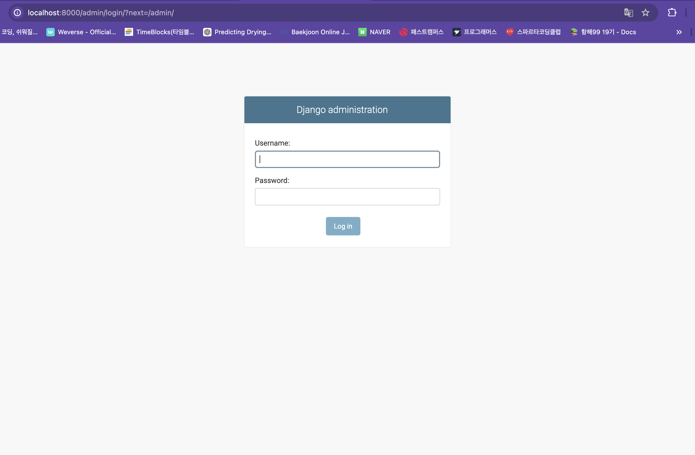
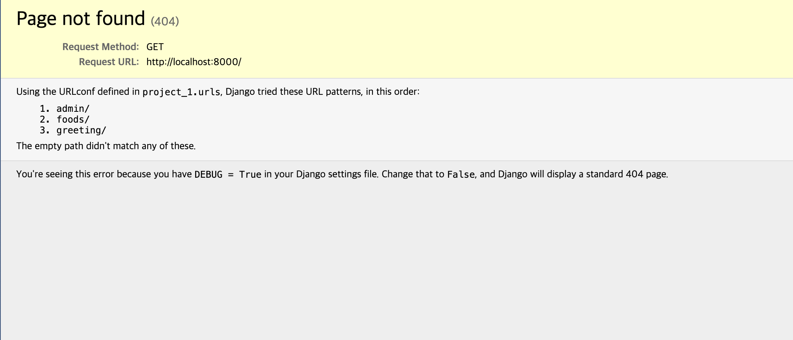

### url 활용하기 
사용자가 브라우저 주소를 입력해 요청하면 django는 urls.py 파일에 적혀있는 것을보고 어떤 처리를 할지 결정한다 

url 파일의 url pattern이 어떻게 처리할지 결정하는 곳

```python
urlpatterns = [
    path('admin/', admin.site.urls),
]
```
이렇게 기본적으로 들어가 있고 뒤의 path가 admin일때 이 admin.site.urls로 들어가라는 의미이다 
들어가면 


이렇게 미리 만들어진 페이지가 나오게 된다

### url 만들기 
이 기본 url을 활용할 수 있다 

```python
from django.contrib import admin
from django.urls import path, include

urlpatterns = [
    path('admin/', admin.site.urls),
     path('foods/', include('foods.urls')),
]
```
path가 food면 푸드 폴더안의 url파일을 확인해라는 뜻으로 현재는 url파일이 없으니 직접 앱안에 만들어줘야 한다 

```python
from django.contrib import admin
from django.urls import path
from . import views

urlpatterns = [
    path('index/', views.index),
]
```
최신버전에서는 이렇게 바뀜
```python
urlpatterns = [
     path('index/', views.index, name='index')
]
```
인덱스 경로(foods의 index경로)로 들어오면 뷰파일의 index함수가 실행된다 
이 index함수를 만들어줘야 한다 

```python
from django.shortcuts import render
from django.http import HttpResponse
# Create your views here.
def index(request):
    return HttpResponse("<h2>끝까지 가볼래 포기는 안할래<h2>")
```
리퀘스트가 들어왔을때 리스폰을 해준다 


### url의 연결원리 
장고는 url로 요청이 들어오면 어떤 응답을 해야할지 결정해야한다 

장고가 가장 먼저 보는 파일은 프로젝트 디렉토리 안에 있는 urls.py이다 
sesstings.py에 ROOT_URLCONF에 장고가 url을 보고 가장 먼저 어떤 파일을 봐야 할지 설정하는 부분이 존재해 여기에 있는 파일을 보는데 기본이 urls.py이다 

이 urls파일에서 매칭이 되면 여기서 시키는데로 동작하게 된다 

- include는 이 폴더 안을 살펴보라는 뜻 
바로 쓰고 싶으면 프로젝트 디렉토리에 view 폴더를 만들고 안에 함수를 정의한다 

```python
 from . import views
 urlpatterns = [
     path('', views.main )
]

#views.py
from django.shortcuts import render
from django.http import HttpResponse

def main(request):
    return HttpResponse("<h2>게임팬 여러분의 뜨거운 환호와 함성과 함께 시작~~~하겠습니다<h2>")
```

### url 작성 원칙
1. urls.py에 적는 url 패턴은 /를 붙여서 작성한다 

도메인 끝에 있는 /를 트레일링 슬래시라고 하고 그 유뮤에 따라 차이가 없다 
하지만 이런 형태가 남아있는 이유는 과거에는 파일과 디렉토리를 구분하는 것이 중요했기 때문이다 

/가 붙은것 -> 디렉토리 

/가 없는것 -> 파일

근데 url은 직접적으로 파일이나 디렉토리를 가르키지 낳는다 직접 데이터에 접근하기 보다는 데이터베이스에 데이터를 저장해서 사용한다 

디장고는 기본적으로 트레일링 슬래시가 없는 url이 들어오면 먼저 해당 url과 맞는 패턴이 있는지 살펴보고 없다면 /붙은 url로 리다이렉트 한다 -> 그래서 작성할때 붙여있는 슬래시를 붙인 상태로 작성하는 것이 좋다 

2. 다른 url로 이동하기 위한 url을 적을때 /가 앞에 있으면 도메인 부터의 경로를 의미한다 
이게 urls.py을 말하는줄 알았는데 그냥 a 태그에서 사용하는거더라 

django에서는 url 앞에 /를 넣지 않아야 한다 

### 메인 페이지 에러 
지금 메인페이지에 들어가면 메인페이지가 에러난것처럼 보이지만 사실은 아니다 


지금 보고 있는 페이지는 명시되어 있는 url을 보여주는 페이지 인데 empth path 그러니까 아무것도 없는 기본 path는 찾지 못했다라는 의미이다 
이걸 막고 싶다면 path가 ''일때 다른것처럼 include하면 된다 

### django템플릿과 렌더링

직접 httpResposnse로 여러 코드를 적어도 상관없지만 이렇게 하기는 더려워지고 힘들다 
렌더링을 해 html 파일을 밖으로 빼보자 

각 앱에 templates폴더를 만들고 안에 각 app의 이름의 디렉토리를 만든다 

지금은 html로 하지만 나중에는 react로 바꿀 계획이다 

```python
def index(request):
    return render(request, 'foods/index.html')
```