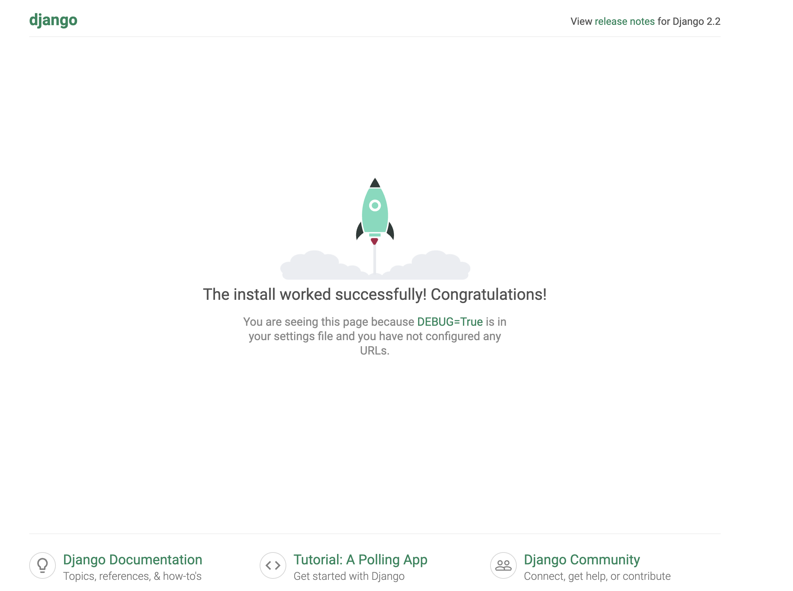

### django 프로젝트 생성

django-admin startproject 프로젝트 이름 명령어로 실행하면 기본 구조가 생성된다 

1. -- init__: 이 디렉토리를 패키지라고 알려주는 파일
2. setting: 프로젝트의 환경및 구성 저장
3. urls: 프로젝트의 url 선언 저장
4. asgi: 프로젝트에 사용할 ASGI 서버 
5. wsgi: 프로젝트에 사용할 WSGI 서버

서버 시작점은 이 폴더와 같은 수준에 만들어진 manage.py 파일에 있다 

manage.py: django 프로젝트 생성시 자동으로 새이기는 프로젝트 관리위한 파일

```
python manage.py runserver
```
이 명령어 치면 

```
July 29, 2024 - 01:42:26
Django version 2.2, using settings 'project_1.settings'
Starting development server at http://127.0.0.1:8000/
```
이렇게 서버가 열리고 접속하면 제대로 서버가 열렸다는 페이지가 표시된다 


### run server
왭브라우저로 접속했을때 만든 django 프로젝트를 보여주는 역할을 하는것을 서버라고 한다. 
원래 서버의 코드가 변경되면 기존의 서버를 종료하고 다시 재시작을 해야하는데 django는 이러한 일련의 과정을 편하게 하기 위헤 변경된 작업 결과를 확인할 수 있는 개발 서버를 제공한다 (파일 추가 같은 경우는 다시 시작해야함)

실제 배포시에는 이 run server 가 아닌 따로 웹 서버를 이용해서 배포 해야한다 
**run server -> 개발서버**

### 숨어있는 ip, port

```
django-admin runserver {ip:port}
python manage.py runserver {ip:port}

```
로컬에서 개발할때 쓰는 명령어 뒤에 아이피와 포트를 붙여 특정 아이피와 포트로도 실행할 수 있다 
이건 나중에 cd할때 도커랑 연계해서 쓰면 되겠다 

### 파일 구조 자세히 
 
 - manage.py
 django 프로젝트 생성시 같이 생성되는 프로젝트 관리를 위한 명령 파일
같은 역할을 하는게  django-admin으로 manage.py은 django-admin에 프로젝트에 대해 설정하는 기능이 몇개 더 추가된것이다 

- --init--
이 디렉토리를 파이썬의 패키지로 인식할수 있게 하는 파일로 3.3부터는 없어도 되지만 하위버전 호환을 위해 있는 것이 좋다 

- setting
django의 여러 설정을 가지고 있는 파일

- url
프로젝트로 들어온 알맞은 url을 알맞은 로직으로 연결해주는 역할을 하는 파일

- wsgi
WebServer Gateway Interface의 약자로 웹 서버와 통신하기 위한 표준 인터페이스 이며 파이썬 프레임워크이다 

### django 의 기본 구조 이해하기
- project와 app의 차이 
프로젝트는 웹 서비스전체, app은 안에서 기능을 나타내는 단위로 django에서는 하나하나의 기능을 독립적인 앱 단위로 개발 할 수 있다 

python manage.py startapp {appname} 을 입력해 기본 뼈대를 만든다 

- 안의 파일 구조 설명
1. admin
앱을 django 관리자와 연동하기 위해 필요

2. apps.py
앱에 대한 설정을 넣어주는 파일

3. models.py
django app 에서 사용할 데이터 모델로 데이터베이스 연동과 관련된 파일

4. view.py
서버에 데이터가 들어왔을때 어떻게 처리할지에 대한 로직이 들어감

5. tests.py
테스트코드를 작성하는 곳

6. migrations
데이터베이스를 마이그레이션할때 변경사항의 히스토리가 누적되는 폴더

### app을 project에 등록
장고에서 새로운 앱을 만들었다면 그 사실을 django에 알려줘야 한다(nest에 모듈을 등록하는것처럼)

프로젝트의 setting에 들어가 INSTALLED_APPS을 찾는다 

이 리스트안의 app들이 현재 우리 프로젝트를 구성하고 있는 앱의 목록이므로 여기에 app의 이름을 넣어주면 된다 

**앱들이 꼭 하나의 프로젝트에만 들어가는게 아니라 여러 프로젝트에 들어갈 수 있다**

-> 하나의 앱이 여러개의 프로젝트에 들어갈 수 있다 

기능단위로 나눠져있기 때문에 자신이 전에 만든것을 가져와 조금만 현재 프로젝트에 고쳐 사용할 수 있고 다른 개발자가 만든 앱을 가져와 내 프로젝트에 맞게 조금만 고쳐서 사용할 수도 있다 

이런식으로 여러 프로젝트에서 사용할 수 있게 만들어진 app을 재사용성이 있는 app(Reusable app)이라고 한다 

- Reusable app을 만드는 방법
하나의 기능단위라고는 하지만 그 기준이 명확하지 않다 하나의 가능을 하나로도 만들 수 있고 여러가지로 나눠 만들 수도 있다 

처음부터 작은 단위의 app으로 나누는 것은 어렵지만 몇몇 개발자가 제시한 가이드 라인이 존재한다 

1. 한가지 app은 한가지 기능을 하고 그 기능을 잘 수행해야 한다 
2. 장고개발자는 프로젝트를 많은 앱으로 구성하는 것을 두려워 해서는 안된다 
3. 각각의 app을 유연하게 작성해야한다 
4. 다른 사람에게 배포가 가능하도록 만들어야 한다 

하지만 결국 중요한건 장고에 대한 경험과 어떻게 나눌지에 대한 노하우!

