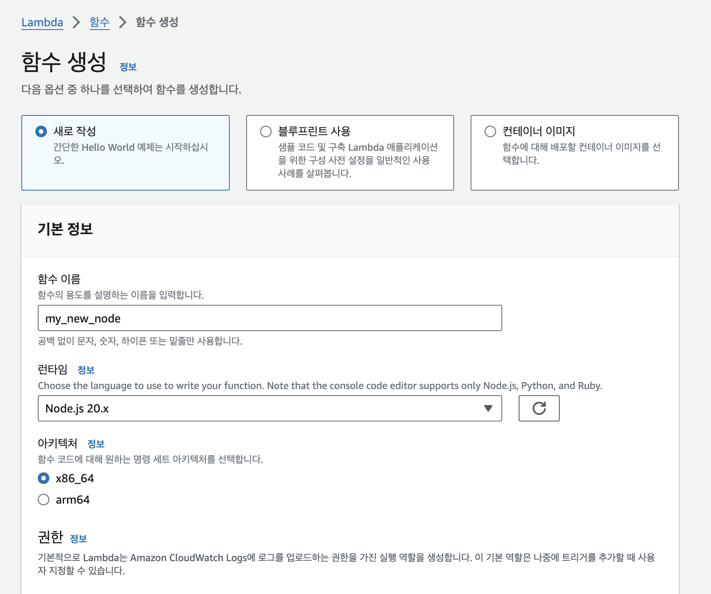
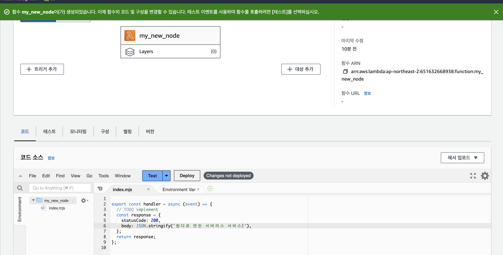
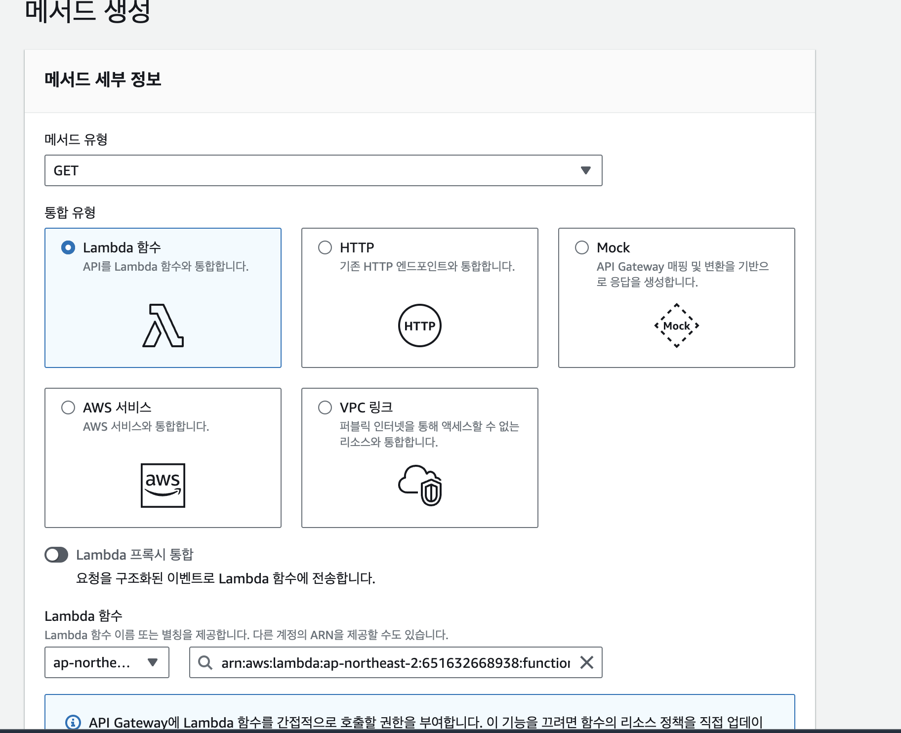
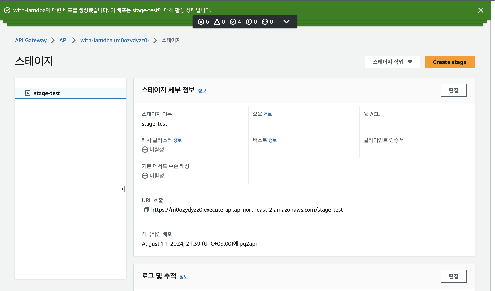
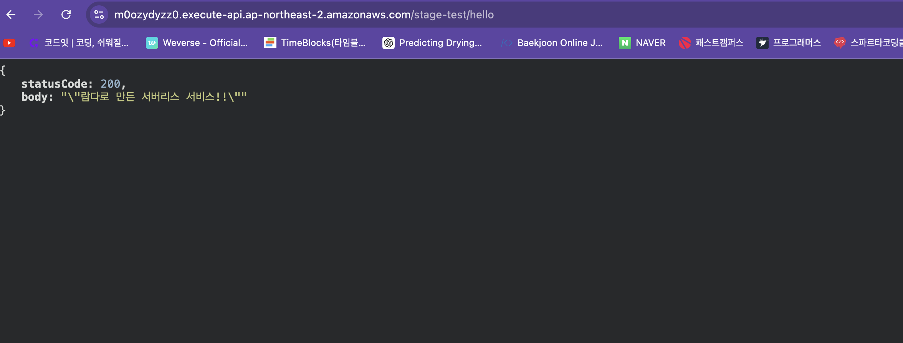
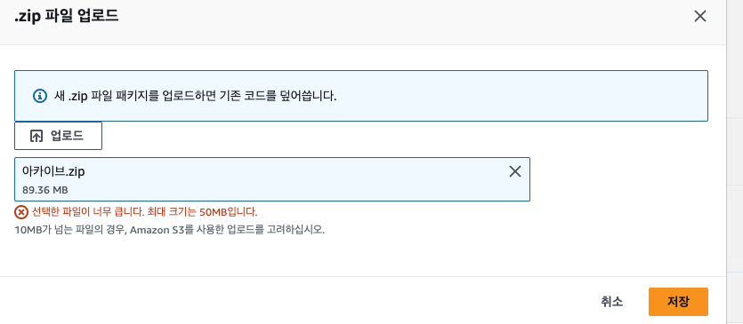
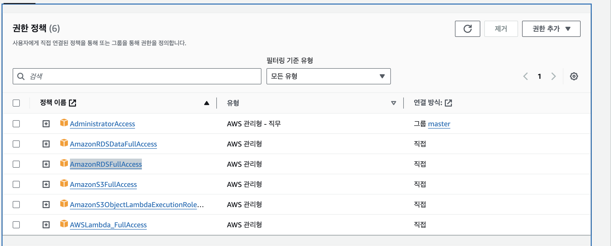
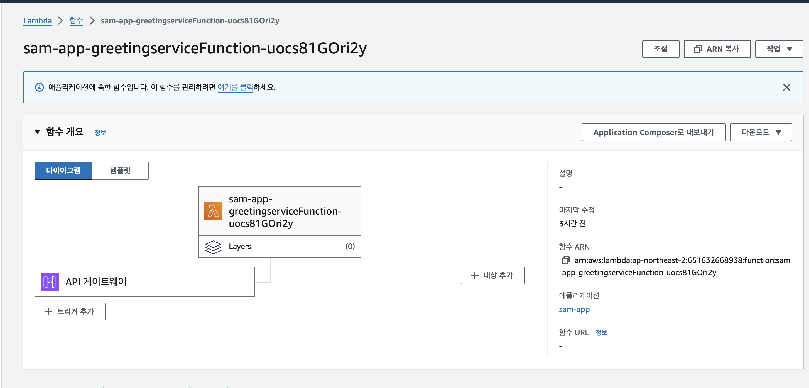
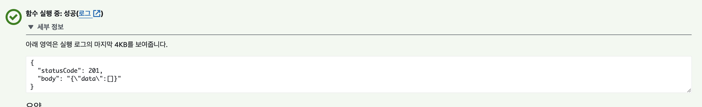

### aws lambda
lambda는 aws의 서버리스 컴퓨팅 서비스로 서버의 설정과 관리 없이 백엔드 서비스를 운영할 수 있게 해주는 서비스로 개발자는 코드에만 집중하고 관리는 aws가 맞습니다

aws lambda는 실행시간과 사용된 리소스에 따라 과금이 되어 코드를 실행할때만 비용이 발생한다

aws lamdba의 이벤트 소스는 이벤트를 계시하고 lambda 함수는 이벤트 처리하게 하는 사용자 지정 코드다

### 서버리스란
개발자가 서버를 관리하지 않고 app을 빌드하고 실행할 수 있게 해주는 모델로 서버리스의 서버는 실제로 아예 서버가 없는게 아니라 어플리케이션이 구동될때마 활성화 되고 종료되면 리소스가 비활성화 된다

### 사용법
1. aws lambda에 들어가 함수 생성을 누르고 함수를 만든다


test를 누르고 이벤트를 생성한다 나는 제대로 값이 나오는지 확인하기 위해 안의 값을 바꿨는데 이러면 test를 누르고 업데이트 위해 Deploy를 눌러야 한다

### api gateway 사용 api 배포
api gateway에 들어가면 4개의 유형 중 하나를 선택할 수 있는데 그중 프라이빗이 아닌 그냥 rest api를 선택한다

rest api의 세부 정보에서는 새 api를 선택하고 생성한다 
리소스 생성한 후 메서드 생성에 들어가 유형과 사용할 람다 함수를 연동한다

생성 후 api 배포를 누른 후 (스테이지는 새 스테이지) 스테이지의 url에 앞서 만들었던 gateway의 리소스 경로를 더해 요청을 보내면 만들었던 람다 함수가 실행이 된다



### aws RDS+ aws lambda + prisma

이제 기본적으로 설정해놓은 값을 반환하는거 말고 실제 데이터베이스와 연결해서 aws lamdba로 서버 구축을 해봤다

ORM으로 prisma를 사용해 기본적인 프로젝트를 만들고 이걸 직접 aws lamdba에 올리려고 하면 

이렇게 못올리게 된다 여기서는 aws s3에 올려서 하라고는 하는데 찾아보니까 aws SAM이 나왔다 

- aws SAM 이란??
AWS Serverless Application Model의 약자로 코드형 인프라를 사용해 서버리스 애플리케이션을 구축하기 위한 프레임워크로 aws에서 서버리스 애플리케이션을 만들 수 있다

람다를 이용해 배포시 cloudFormation을 사용하면 실제 배포하는것보다 이게 더 큰데 sam은 이걸 관리하기 쉽게 쓰이는것만 사용하게 해준다

SAM은 템플릿과 aws SAM CLI로 구성된다

- IAM 권한 부여 
aws 콘솔에 들어가 IAM 사용자를 만든 후 사용자에게 aws lambda_FullAcess, AmazonRDSDataFullAccess, AmazonRDSFullAccess의 권한을 부여한다


그 후 엑세스 키를 만들고 엑세스 키와 비밀키를 저장한다

- sam 설치
```
brew tap aws/tap
brew install aws-sam-cli
curl "https://awscli.amazonaws.com/AWSCLIV2.pkg" -o "AWSCLIV2.pkg"
sudo installer -pkg AWSCLIV2.pkg -target /
```
aws의 cli를 설치한다

```
aws configure
AWS Access Key ID [None]: YOUR_ACCESS_KEY_ID
AWS Secret Access Key [None]: YOUR_SECRET_ACCESS_KEY
Default region name [None]: ap-northeast-2
Default output format [None]: json
```
앞서 저장해놨던 엑세스키와 비밀키를 입력하고 region name은 서울인 ap-northeast-2를 입력, 포멧은 json을 입력한다

그후 sam init 명령어를 통해 시작한다 

### sam init 명령어
```
Which template source would you like to use?
        1 - AWS Quick Start Templates
        2 - Custom Template Location
```
어떤 템플릿을 사용할지 묻는 명령어로 1번을 선택한다
```
Choose an AWS Quick Start application template
        1 - Hello World Example
      
Template: 
```
이거 뒤에 16번까지 나오는데 1번을 선택한다 
```
Use the most popular runtime and package type? (Python and zip) [y/N]: 
```
파이썬과 zip을 사용하는걸로 런타임을 지정할것인가(나는 노드 선택이라 n)
```
Which runtime would you like to use?
```
각 언어마다 번호가 매겨져 있어 원하는 언어와 버전을 선택해 만들면 됟다
그후 나오는 X-Ray Tracing, CloudWatch Application Insights도 y로 설정한다(근데 이건 과금, 엑스레이는 함수 결과 시각화, 클라우드 와치는 모니터링 서비스)

마지막으로 이름을 적는다

### sam 구조
sam 프로젝트가 만들어지면 안의 예제로 hello-world 폴더가 생기는데 이것처럼 폴더를 만들고 프로젝트를 만든다

폴더에서 yarn init으로 프로젝트를 만들고 프리즈마, dotenv등을 add하고 람다 함수를 만든다
- schema.prisma 파일
스키마 파일에 데이터베이스와 모델을 정의하고 제너레이터에 binaryTargets를 추가한다

```javascript
generator client {
  provider = "prisma-client-js"
  binaryTargets = ["native", "linux-arm64-openssl-1.0.x", "rhel-openssl-3.0.x"]
}
```
- 람다 함수 코드
``` javascript
import { PrismaClient } from '@prisma/client';
import dotenv from 'dotenv';
dotenv.config();
export const prisma = new PrismaClient({
  datasources: { db: { url: process.env.DATABASE_URL } },
}); 
export const lambdaHandler = async (event) => {
    let users = await prisma.user.findMany()
    return {
        statusCode: 201,
        body: JSON.stringify({ data: users}),
    };
};
```
람다헨들러라는 이름으로 람다함수를 만들고 프리즈마를 사용해 결과를 반환한다

### 템플릿
aws SAM은 템플릿을 사용해 서비스 애플리케이션의 리소스를 정의하고 관리한다 
기본적으로 만들어진 구조는 다음과 같이 이루어져 있다 

AWSTemplateFormatVersion: 템플릿의 형식 버전을 지정

Transform: SAM 템플릿임을 AWS에 알리기 위해 AWS::Serverless-2016-10-31으로 설정

Description: 템플릿에 대한 설명을 제공

Globals: 모든 리소스에 공통으로 적용될 전역 설정을 정의

Resources: 애플리케이션에서 사용되는 서버리스 리소스 정의(Lambda 함수, API Gateway 등)

Outputs: 템플릿의 출력 값을 정의

이곳에 resource를 내 코드에 맞게 고친다

### resource
```yaml
Resources:
  greetingserviceFunction:  #함수 이름 정의  -> 아래 아웃풋도 이걸로 바꿔야 함
    Type: AWS::Serverless::Function # More info about Function Resource: https://github.com/awslabs/serverless-application-model/blob/master/versions/2016-10-31.md#awsserverlessfunction
    Properties:
      CodeUri: services/greetingservice/ #내가 만든 함수가 어느 폴더에있는지 sam project 기준 나는 service 폴더를 만들고 안에 함수 폴더를 만듬
      Handler: app.lambdaHandler # app.js안의 lamdbdaHandler함수 지정
      Runtime: nodejs20.x
      Architectures:
      - x86_64
      Environment:   #환경변수 설정
        Variables:
          DATABASE_URL: 
          DATABASE_HOST: 
          DATABASE_PORT: 3306
          DATABASE_NAME: 
          DATABASE_USERNAME: 
          DATABASE_PASSWORD: 
      Events:     #이벤트 트리거 정의
        greetingservice: 
          Type: Api # More info about API Event Source: https://github.com/awslabs/serverless-application-model/blob/master/versions/2016-10-31.md#api
          Properties:
            Path: /user #경로
            Method: get # httpmethod
    Metadata:
      SamResourceId: greetingserviceFunction
      BuildProperties:   #프리즈마를 위해 넣어줌
          Loader:
            - .prisma=file
            - .so.node=file
          AssetNames: '[name]'
      
Outputs:
  # ServerlessRestApi is an implicit API created out of Events key under Serverless::Function
  # Find out more about other implicit resources you can reference within SAM
  # https://github.com/awslabs/serverless-application-model/blob/master/docs/internals/generated_resources.rst#api
  greetingserviceApi:
    Description: API Gateway endpoint URL for Prod stage for greetingservice function
    Value: !Sub "https://${ServerlessRestApi}.execute-api.${AWS::Region}.amazonaws.com/Prod/user/"
  greetingservice:
    Description: greetingservice Lambda Function ARN
    Value: !GetAtt greetingserviceFunction.Arn
  greetingserviceIamRole:
    Description: Implicit IAM Role created for Hello World function
    Value: !GetAtt greetingserviceFunctionRole.Arn
```
그 후 sam 폴더에 들어가 sam build를 사용해 람다함수의 코드를 빌드 한다 
```
 sam build
```

근데 여러번 하다보면 node_modules가 두개로쪼개지기도 하는데 그러면 그냥 node_modules2를 지우고 다시 빌드 하면 된다
빌드가 끝나면 .aws-sam의 빌드 폴더에 템플릿에서 정의된 함수의 이름으로 된 폴더가 생기고 안에 보면 내가 만든 프로젝트가 그 안에 들어가있다 

### 배포하기
sam deploy --guided 명령어를 사용해 배포를 하는데 처음에만 가이드를 뒤에 붙이고 그 다음부터는 그냥 sam deploy 명령어를 쓰면 된다 

명령어를 입력하면 설정을 입력해야 한다 
```
Stack Name [my-sam]: my-sam
AWS Region [us-east-1]: ap-northeast-2
Confirm changes before deploy [Y/n]: y
Allow SAM CLI IAM role creation [Y/n]: y
Disable rollback [y/N]: y
HelloWorldFunction has no authentication. Is this okay? [y/N]: y
Save arguments to configuration file [Y/n]: y
SAM configuration file [samconfig.toml]: samconfig.toml
SAM configuration environment [default]: default
```

여기서 실패하면 바로 에러가 뜬다 보통 템플릿에 있는 codeUrl이 틀렸거나 함수이름에 숫자나 영어가 아닌게 들어가면 에러가 뜬다 

성공시 배포되는 시간이 있어 좀 멈쳐져있다가 업로딩이 뜨고 기다리면 Deploy this changeset?라는 말이 뜨는데 여기에서 y를 선택한다

다 끝나면 Successfully created/updated stack - sam-app in ap-northeast-2 라는 명령어가 뜬다 

제대로 됐다면 aws 콘솔의 람다에 내가 만든 스택이름과 함수이름으로 람다 함수가 생성된다


마지막 테스트로 람다 함수 테스트를 해 제대로 나오는지 확인한다 

 게이트 웨이의 엔드포인트에 들어가면 제대로 값이 나온다

 ### 참고블로그
 <https://medium.com/@lifthus531/aws-sam%EC%9D%84-%ED%99%9C%EC%9A%A9%ED%95%9C-%EC%84%9C%EB%B2%84%EB%A6%AC%EC%8A%A4-%EC%9B%B9-%EC%84%9C%EB%B9%84%EC%8A%A4%EC%9D%98-%EA%B5%AC%ED%98%84-1-4fa3e44c99f8>

<https://medium.com/@lifthus531/aws-sam%EC%9D%84-%ED%99%9C%EC%9A%A9%ED%95%9C-%EC%84%9C%EB%B2%84%EB%A6%AC%EC%8A%A4-%EC%9B%B9-%EC%84%9C%EB%B9%84%EC%8A%A4%EC%9D%98-%EA%B5%AC%ED%98%84-2-5874bab4badd>

<https://medium.com/@lifthus531/aws-lambda-%ED%99%98%EA%B2%BD%EC%97%90%EC%84%9C-prisma-%EC%82%AC%EC%9A%A9%ED%95%98%EA%B8%B0-e61fed06d4c0>

<https://www.prisma.io/docs/orm/prisma-client/deployment/traditional>

<https://velog.io/@___pepper/AWS-sam%EC%9D%84-%EC%9D%B4%EC%9A%A9%ED%95%9C-serverless-%EB%B0%B0%ED%8F%AC>