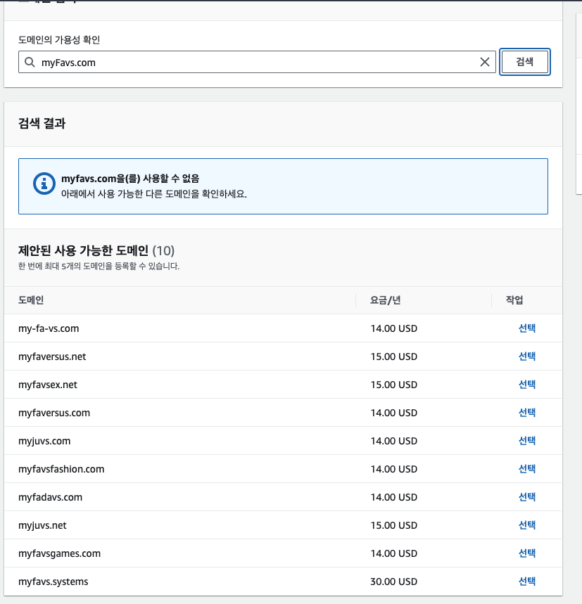

### 도메인 구입
도메인 구입하는 방법은 aws Route53과 가비아에서 구입하는 방법이 있는데 aws route53을 사용하기로 했다

aws의 route53에 들어가 도메인 등록 버튼을 클릭한다

구매 버튼을 클릭 후 연락처 입력 후 구매를 완료한다

### aws S3와 연결
Route53에 들어가 호스팅 역역이라는 메뉴로 가면 아까 구입한 도메인 이름으로 호스팅 영역이 생성되어있다

route53은 호스팅 영역 단위로 도메인을 관리한다

만약 가비아에서 만든 도메인을 연결하려고 한다면 호스팅 영역메뉴에 가서 직접 산 도메인 이름으로 호스팅 영역을 만들고 가비아에 가서 네임서버 설정을 해줘야 한다

aws 호스팅 영역에 생긴 윺형이 ns인 값/트래픽 라우팅 대상을 커스텀 네임서버로 등록한다 

- route53에 A 레코드 등록하기 
a 레코드는 브라우저가 도메인 주소로 들어왔을때 어떤 주소의 서버가 응답해 줄지 지정해주는 용도로 사용한다 

ec2면 ec2의 아이피 주소를 지정해주면 되고 s3면 s3버킷의 웹 사이트 엔드 포인트를 지정한다

레코드 생성에 들어가 레코드 이름을 만들면 서브 도메인으로 주소에 추가 할 수 있고 비워두면 그냥 최상위 주소로 a 레코드를 만들 수 있다 

**버킷 이름과 주소 이름은 같아야 한다**