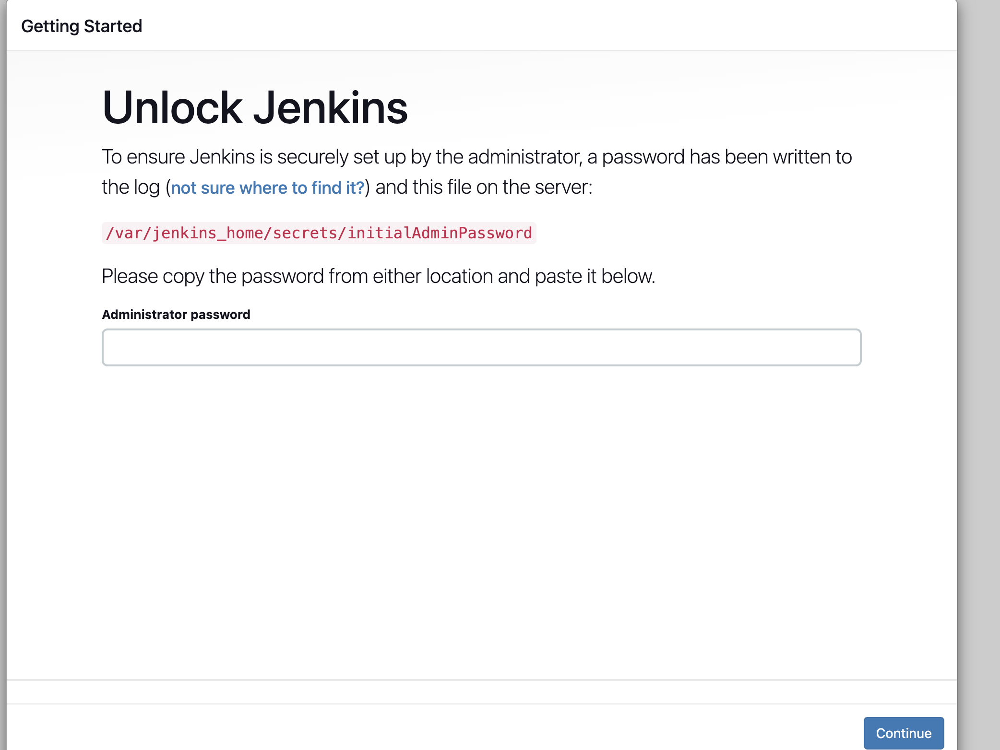
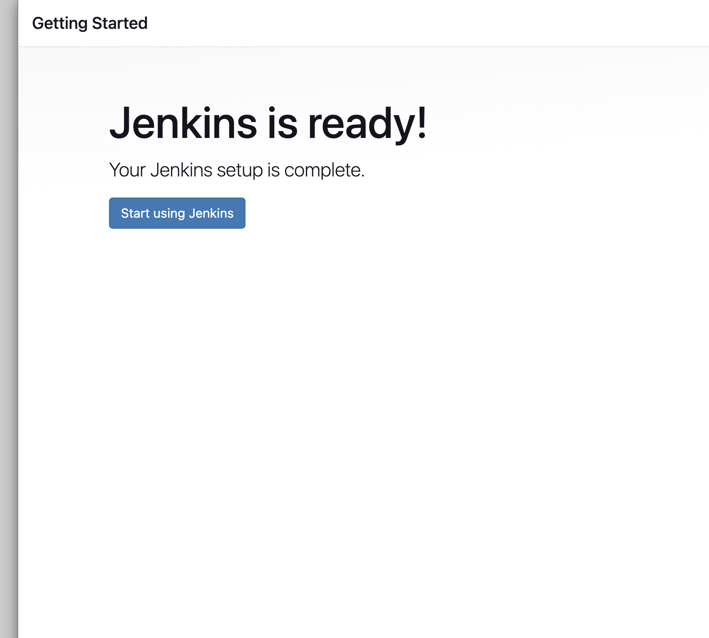
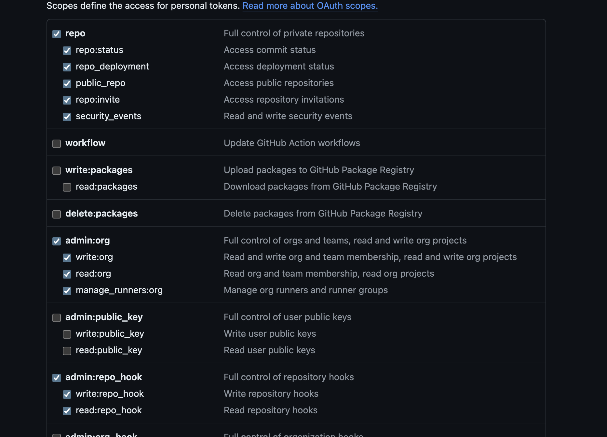
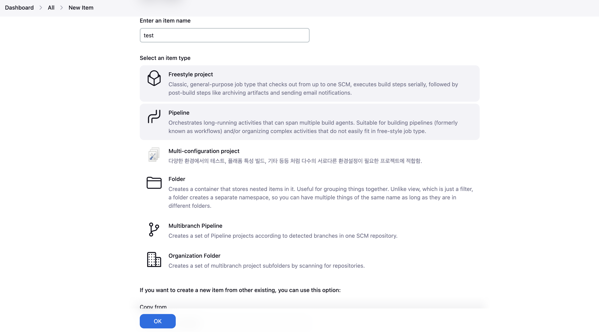
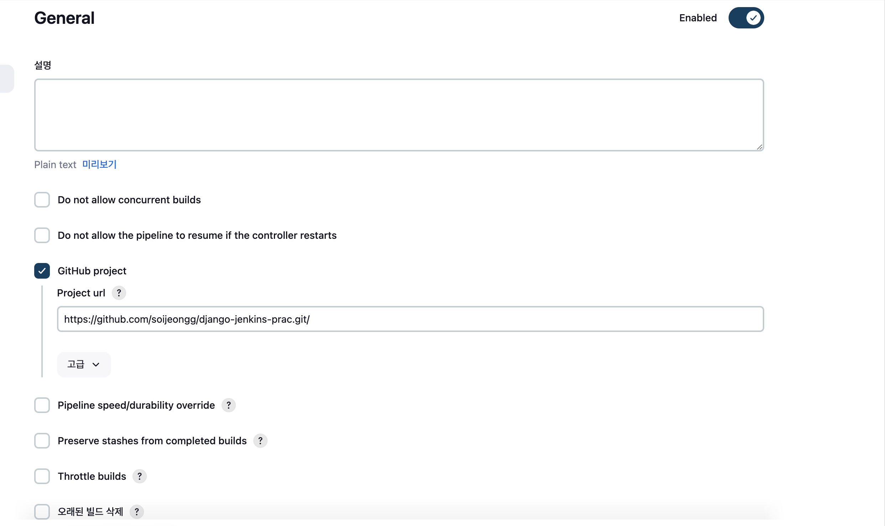
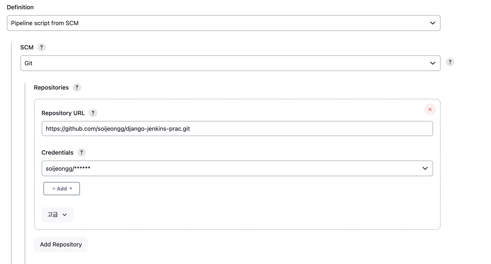
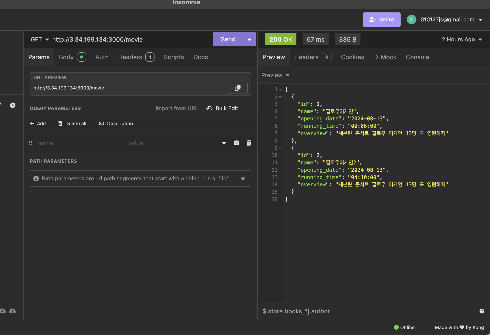

### ec2에 젠킨스 설치

- 도커 설치하기 필요한 패키지 설치


``` bash 
sudo apt-get update
sudo apt-get install apt-transport-https ca-certificates curl software-properties-common
```

- Docker의 공식 GPG 키 추가

```bash
curl -fsSL https://download.docker.com/linux/ubuntu/gpg | sudo apt-key add -
```
Docker 리포지토리 추가 및 도커 설치

```bash
sudo add-apt-repository \
"deb [arch=amd64] https://download.docker.com/linux/ubuntu \
$(lsb_release -cs) \
stable"

sudo apt-get update

sudo apt-get install docker-ce
```

- 도커 권한 주기

``` bash
sudo groupadd docker
sudo usermod -aG docker $USER
sudo newgrp docker
```

- ec2에 젠킨스 설치

``` bash
sudo apt-get install openjdk-11-jdk -y
wget -q -O - https://pkg.jenkins.io/debian/jenkins.io.key | sudo apt-key add -
sudo sh -c 'echo deb http://pkg.jenkins.io/debian-stable binary/ > /etc/apt/sources.list.d/jenkins.list'
sudo apt-get update
sudo apt-get install jenkins
sudo usermod -aG docker jenkins
sudo systemctl start jenkins

```

그 후 퍼블릭 ip:8080으로 들어가게 되면 젠킨스가 실행된다 

맨 처음에 
이렇게 나오는데 여기서 입력해야 하는 비밀번호는 sudo cat /var/lib/jenkins/secrets/initialAdminPassword을 입력하면 비밀번호가 나온다 

입력 후 플러그인과 사용자를 만들면 젠킨스 설정이 완료된다



### 젠킨스 기본 설정
젠킨스 관리에 들어가 플러그인에 들어간다  

docker plugin, ssh credential plugin(credential 사용), ssh agent plugin(sshagent 사용), github integration plugin(깃허브 윕훅 감지)을 설치한다

깃허브 레포지토리에 들어가 설정 -> 웹훅 -> add webhook에 들어가 웹훅을 만든다

payload는 젠킨스가 실행되고 있는 ip의 주소:8080/github-webhook/로 적고 Content type *에는 application/json으로 설정한다

그 후 사용자의 setting ->Developer Settings ->token(classic)으로 들어가 새 토큰을 만든다 

권한을 이렇게 준다


젠킨스 설정으로 들어가서 깃허브 부분에 깃허브 서버를 클릭하면 나오는 부분에 이름을 입력하고 
add를 눌러 자격증명을 만든다

kind부분에 secret text로 설정하고 유저네임에 원하는 이름, password에 깃허브에서 만든 토큰을 입력해준다

그 후 Credentials 부분을 secret text를 입력한다 

### 환경변수 설정
깃허브 액션에서 쓰는 것처럼 젠킨스에서 쓸 환경변수나 aws 키를 저장해줘야 한다 

젠킨스 설정에 들어가 Credentials에 들어간 후 Stores scoped to Jenkins 도메인의 글로벌을 누르면 새 도메인을 입력할 수 있다

여기에 들어가 각 환경변수들과 aws에 접속하기 위한 aws .pem키를 입력한다

- aws key
	SSH Username with private key로 kind를 바꾼다

aws 사이트의 ec2의 키페어에 들어간 후 작업을 눌러 키페어 가져오기를 한다
여기에 .pem 파일을 가져오면 내용을 알 수 있다(처음에는 모든 파일이 아니니까 그 옵션을 풀어준다)

처음부터 끝까지 넣어줘야 한다 (begin 부터 end key 까지)

- 깃허브 토큰
유저네임을 깃허브 아이디로, password를 깃허브에서 발급한 토큰으로 입력, 아이디를 자신이 원하는걸로 입력한다


### 젠킨스 프로젝트 

젠킨스에서 프로젝트는 젠킨스 서버에서 실행되는 작업으로 과정을 자동화하는데 사용한다

1. 프리스타일 프로젝트 
가장 기본적인 유형으로 다양한 빌드 작업을 수동으로 설정할 수 있으며 다양한 소스 관리 도구를 지원한다

2. 파이프라인 프로젝트
젠킨스파일을 사용해 복잡한 빌드 과정을 스크립트로 작성할 수 있다

3. 멀티브랜치 파이프 라인 프로젝트 
여러 브랜치에 대한 파이프라인 관리하는 프로젝트로 각 브랜치마다 별도의 jenkinsfile을 정의해도 할 수 있다

4. 폴더 프로젝트 
여러 프로젝트를 논리적으로 그룹화하고 조직화 할 수 있다

### 파이프라인 프로젝트 
새로운 아이템에 들어가 파이프 라인 프로젝트를 선택한다 


github project를 선택해 자신의 깃허브 레포지토리 url을 입력한다

 
 빌드 트리거에 GitHub hook trigger for GITScm polling를 선택한다

 파이프라인 부분에 definition을 pipelineScript from SCM으로 설정한 후 SCM을 git으로 설정 한 후 주소와 자격증명을 넣어준다
 
 브런치는 기본 master로 되어있지만 깃허브 자동은 main이여서 main으로 바꾸거나 자신이 배포할 깃 코드가 올라간 브런치를 선택한다 

### 젠킨스 파일

``` Jenkinsfile
pipeline {
    agent any

    environment {
       //enviroment에 credentials에서 가져올 변수들을 지정해준다
        EC2_SSH_CREDENTIALS = credentials('aws_key')
        GIT_REPO_URL = 'https://github.com/soijeongg/django-jenkins-prac.git'
        GIT_BRANCH = 'main'
        DOCKER_IMAGE_NAME = 'study-image'
        CONTAINER_NAME = 'study-container'
        TARGET_EC2_IP = credentials('TARGET_EC2_IP')
        PORT = credentials('PORT')
        DB_ENGINE = credentials('DB_ENGINE')
        DB_NAME = credentials('DB_NAME')
        DB_USER = credentials('DB_USER')
        DB_PASSWORD = credentials('DB_PASSWORD')
        DB_HOST = credentials('DB_HOST')
        DB_PORT = credentials('DB_PORT')
    }
    
    stages {
        stage('Cleanup Workspace') {
            steps {
                // 깃클론 에러 때문에 먼저 있었던 깃 클론을 지워준다
                deleteDir()
            }
        }

        stage('Git Clone') {
            steps {
                // GitHub에서 소스 코드 클론
                sh "git clone -b ${GIT_BRANCH} ${GIT_REPO_URL} ."
            }
        }
        stage('Create .env File') {
            steps {
                sh """
                echo DB_ENGINE=${DB_ENGINE} > .env
                echo DB_NAME=${DB_NAME} >> .env
                echo DB_USER=${DB_USER} >> .env
                echo DB_PASSWORD=${DB_PASSWORD} >> .env
                echo DB_HOST=${DB_HOST} >> .env
                echo DB_PORT=${DB_PORT} >> .env
                echo PORT=${PORT} >> .env
                """
            }
        }

        stage('Build Docker Image') {
            steps {
              //환경변수를 사용해 빌드한다
                sh """
                    docker build --build-arg DATABASE_HOST=${env.DB_HOST} \
                                --build-arg DATABASE_PORT=${env.DB_PORT} \
                                --build-arg DATABASE_NAME=${env.DB_NAME} \
                                --build-arg DATABASE_USERNAME=${env.DB_USER} \
                                --build-arg DATABASE_PASSWORD=${env.DB_PASSWORD} \
                                --build-arg PORT=${env.PORT} \
                                --build-arg TARGET_EC2_IP=${env.TARGET_EC2_IP} \
                                -t ${env.DOCKER_IMAGE_NAME} .
                    """
            }
        }
        stage('Save Docker Image as TAR') {
            steps {
                sh 'docker save -o ${DOCKER_IMAGE_NAME}.tar ${DOCKER_IMAGE_NAME}'
            }
        }

        stage('Copy Docker Image to Target EC2') {
            steps {
              //도커 이미지를 전송한다
                sshagent(credentials: ['aws_key']) {
                    sh """
                    scp -o StrictHostKeyChecking=no ${DOCKER_IMAGE_NAME}.tar ubuntu@${TARGET_EC2_IP}:/home/ubuntu/
                    ssh -o StrictHostKeyChecking=no ubuntu@${TARGET_EC2_IP} 'chmod 644 /home/ubuntu/${DOCKER_IMAGE_NAME}.tar'
                    """
                }
            }
        }

        stage('Load Docker Image and Run Container on Target EC2') {
            steps {
                sshagent(credentials: ['aws_key']) {
                  //aws_key를 가지고 도커를 불러오고 실행한다
                    sh """
                    ssh -o StrictHostKeyChecking=no ubuntu@${TARGET_EC2_IP}
                    docker load -i /home/ubuntu/${DOCKER_IMAGE_NAME}.tar
                    docker stop ${CONTAINER_NAME} || true
                    docker rm ${CONTAINER_NAME} || true
                    docker run -d --name ${CONTAINER_NAME} -p ${PORT}:${PORT} ${DOCKER_IMAGE_NAME}
                    """
                }
            }
        }
    }

    post {
        always {
            cleanWs()
        }
    }
}
```

도커 파일에 env와 ARG를 환경변수에 맞게 생성해야 한다 
또한 만약 파이썬이라면 node 처럼 패키지를 한데 모아놓은 파일이 없어 txt파일을 스스로 만들고 그걸 pip로 다운로드를 해야 하는데 자꾸 에러가 나서 파이썬 애플리케이션을 실행하는데 필요한 의존성을 설치해야 한다

```Dockerfile
# 베이스 이미지 설정
FROM python:alpine

RUN apk update && apk add --no-cache \
    gcc \
    musl-dev \
    libffi-dev \
    openssl-dev \
    mariadb-connector-c-dev \
    postgresql-dev \
    python3-dev \
    build-base \
    jpeg-dev \
    zlib-dev

# 빌드 인자 설정
ARG DATABASE_HOST
ARG DATABASE_PORT
ARG DATABASE_NAME
ARG DATABASE_USERNAME
ARG DATABASE_PASSWORD
ARG PORT
ARG TARGET_EC2_IP

# 작업 디렉터리 설정
WORKDIR /app

# 필요한 파일 복사
COPY requirements.txt .
COPY . .

# 환경 변수 설정
ENV PORT=${PORT}
ENV DATABASE_HOST=${DATABASE_HOST}
ENV DATABASE_PORT=${DATABASE_PORT}
ENV DATABASE_NAME=${DATABASE_NAME}
ENV DATABASE_USERNAME=${DATABASE_USERNAME}
ENV DATABASE_PASSWORD=${DATABASE_PASSWORD}
ENV TARGET_EC2_IP=${TARGET_EC2_IP}

# 파이썬 패키지 설치
RUN pip install --no-cache-dir -r requirements.txt

# 컨테이너 시작 명령어
CMD sh -c "python manage.py runserver 0.0.0.0:${PORT}"
```

이렇게 했더니 오류도 안나고 잘 배포 됐다
