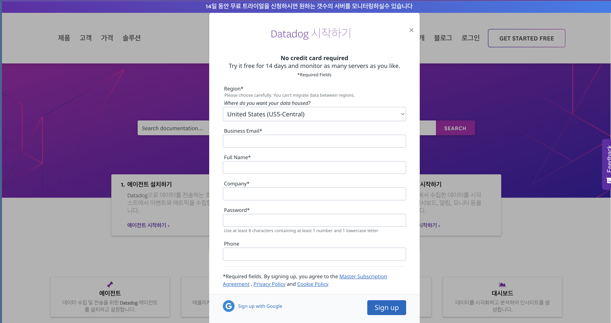
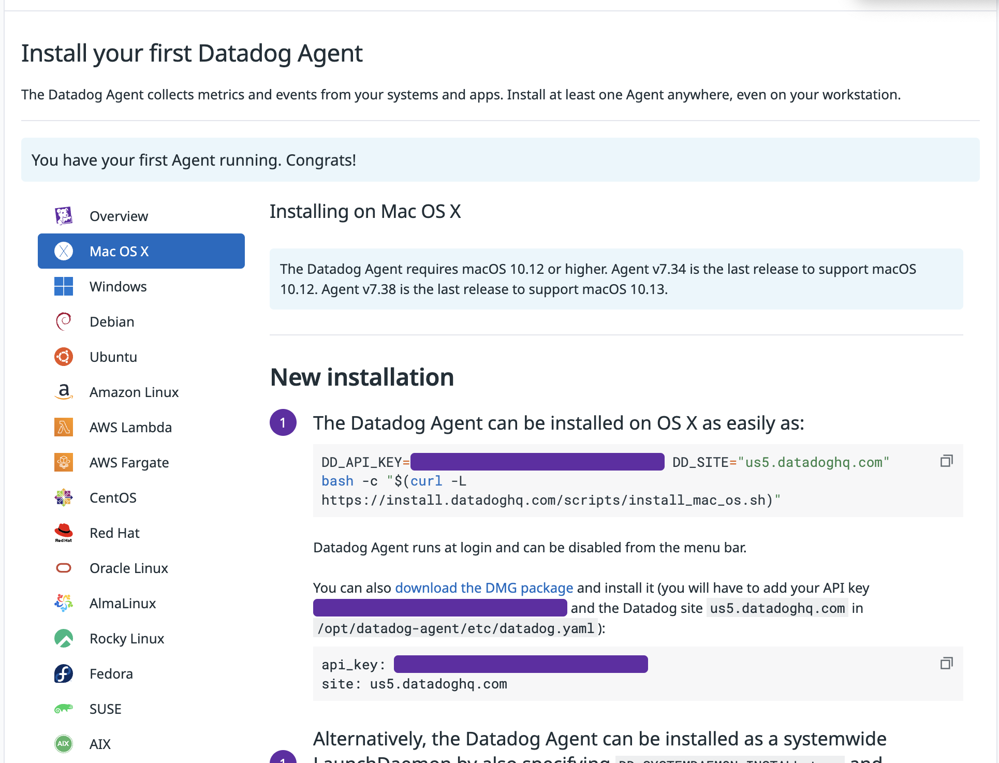
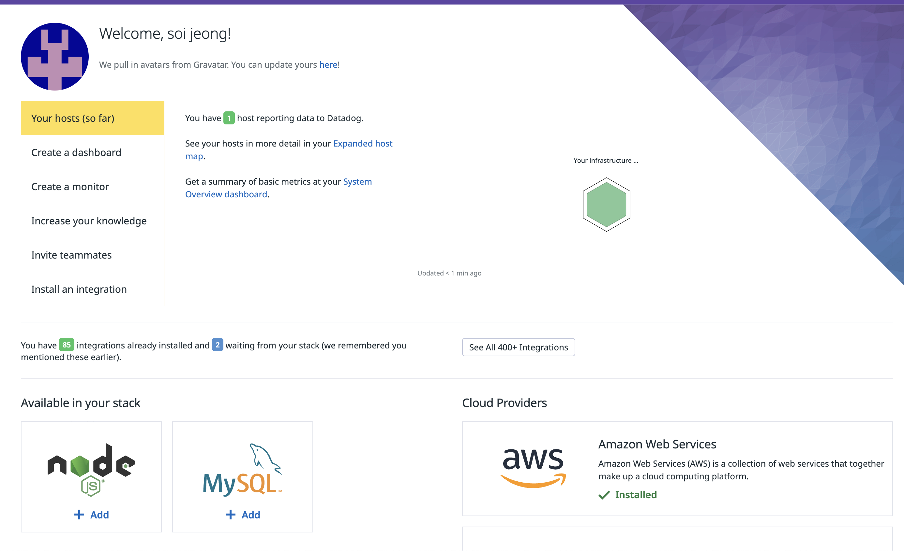
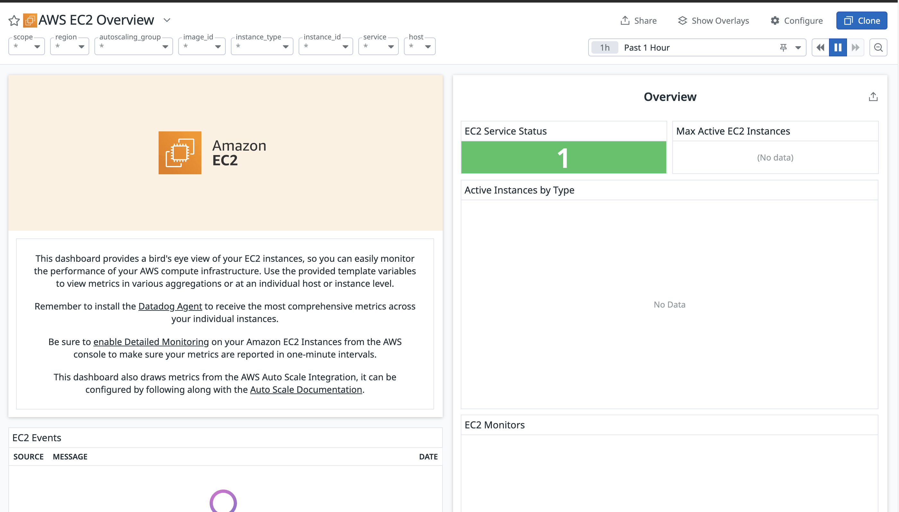
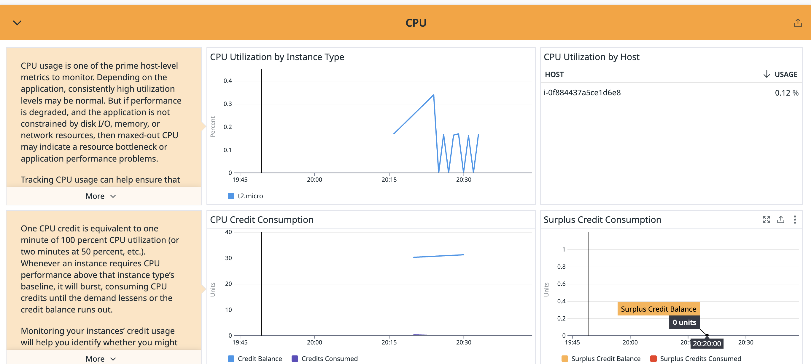

### 데이터독이란
클라우드 기반의 인프라 및 애플리케이션 모니터링, 로그 관리, 보안 모니터링 플랫폼으로 인프라의 성능을 실시간으로 모니터링, 분석, 탐지한다

서버를 모니터링 하는 기능을 시작으로 aws와 GCP 서비스와 통합해 모니터링을 할 수 있으며 다양한 서버, 컨테이너, 데이터베이스등 다양한 인프라를 모니터링 할 수 있다

데이터독은 로그 소스를 통합해 관리하고분석한다 -> 이를 통해 그라파나처럼 특정 상황시 알림을 보낼 수 있다
 
### 데이터독 회원가입 하기
데이터독 사이트에 들어가<https://docs.datadoghq.com/ko/> 회원가입을 한다

근데 어차피 한국은 없으니까 나라는 아무거나 설정하고 회사도 아무거나 설정해준다 


만든 후 들어가 스택중 자신의 스택을 선택한 후 넥스트를 누르고 나오는 Agent setup에 들어가 운영체제에 맞는 방법으로 데이터독을 설치한다


여기 첫번째 나와 있는 방법을 사용했고 처음에 다운로드를 했는데도 계속 위에 있는게 돌아가서 status로 찍어서 확인해봤는데 에러떠서 한번 더 다운로드 했더니 성공했다


메인 페이지에 돌아가 Cloud Providers에서 연결하고 싶은 클라우드 서비스를 선택한다 
들어가서 aws로 보내고 연결한다

### 대시보드 꾸미기
대시보드의 리스트로 들어가게 되면 aws의 서비스의 요소들이 나온다, 이 중에서 보고 싶은 걸 눌러 들어간다

만약 ec2에 들어가게 되면 

이렇게 예시로 나오게 된다 지금은 그냥 만든게 없어서 아무것도 안뜨는데 ec2에서 만들고 해당 인스턴스의 작업 -> 모니터링 및 문제해결 ->세부모니터링 을 눌러 활성화 해줘야 한ㅇ다


그 후 ec2에 스트레스를 업데이트 하고 부하를 가한 뒤 데이터독을 보면 부하가 찍힌다

```
sudo apt-get update
sudo apt-get install -y stress
stress --cpu 4 --timeout 300
```



여기서 이 요소를 다른 서비스의 요소들과 한꺼번에 모아서 보고싶으면 여기 공유 눌러서 복사해대시보드에 복붙하면 거기에 생긴다

### APM

- HOST-Based
모니터링이 서버나 컴퓨팅 수준에서 이루어지는 모니터링이다

- Container-Based
도커, 쿠버네티스, ecs등을 모니터링한다

- Serverless
aws lambda 처럼 서버리스를 모니터링 하는데 사용한다


### ec2에 사용해 보기

각 언어마다 해야할게 나와 있다 

node.js는 npm install --save dd-trace를 install 하고 그 후 애플리케이션 시작점에 추가한다 
```javascript
const tracer = require('dd-trace').init()
```

그 후 env 파일에 DD_ENV='환경이름', DD_LOGS_INJECTION=true을 추가한다
이후 사용할 데이터독에 데이터독 에이전트가 애플리케이션의 데이터를 수집하고 서버로 전송하는 역할을 한다

데이터독용 ec2가 있다면 도커를 사용해 간편하게 데이터독을 설치 할 수 있다
먼저 도커를 설치한 다음(젠킨스에 있는 도커에 권한주기 및 설치 부분 참조<https://soijeongg.github.io/jenkinsStudy/>)
```
docker run -d --name dd-agent \
  -e DD_API_KEY=<YOUR_DATADOG_API_KEY> \
  -e DD_ENV=<ENVIRONMENT> \
  -v /var/run/docker.sock:/var/run/docker.sock:ro \
  datadog/agent:latest
  ```
여기서 api키는 데이터독 로그인 후 Integrations 들어가면 나오는 api를 눌러 확인한다 

그 후 도커로 만들때 넣어준다 

DD_API_KEY는 자신이 데이터독내에서 서비스 구분을 위해 이름을 원하는것을 넣어주면 된다