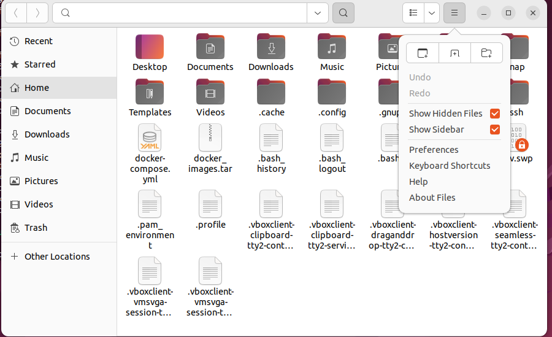

## 목차 
0. vm 설치  
1. 컴퓨터 도커 세팅    
2. vm 도커 세팅  
3. 로컬에서 도커 파일 생성  
4. vm으로 도커파일 전송 및 실행  
5. 도커 컴포즈 실행을 위한 vm 도커컴포즈 설치   
6. mysql 도커 파일  &  ngnix 도커파일  
7. 도커 컴포즈 파일 생성 
8. VM으로 파일 전송 및 실행 
9. 혹시 만약 잘못보내서 삭제해야될때     

## 가상머신 설치 
oracle Vm 설치 홈페이지[링크](https://www.oracle.com/kr/virtualization/technologies/vm/downloads/virtualbox-downloads.html#vbox)에 들어가 본인의 운영체제에 맞는 installer를 설치한다   
해당 가상머신에서 돌아갈 우분투 운영체제를 설치한다[링크](https://ubuntu.com/download/desktop)  
현재는 lts가 가 24.0.1. 이여서 이것 밖에 없는데 나는 22.0.4를 설치했다[링크](https://releases.ubuntu.com/22.04/)
가상머신을 실행한다


파란색의 새로 만들기에 들어간다   
이름을 쓰고 iso이미지는 내려보면 다운받았던 ISO이미지가 보인다  
만약 안보인다면 자신이 다운받았던 폴더에 들어가 찾는다 


무인설치 부분에 들어가 암호를 사용자 암호를 바꾼다  
하드웨어의 경우 기본 메모리는 11245로 프로세서는 cpu6개로 설정했다  
그 후 처음 화면의 시작을 눌러 들어간다

## 컴퓨터 도커 세팅
### 1. 도커 데스크탑 설치 
도커 공식 홈페이지[링크](https://www.docker.com/)에 들어가 Download Docker Desktop을 눌러 도커 데스크톱을 설치한다 

설치 후 프로그램을 실행해 도커 엔진이 돌아가게 한다 

### 1. vm 접속후 도커 설치하기 위해 필요한 패키지 설치하기 위해 sudo 권한 갖기 

``` bash
su
```

입력 후 비밀번호 입력하라는 말이 나오면 기존에 접속할때 사용했던 비밀번호 입력  
유저 이름 뒤에 #이 붙으면 성공

## 2. 도커 설치

### 2-1. 도커 설치하기 위해 필요한 패키지 다운로드

``` bash
sudo apt-get update
sudo apt-get install \
 apt-transport-https \
 ca-certificates \
 curl \
 software-properties-common
```
apt-transport-https: HTTPS 프로토콜을 사용하여 패키지를 다운로드할 수 있도록 지원하는 패키지  
ca-certificates:HTTPS 통신 시 인증서 검증하는 데 필요한 인증서 묶음, 인증서가 유효한지 확인함  
curl: URL에서 데이터 가져오거나 서버로 데이터 요청(api 요청)  
software-properties-common: 우분투에서 ppa를 사용하기 위한 패키지  

**PPA란**

Personal Package Archive로 우분투는 우분투 소프트웨어 센터에 등록된 프로그램만 다운 받을 수 있는데 안전하지만 이는 등록되지 않은 프로그램을 다운받을 수 없고 업데이트가 느리다는 단점이 있다  
이때 등록되지 않은 프로그램과 최신버전을 다운받을 수 있게 해주는 것이 PPA이다

### 2-2. 도커 공식 GPG 키 추가 

```bash
curl -fsSL https://download.docker.com/linux/ubuntu/gpg | sudo apt-key add -
```

GPG란 데이터를 암호화하고 서명하는데 사용되는 공개키 암호화 기술로 리눅스 패키지 관리 툴이 프로그램 패키지가 유효한지 확인하기 위해 설치전 gpg키로 검증

### 2-3. 도커 리포지토리 추가 
```bash
sudo add-apt-repository \
"deb [arch=amd64] https://download.docker.com/linux/ubuntu \
$(lsb_release -cs) \
stable"
```

apt리포지토리에 도커가 추가 

### 2-4. 도커 CE 설치 
```bash
sudo apt-get update
sudo apt-get install docker-ce
```
기업용 EE와 무료인 CE중 CE설치

### 2-5. 도커 설치 확인
```bash
docker --version
```
도커의 버전이 나오면 설치 완료

### 2-6. 사용자에게 도커 권한주기 

```bash
sudo groupadd docker
sudo usermod -aG docker $USER
sudo newgrp docker
```

## 3. 사용자의 로컬에서 도커 파일 생성 및  도커 이미지 빌드하기 

### 3-1. 서버의 도커 파일만들기 

도커 파일을 작성하고 이 도커파일을 빌드해 도커 이미지를 만든다 이 도커파일에는 도커의 토대가 될 이미지나 실행할명령어를 기재한다 

해당 도커 파일의 명령어는 이 [링크](https://velog.io/@soijeongg/Dockerfile-%EC%9D%B4%EB%AF%B8%EC%A7%80%EB%A7%8C%EB%93%A4%EA%B8%B0)에서 확인 가능하다 
해당 서버의 레포지토리에  dockerfile을 생성한다 

도커의 이미지에 필요한 env를 정리한다 이 env들이 해당 도커 파일을 사용해 도커 이미지 생성시 필요하다 
```bash

PORT
CORS
```
``` Docker
# 기반이 되는 이미지 설정
FROM node:22.10-alpine

# ARG 선언
ARG PORT
ARG CORS

# ENV 설정 \은 줄변경하기 위한 표시
ENV AWS_BUCKET_NAME=${AWS_BUCKET_NAME} \
    AWS_REGION=${AWS_REGION}  

# #Docker 이미지 내부에서 RUN, CMD, ENTRYPOINT의 명령이 실행될 디렉터리를 설정합니다.
WORKDIR /usr/src/app

# 외부 패키지 설치를 위해 package.json, package-lock.json 복사
COPY package.json package-lock.json ./

# 패키지 설치 (RUN은 도커 이미지를 빌드하는 순간에 실행됨)
RUN  npm install

# 폴더안의 내용을 전부 복사해 vm에넣기  COPY (로컬 위치 ) (도커속 위치)
COPY . .

# 사용할 포트를 내보낸다 
EXPOSE 9104

# 이미지로 부터 컨테이너 생성해 최초로 실행할때 수행
CMD ["npx", "nodemon", "app.js"]
```
기본이 되는 api의 도커파일을 만들고 도커 빌드 명령어를 사용해 이미지를 빌드한다  
빌드시 args로 설정한 환경변수에 값을 전달해야 하는데 빌드명령어의  buildargs에 값을 넣어 전송한다  
도커 이미지를 빌드할때 ENV만 사용하면 도커 파일 내부에 직접 작성한 고정값만 사용 가능 -> 값을 숨기기 위해 args사용

### 3-2 도커 파일 빌드하기 

도커 파일 빌드시 명령어로 args에 값을 넣어줘야 한다 

``` bash
docker buildx build `
  --build-arg CORS=* `
   --build-arg DB_PORT=3306 `
   -t <이미지 이름> .
```

`(백틱)은 vs코드 터미널인 파워셀에서 명령어를 여러줄로 나눌때 사용된다  
윈도우나 맥에서는 \(백슬래시)를 사용한다   
t 는 빌드된 이미지에 이름과 태그를 지정한다  
뒤의 .은 컨텍스트를 지정하는 것으로 이미지를 빌드할떄 필요한 파일과 디렉토리를 읽는 기준이 된다 . 은 현재 디렉토리를 빌드 컨텍스트로 이용한다는 뜻이다  

### 3-3 해당 도커 이미지 저장하기
도커파일을 통해 빌드한 도커 이미지를 tar형식으로 저장한다

``` bash
docker save -o <파일이름>.tar <이미지이름>
```

## 4.vm으로 도커파일 전송 및 실행 
### 4-1. VM에 ssh 설치하기
VM에 들어가 파일 전송을 위한 ssh를 설치한다  
```bash
sudo apt update
sudo apt install openssh-server
sudo systemctl start ssh
```

이후 VM이 부팅시마다 자동실행되도록 설정하게 한다 
```bash
 sudo systemctl enable ssh
 ```

 ### 4-2. VM의 아이피 주소 부여하기 
 
우분투가 실행되고 있는게 아닌 VM 관리자의 설정에 들어가 네트워크 -> 어댑터1 부분에 들어간다  
다음에 연결됨 부분을 어댑터에 브리지로 바꾼다  
어댑터에 브리지란 호스트와 아이피 대역대가 같은 고정적인 아이피이다  
VM의 아이피 주소를 알기 위해 ifconfig를 설치한다

```bash
sudo apt install
net-tools ifconfig
```

해당 명령어 실행 후 enp0s3 항목의 inet 부분에 가면 아이피주소를 알 수있다 

### 4-3. VM에 파일 전송하기

해당 아이피 주소와 scp를 사용해 로컬에서 VM으로 도커 이미지를 옮긴다

```bash
scp (저장된 이름).tar (VM사용자이름)@(아이피주소): /home/(VM사용자이름)/
```

입력하면 vm의 비밀번호 물어보는데 제대로 입력하면 파일이 전송된다  
/home/(VM사용자이름)/가 파일을 전송할 경로인데 이 경로가 존재하지 않으면 에러나고 failed뜬다  

### 4-4. VM에서 파일 실행하기

vm의 터미널 도커 이미지를 로드 하는 명령어를 입력하고 실행한다 

```bash
docker load -i <파일명>.tar
docker run -d --name <사용자지정이름> -p 호스트에서 사용할 포트:컨테이너 내부 포트 <이미지이름>
```

docker ps 명령어로 실행중인 도커 컨테이너를 알 수 있고 docker logs <컨테이너ID> 명령어로 해당 컨테이너의 로그를 알 수 있다  
만약 docker ps에 안나온다면 도커 컨테이너의 실행이 에러가 나 중지되었다는 의미 이다  
이때 docker -a 명령어를 사용하면 모든 컨테이너를 반환해주기 때문에 이 명령어를 사용해 컨테이너ID를 알아내 로그를 확인하면 된다  


## 5. 도커 컴포즈 실행을 위한 vm 도커컴포즈 설치  

VM의 터미널에 도커 컴포즈를 설치한다 
```bash
 sudo apt-get update
 sudo apt-get install docker-compose-plugin
 docker compose version
 ```

 ## 6. mysql도커파일과 nginx 도커파일 생성

 1. mysql 도커파일 생성
   
``` Docker
# 기반 이미지
FROM mysql:latest
COPY db/init.sql /docker-entrypoint-initdb.d/
ARG MYSQL_ROOT_PASSWORD
ARG MYSQL_DATABASE
ARG MYSQL_USER
ARG MYSQL_PASSWORD

ENV MYSQL_ROOT_PASSWORD=$MYSQL_ROOT_PASSWORD 
ENV MYSQL_DATABASE=$MYSQL_DATABASE
ENV MYSQL_USER=$MYSQL_USER
ENV MYSQL_PASSWORD=$MYSQL_PASSWORD
EXPOSE 3306
```

COPY한 파일은 db를 세팅하기 위한 파일로 데이터베이스를 초기화 하거나 기본 데이터를 로드하기 위한 sql파일이다  
도커파일과 같은 경로에 db라는 폴더를 만들고 여기에 기본 세팅 파일을 init이라는 이름으로 sql 파일을 저장한다  
기존에 사용하고 있는 로컬 데이터베이스에서 데이터베이스를 sql로 내보내기 실행해 만든 sql 파일을 사용했다  
이 초기화는 최초실행시에만 실행되고 mysql데이터가 이미 초기화된 상태라면 이 파일은 무시된다  


환경변수는 db비밀번호, db의 유저이름, 데이터베이스  이름,  루트 비밀번호를 설정해주면 된다 

2.nginx 도커파일 생성

```Docker
FROM nginx:latest
COPY ./nginx.conf /etc/nginx/nginx.conf
COPY ./default.conf /etc/nginx/conf.d/default.conf
EXPOSE 80
```


nginx.conf는 nginx의 기본 설정파일이고 default.conf는 리버스 프록시를 하기 위한 서버 설정이 들어있다  

1. nginx.conf

``` 
events {
    worker_connections 1024;
}

http {
    # MIME 타입 포함
    include       /etc/nginx/mime.types;
    default_type  application/octet-stream;

    # 로그 포맷 정의
    log_format  main  '$remote_addr - $remote_user [$time_local] "$request" '
                     '$status $body_bytes_sent "$http_referer" '
                     '"$http_user_agent" "$http_x_forwarded_for"';

    # 로그 설정
    access_log  /var/log/nginx/access.log  main;
    error_log   /var/log/nginx/error.log warn;

    # 기본 설정
    sendfile        on;
    keepalive_timeout  65;
    client_max_body_size 100M;

    # gzip 압축 설정
    gzip  on;
    gzip_disable "msie6";
    gzip_types text/plain text/css application/json application/javascript text/xml;

    # conf.d 디렉토리의 설정 파일들을 포함
    include /etc/nginx/conf.d/*.conf;
}
```

2. default.conf

```
server {
        listen       80;
        server_name  127.0.0.1;

        location / {
            root   html;
            index  index.html index.htm;
        }

        location /metrics {
            stub_status;
            allow all;
        }

        # 에러 페이지 처리
        error_page   500 502 503 504  /50x.html;
        location = /50x.html {
            root   html;
        }
    }

    # 두 번째 서버 블록 - 프록시 서버
    server {
        listen 9688;
        server_name x.x.x.x;    # 실제 아이피 주소나 아이피 이름

       
        location /status {
            stub_status;
        }

        # 프록시 설정
        location / {
            proxy_pass http://api:9104;  # x.x.x.x 대신 실제 백엔드 서버 주소 입력
            proxy_set_header Host $host;
            proxy_set_header X-Real-IP $remote_addr;
            proxy_set_header X-Forwarded-For $proxy_add_x_forwarded_for;
            proxy_set_header X-Forwarded-Proto $scheme;
            
            # 추가 프록시 설정
            proxy_connect_timeout 60s;
            proxy_send_timeout 60s;
            proxy_read_timeout 60s;
            proxy_buffering on;
        }
    }
```

default파일에서 sever listen 부분에 리버스프록시할 포트 번호를 적고 서버 네임 부분에 서버의 아이피나 이름을 적는다  
location의  proxy_pass에 위의 포트로 들어오면 보내줄 주소를 적는다  
이때 실제 아이피를 적는것이 아니라 도커 컴포즈에서 실행할때 사용했던 서비스의 이름을 적는다  
도커 컨테이너의 아이피 주소는 동적으로 할당되기 때문에 직접 사용하기가 어렵기 떄문에 고정된 서비스 이름을 사용한다


## 7. docker-compose 파일 생성
도커파일을 만든 경로에 docker-compose.yaml 파일을 생성한다 

```yaml
services:
  api:
    build: 
      context:  .
      dockerfile: Dockerfile
      args:
        DB_HOST: ${DB_HOST}
        DB_PORT: ${DB_PORT}
        DB_USER: ${DB_USER}
        DB_NAME: ${DB_NAME}
    image: api_server:latest
    environment:
      DB_HOST: ${DB_HOST}
      DB_PORT: ${DB_PORT}
      DB_USER: ${DB_USER}
      DB_NAME: ${DB_NAME}
    networks:
      - api_network
  mysql:
    build:
      context: .
      dockerfile: Dockerfile.mysql
      args:
        MYSQL_ROOT_PASSWORD: ${MYSQL_ROOT_PASSWORD}
        MYSQL_DATABASE: ${MYSQL_DATABASE}
        MYSQL_USER: ${MYSQL_USER}
        MYSQL_PASSWORD: ${MYSQL_PASSWORD}
    image: mysql:latest
    ports:
      - "3306:3306"
    environment:
      MYSQL_ROOT_PASSWORD: ${MYSQL_ROOT_PASSWORD}
      MYSQL_DATABASE: ${MYSQL_DATABASE}
      MYSQL_USER: ${MYSQL_USER}
      MYSQL_PASSWORD: ${MYSQL_PASSWORD}
    volumes:
      - mysql_data:/var/lib/mysql

  nginx:
    build: 
      context: .
      dockerfile: Dockerfile.nginx
    depends_on:
      - api
      - mysql
    image: nginx:latest
    ports:
      - "80:80"
      - "9688:9688"
    networks:
      - api_network

volumes:
  mysql_data: {}

networks:
  api_network: 
    driver: bridge


```

도커 컴포즈에서 가장 중요한건 들여쓰기를 사용해 각 서비스의 수준을 맞추는 것이라고 생각한다  
들여쓰기가 잘 안되어있으면 애가 아예 돌아가지 않는다 

### 7-1. api 서비스 

```yaml
services:
  api:
    build: 
      context:  .
      dockerfile: Dockerfile
      args:
        DB_HOST: ${DB_HOST}
        DB_PORT: ${DB_PORT}
        DB_USER: ${DB_USER}
        DB_NAME: ${DB_NAME}
    image: api_server:latest
    environment:
      DB_HOST: ${DB_HOST}
      DB_PORT: ${DB_PORT}
      DB_USER: ${DB_USER}
      DB_NAME: ${DB_NAME}
    networks:
      - api_network
```

서비스임을 선언하는 서비스를 지정한 다음 해당 서비스의 이름을 적는다  
이 이름은 컨테이너를 식별하는 이름으로 네트워크 통신시 사용한다  
빌드는 도커를 빌드하기 위한 설정으로 context: .은 도커파일과 빌드시 필요한 파일을 가져오는 빌드 컨텍스트의 경로를 현재 경로로 지정하겠다는 의미  
dockerfile명령어로 사용할 도커파일을 지정한다  
그 다음 도커 파일을 만들때 사용했던것처럼 args와 environment를 적는다 
중간에 이미지는  빌드된 이미지의 이름을 지정한것이다  
마지막 네트워크는 도커 컴포즈의 서비스간 통신을 하기 위해 지정한 것이다  
포트를 지정하지 않은 이유는 이 서비스는 바깥으로 들어나는 포트 없이 nginx에서 사용하는 포트로만 연결하게 해놓을꺼라 없앴다   

### 7-2 mysql 서비스

``` yaml

mysql:
    build:
      context: .
      dockerfile: Dockerfile.mysql
      args:
        MYSQL_ROOT_PASSWORD: ${MYSQL_ROOT_PASSWORD}
        MYSQL_DATABASE: ${MYSQL_DATABASE}
        MYSQL_USER: ${MYSQL_USER}
        MYSQL_PASSWORD: ${MYSQL_PASSWORD}
    image: mysql:latest
    ports:
      - "3306:3306"
    environment:
      MYSQL_ROOT_PASSWORD: ${MYSQL_ROOT_PASSWORD}
      MYSQL_DATABASE: ${MYSQL_DATABASE}
      MYSQL_USER: ${MYSQL_USER}
      MYSQL_PASSWORD: ${MYSQL_PASSWORD}
    volumes:
      - mysql_data:/var/lib/mysql

    
```

mysql또한 똑같은 형식을 따른다  
포트 명령어를 통해 포트를 정해준다  
데이터베이스의 데이터를 저장하기 위해 볼륨을 설정해준다  

### 7-3 nginx 서비스

```Docker
nginx:
    build: 
      context: .
      dockerfile: Dockerfile.nginx
    depends_on:
      - api
      - mysql
    image: nginx:latest
    ports:
      - "80:80"
      - "9688:9688"
    networks:
      - api_network

```

nginx또한 같은 형식을 따른다  
depends_on은 도커 컴포즈에서 특정 서비스가 다른 서비스에 의존하는 관계를 정의한다  
아래 정의한 서비스(여기서는 api, mysql) 가 시작되는것을 기다렸다가 시작되면 해당 서비스가 시작된다  
포트 중 80은 기본 nginx의 포트이고 두번째 9688은 리버스 프록시에 사용한 포트이다

### 7-4. volumes, network 

```Docker
volumes:
  mysql_data: {}

networks:
  api_network: 
    driver: bridge
```

volumes은 컨테이너가 재시작되더라도 데이터를 유지하기 위해 사용된다  
볼륨이름 mysql_data을 정의했으며 실제 위치는 도커가 자동 관리한다  
실제로 데이터를 사라지지 않게 관리하려면 이 볼륨을 mysql의 디렉토리와 연결해야 한다(mysql_data:/var/lib/mysql) 

네트워크는 도커 컴포즈의 서비스 간의 통신을 설정하는것이다  
api_network라는 이름으로 네트워크를 만들었고 bridge 드라이버를 사용해 동일한 네트워크에 연결된 컨테이너 간의 통신을 설정했다

## 8. VM으로 파일 전송 및 실행

도커 컴포즈 파일을 사용해 도커 이미지를 빌드한다 

``` bash
docker-compose build --no-cache
```

빌드 후 도커 파일 하나를 저장하고 VM으로 보낼때 헀던것처럼 이미지를 저장하고 scp로 vm으로 보낸다 

```bash
scp (저장된 이름).tar (VM사용자이름)@(아이피주소): /home/(VM사용자이름)/
scp docker-compose.yml (VM사용자이름)@(아이피주소): /home/(VM사용자이름)/
scp .env (VM사용자이름)@(아이피주소): /home/(VM사용자이름)/
```

컨테이너를 한번에 실행하기 위해 도커 컴포즈 파일을 전송하고 환경변수를 사용하기 위해 env파일을 전송한다 

### VM에서의 실행

``` bash
docker load -i <파일명>.tar 
docker-compose up -d
```

올린 뒤에 docker ps로 제대로 올라갔는지 확인한다

9. 혹시 파일 잘못 보내서 삭제해야 할때 

만약 파일을 VM에 잘못보내서 삭제해야 되면 VM에 들어가 file에서 도커 컴포즈 파일, 이미지 파일, .env 파일을 삭제 한다  
.env 파일이 안보이면 파일에서 이 버튼을 클릭하면 나오는 show Hidden files을 클릭하면 보인다


그 후 도커 컨테이너를 전부 중지하고 삭제한다 

```bash
docker stop $(docker ps -q)
docker rm -f $(docker ps -aq)
```