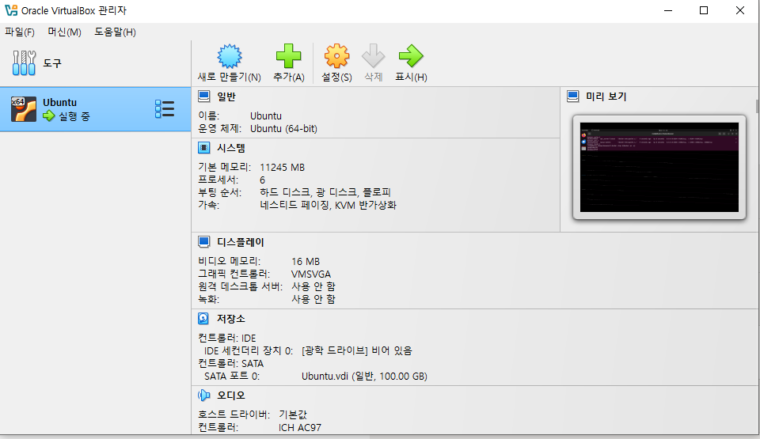
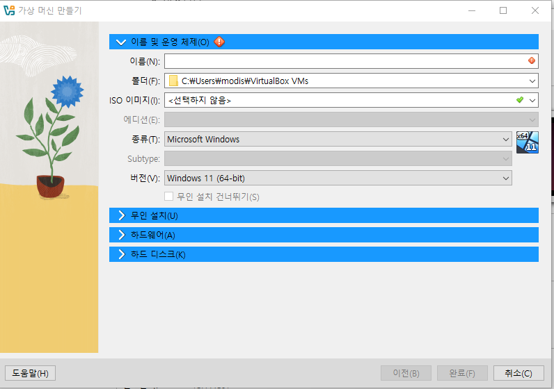

## 목차 
0. vm 설치
1. 컴퓨터 도커 세팅  
2. vm 도커 세팅  
3. 로컬에서 도커 파일 생성  
4. vm으로 도커파일 전송 및 실행  
5. 도커 컴포즈 실행을 위한 vm 도커컴포즈 설치   
6. mysql 도커 파일   
7. ngnix 도커파일  
8. 도커 컴포즈 파일 생성  
9. 혹시 만약 잘못보내서 삭제해야될때   
10. 에러들 (갑자기 리슨 안나오면 그냥 스탐하고 다시 ) && 기타  

## 가상머신 설치 
oracle Vm 설치 홈페이지[https://www.oracle.com/kr/virtualization/technologies/vm/downloads/virtualbox-downloads.html#vbox]에 들어가 본인의 운영체제에 맞는 installer를 설치한다   
해당 가상머신에서 돌아갈 우분투 운영체제를 설치한다[https://ubuntu.com/download/desktop]  
현재는 lts가 가 24.0.1. 이여서 이것 밖에 없는데 나는 22.0.4를 설치했다[https://releases.ubuntu.com/22.04/]
가상머신을 실행한다


파란색의 새로 만들기에 들어간다   
이름을 쓰고 iso이미지는 내려보면 다운받았던 ISO이미지가 보인다  
만약 안보인다면 자신이 다운받았던 폴더에 들어가 찾는다 


무인설치 부분에 들어가 암호를 사용자 암호를 바꾼다  
하드웨어의 경우 기본 메모리는 11245로 프로세서는 cpu6개로 설정했다  
그 후 처음 화면의 시작을 눌러 들어간다

## 컴퓨터 도커 세팅
### 1. 도커 데스크탑 설치 
도커 공식 홈페이지[https://www.docker.com/]에 들어가 Download Docker Desktop을 눌러 도커 데스크톱을 설치한다 

설치 후 프로그램을 실행해 도커 엔진이 돌아가게 한다 

### 1. vm 접속후 도커 설치하기 위해 필요한 패키지 설치하기 위해 sudo 권한 갖기 

``` bash
su
```

입력 후 비밀번호 입력하라는 말이 나오면 기존에 접속할때 사용했던 비밀번호 입력한다 -> 유저 이름 뒤에 #이 붙으면 성공

### 2. 도커 설치

#### 2-1. 도커 설치하기 위해 필요한 패키지 다운로드

``` bash
sudo apt-get update
sudo apt-get install \
 apt-transport-https \
 ca-certificates \
 curl \
 software-properties-common
```
apt-transport-https: HTTPS 프로토콜을 사용하여 패키지를 다운로드할 수 있도록 지원하는 패키지  
ca-certificates:HTTPS 통신 시 인증서 검증하는 데 필요한 인증서 묶음, 인증서가 유효한지 확인함  
curl: URL에서 데이터 가져오거나 서버로 데이터 요청(api 요청)  
software-properties-common: 우분투에서 ppa를 사용하기 위한 패키지  

**PPA란**

Personal Package Archive로 우분투는 우분투 소프트웨어 센터에 등록된 프로그램만 다운 받을 수 있는데 안전하지만 이는 등록되지 않은 프로그램을 다운받을 수 없고 업데이트가 느리다는 단점이 있다  
이때 등록되지 않은 프로그램과 최신버전을 다운받을 수 있게 해주는 것이 PPA이다

#### 2-2. 도커 공식 GPG 키 추가 

```bash
curl -fsSL https://download.docker.com/linux/ubuntu/gpg | sudo apt-key add -
```

GPG란 데이터를 암호화하고 서명하는데 사용되는 공개키 암호화 기술로 리눅스 패키지 관리 툴이 프로그램 패키지가 유효한지 확인하기 위해 설치전 gpg키로 검증

#### 2-3. 도커 리포지토리 추가 
```bash
sudo add-apt-repository \
"deb [arch=amd64] https://download.docker.com/linux/ubuntu \
$(lsb_release -cs) \
stable"
```

apt리포지토리에 도커가 추가 

#### 2-4. 도커 CE 설치 
```bash
sudo apt-get update
sudo apt-get install docker-ce
```
기업용 EE와 무료인 CE중 CE설치

#### 2-5. 도커 설치 확인
```bash
docker --version
```
도커의 버전이 나오면 설치 완료

#### 2-6. 사용자에게 도커 권한주기 

```bash
sudo groupadd docker
sudo usermod -aG docker $USER
sudo newgrp docker
```

### 3. 사용자의 로컬에서 도커 파일 생성 및 도커 컴포즈 이용해 도커 이미지 빌드하기 

#### 3-1. 서버의 도커 파일만들기 

도커 파일을 작성하고 이 도커파일을 빌드해 도커 이미지를 만든다 이 도커파일에는 도커의 토대가 될 이미지나 실행할명령어를 기재한다 

해당 도커 파일의 명령어는 이 [링크] (https://velog.io/@soijeongg/Dockerfile-%EC%9D%B4%EB%AF%B8%EC%A7%80%EB%A7%8C%EB%93%A4%EA%B8%B0)에서 확인 가능하다 
해당 서버의 레포지토리에  dockerfile을 생성한다 

도커의 이미지에 필요한 env를 정리한다 이 env들이 해당 도커 파일을 사용해 도커 이미지 생성시 필요하다 
```bash

PORT
CORS
```
``` Docker
# 기반이 되는 이미지 설정
FROM node:22.10-alpine

# ARG 선언
ARG PORT
ARG CORS

# ENV 설정 \은 줄변경하기 위한 표시
ENV AWS_BUCKET_NAME=${AWS_BUCKET_NAME} \
    AWS_REGION=${AWS_REGION}  

# #Docker 이미지 내부에서 RUN, CMD, ENTRYPOINT의 명령이 실행될 디렉터리를 설정합니다.
WORKDIR /usr/src/app

# 외부 패키지 설치를 위해 package.json, package-lock.json 복사
COPY package.json package-lock.json ./

# 패키지 설치 (RUN은 도커 이미지를 빌드하는 순간에 실행됨)
RUN  npm install

# 폴더안의 내용을 전부 복사해 vm에넣기  COPY (로컬 위치 ) (도커속 위치)
COPY . .

# 사용할 포트를 내보낸다 
EXPOSE 9104

# 이미지로 부터 컨테이너 생성해 최초로 실행할때 수행
CMD ["npx", "nodemon", "app.js"]
```
기본이 되는 api의 도커파일을 만들고 도커 빌드 명령어를 사용해 이미지를 빌드한다  
빌드시 args로 설정한 환경변수에 값을 전달해야 하는데 빌드명령어의  buildargs에 값을 넣어 전송한다  
환경변수를 뜻하는 env는 외부에서의 값 전달이 불가능하기 때문에 도커파일에 값을 하드코딩 해줘야 한다  
그렇게 되면 값을 숨기기가 불가능해진다  
그렇기 때문에 외부에서 동적으로 값 전달이 가능한 args를 사용한다 